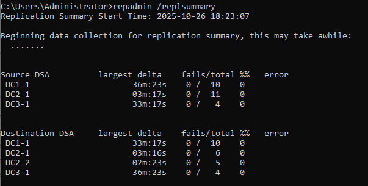
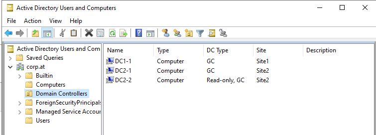

# BS1.3

## TOPO


## Plan
wir wollen eine RODC (Read only Domain Controler) aufsetzen. Dazu machen wir wie in BS1.1 ein dual site setup, aber diesmal ist DC2-1 ein RODC.

RODC's werden in unsicheren standorten verwendet da auch wenn irgendwie zugriff auf die Maschine ensteht nichts am ad verändert werden kann.

# Domain: **corp.at**


## DC2-2
| interface    | ip          | lan segment|
| ------------ | ----------- | ---------- |
| Ethernet1    | 192.168.2.2 | Lan_2-1    |
| NAT-Interface| DHCP        | - |

- ### Konfiguration
    - in VM-ware ein neue netztkarte im Lan_2-1
    - Server Umbenenen: **DC2-2**
    - IP Addressen setzen und NIC's umbenenen (wie in den Tabellen beschrieben)
    - Windows Rollen instalieren:
        - Active Directory Domain Services **(AD DS)**
        - (dienste wie DNS werden bei der Hochstuffung zu einem Domain-Controler instaliert)
    - features instalieren
    - der Router aus **BS1.1** sollte schon konfiguriert sein wenn nicht siehe [BS1.1](../BS1.1/BS1.1.md)
    ---
    - testen ob DC2-2 DC1-1 pingen kann
    - DC1-1 als dns auf DC2-2 eintragen

        *Tip: nat interface abbdrehen*

    - DC2-2 auf einen DC aufstufen

        im dialog darauf achten das die **checkbox** "Read only domain controler (RODC)" angehackt ist!

        
    
    - im nächsten dialog fenster kann man RODC optionen verteilen
        - wer kann den RODC bearbeiten (welche rollen, user oder Gruppen)
        - etc.

        
    
    - instalation abschliessen
- jetzt nur noch [**testen**](#testen)


## Testen
- ## Replikation Testen
    - ```repadmin /replsummary```
  
    

    Bild zeigt eine zusammenfassung der replikationen an auf DC1-1

    - ```repadmin /showrepl```

    

    Bild zeigt eine zusammenfassung der letzen replikationen an und ob diese versuche gelungen sind oder nicht

- ## ```active directory user and computer```
        
    in **active directory user and computer** sieht man alle DC's in einer domain

    screenshot auf DC1-1

    

