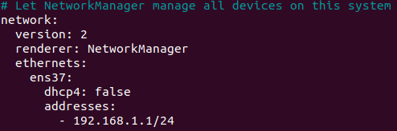
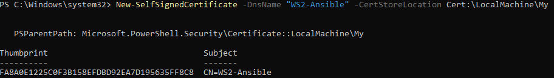

# BS1.5

## Plan
wir wollen die Konfiguration von Windows Servern mit Ansible umsetzen.

Dazu setzen wir eine Testumgebung aus einer Linux Ansible Control Node und zwei Windows-Servern um.

## Control-Node
| interface          | ip             | lan segment|
| ------------------ | -------------- | ---------- |
| NAT-Interface      | DHCP           | -          |
| ens37              | 192.168.1.1/24 | WAnsible   |

- ### Konfiguration
 
    - Control Node mit Netplan konfigurieren
    

## WS1-Ansible (Managed Node)
| interface          | ip             | lan segment|
| ------------------ | -------------- | ---------- |
| NAT-Interface      | DHCP           | -          |
| Ethernet1          | 192.168.1.2/24 | WAnsible   |
### Konfiguration 
**Skript:**
```shell
# ---------- Script-Anfang ----------  
# Set device name  
Rename-Computer -NewName 'WS1-Ansible' -Force  
# Rename network adapter
Rename-NetAdapter -Name 'Ethernet0' -NewName 'Internet'

Rename-NetAdapter -Name 'Ethernet1' -NewName 'WAnsible'  
# Setup dynamic for IPv4  
Set-NetIPInterface -InterfaceAlias 'WAnsible' -AddressFamily IPv4 -Dhcp Disabled  
New-NetIPAddress -InterfaceAlias 'WAnsible'-AddressFamily IPv4 -IPAddress '192.168.1.2' -PrefixLength 24 -DefaultGateway "192.168.1.1" 
# DNS-Client  
Set-DnsClientServerAddress -InterfaceAlias 'WAnsible' -ResetServerAddresses
Set-DnsClientServerAddress -InterfaceAlias 'WAnsible' -ServerAddresses ("192.168.1.1")
  
# Set timezone and time (timeserver)  
w32tm /config /syncfromflags:manual /manualpeerlist:"pool.ntp.org" /reliable:yes /update
tzutil /s "W. Europe Standard Time"  
# Allow pings in both directions  
Set-NetFirewallRule -Name "CoreNet-Diag-ICMP4-EchoRequest-In" -Enabled True  
Set-NetFirewallRule -Name "CoreNet-Diag-ICMP4-EchoRequest-Out" -Enabled True

Set-NetFirewallRule -Name "CoreNet-Diag-ICMP6-EchoRequest-In" -Enabled True  
Set-NetFirewallRule -Name "CoreNet-Diag-ICMP6-EchoRequest-Out" -Enabled True  
# RDP aktivieren
winRM quickconfig  
Enable-PSRemoting -Force  
Set-ItemProperty -Path 'HKLM:\System\CurrentControlSet\Control\Terminal Server' -name "fDenyTSConnections" -value 0  
# Reboot  
Restart-Computer
# ---------- Script-Ende----------
```

## WS2-Ansible (Managed Node)
| interface          | ip             | lan segment |
| ------------------ | -------------- | ----------- |
| NAT-Interface      | DHCP           | -           |
| Ethernet1          | 192.168.1.3/24 | WAnsible    |

### Konfiguration
**Skript**
```shell
# ---------- Script-Anfang ----------  
# Set device name  
Rename-Computer -NewName 'WS2-Ansible' -Force  
# Rename network adapter
Rename-NetAdapter -Name 'Ethernet0' -NewName 'Internet'

Rename-NetAdapter -Name 'Ethernet1' -NewName 'WAnsible'  
# Setup dynamic for IPv4  
Set-NetIPInterface -InterfaceAlias 'WAnsible' -AddressFamily IPv4 -Dhcp Disabled  
New-NetIPAddress -InterfaceAlias 'WAnsible'-AddressFamily IPv4 -IPAddress '192.168.1.3' -PrefixLength 24 -DefaultGateway "192.168.1.1" 
# DNS-Client  
Set-DnsClientServerAddress -InterfaceAlias 'WAnsible' -ResetServerAddresses
Set-DnsClientServerAddress -InterfaceAlias 'WAnsible' -ServerAddresses ("192.168.1.1")
  
# Set timezone and time (timeserver)  
w32tm /config /syncfromflags:manual /manualpeerlist:"pool.ntp.org" /reliable:yes /update
tzutil /s "W. Europe Standard Time"  
# Allow pings in both directions  
Set-NetFirewallRule -Name "CoreNet-Diag-ICMP4-EchoRequest-In" -Enabled True  
Set-NetFirewallRule -Name "CoreNet-Diag-ICMP4-EchoRequest-Out" -Enabled True

Set-NetFirewallRule -Name "CoreNet-Diag-ICMP6-EchoRequest-In" -Enabled True  
Set-NetFirewallRule -Name "CoreNet-Diag-ICMP6-EchoRequest-Out" -Enabled True  
# RDP aktivieren
winRM quickconfig
Enable-PSRemoting -Force  
Set-ItemProperty -Path 'HKLM:\System\CurrentControlSet\Control\Terminal Server' -name "fDenyTSConnections" -value 0  
# Reboot  
Restart-Computer
# ---------- Script-Ende----------
```

- ### Ansible Konfiguration 
#### Linux Control Node

- Ansible installieren:
```shell
sudo apt update
sudo apt install ansible
```
- Die Datei /etc/ansible/hosts bearbeiten
```shell
sudo nano /etc/ansible/hosts
    
```
#### Windows Managed Nodes
- WICHTIG!: Falls noch nicht durchs Skript geschehen Windows Remote Management aktivieren (Server Manager->Lokaler Server->Remotemanagement) oder
```shell
winRM quickconfig
Enable-PSRemoting -Force
```

#### Über HTTP verbinden (zertifikatlos und unverschlüsselt)

- Auf den Windows hosts unencrypted access und eingehend http zulassen:
```shell
Set-Item -Path WSMan:\localhost\Service\AllowUnencrypted -Value True

Set-Item -Path WSMan:\localhost\Service\Auth\Basic -Value True

Enable-NetFirewallRule -Name "WINRM-HTTP-In-TCP"
```

- Konfiguration vom vars File für http auf dem Linux Server
```shell
ansible_user="<user>"
ansible_password="<Passwort>"
ansible_connection=winrm
ansible_port=5985
ansible_winrm_server_cert_validation=ignore
ansible_winrm_scheme=http
```

#### Über HTTPS mit Self-Signed-Cert verbinden (verschlüsselt)

- Auf den Windows hosts Zertifikat erstellen:
```shell
New-SelfSignedCertificate -DnsName "WS1-Ansible" -CertStoreLocation Cert:\LocalMachine\My
```


- Der Thumbprint kann nochmal mit ```Get-ChildItem Cert:\LocalMachine\My``` angezeigt werden

- HTTPS Listener konfigurieren (erstellten thumbprint angeben):
```shell
winrm create winrm/config/Listener?Address=*+Transport=HTTPS '@{CertificateThumbprint="BC67D5ADF5BD19E45A0C7FA70F28380A6A287652"}'
```

- HTTPS eingehend erlauben und authentication per winrm erlauben
```shell
netsh advfirewall firewall add rule name="WinRM HTTPS" dir=in action=allow protocol=TCP localport=5986

winrm set winrm/config/service/Auth '@{Basic="true"}'
```

- Konfiguration vom vars File für https auf dem Linux Server
```shell
ansible_user="<user>"
ansible_password="<passwort>"
ansible_connection=winrm
ansible_port=5986
ansible_winrm_server_cert_validation=ignore
ansible_winrm_scheme=https
```

#### Konfiguration schreiben

Ordnerstruktur: 
- inventories/
    - hosts
    - group_vars/
        - windows_nodes/
            - windows_nodes.yaml
            - vault.yaml
- roles/
    - windows_role/
        - tasks/
            - main.yaml
            - install_chocolatey.yaml
            - install_7zip.yaml


- playbooks/
    - windows_config

ansible.cfg

##### hosts file
- Beinhaltet die Addressen der Server
```shell
[windows_nodes]
ws1_ansible ansible_host=192.168.1.2
ws2_ansible ansible_host=192.168.1.3
```

##### windows_nodes file
- Setzt die Variablen die zur Verbindung benötigt werden
```shell
ansible_connection: winrm
ansible_port: 5986
ansible_winrm_server_cert_validation: ignore
ansible_winrm_scheme: https
```

##### vault file
- Es wird ein Vault file für das verschlüsselte Speichern von Benutzernamen und Passwörtern der Server
```shell
# Erstellen (Passwort angeben)
ansible-vault create vault.yaml

# Bearbeiten
ansible-vault edit vault.yaml

# Inhalt ausgeben
ansible-vault view vault.yaml
```
Inhalt:
```shell
ansible_user: <username>
ansible_password: "<password>"
```

##### install_chocolatey file
```shell
- name: Installiert Chocolatey
win_chocolatey:
    name: chocolatey
    state: present
```
##### install_7zip file
```shell
- name: Installiert 7-Zip über Chocolatey
  win_chocolatey:
    name: 7zip
    state: present
```

##### main.yaml file
- Man könnte auch alle tasks direkt in dieses File schreiben, Übersicht wäre aber dadurch schlechter
```shell
- import_tasks: install_chocolatey.yaml
- import_tasks: install_7zip.yaml
```

##### windows_config
```shell
- name: Windows Setup
  hosts: windows_nodes
  roles:
    - windows_role
```


Befehl:
ansible-playbook \
  -i inventories/hosts \
  playbooks/windows_config.yml \
  --ask-vault-pass
