# Cisco Authentication mit NPS/RADIUS

Im Netzwerk eines Mittelständischen Unternehmens sind Netzwerkkomponenten von Cisco in Verwendung. Im Rahmen einer Initiative zur Härtung der Netzwerkkomponenten wollen Sie auch die Benutzer-Authentisierung mit RADIUS verbessern. Dazu nutzen Sie die vorhandene Windows AD Domäne und implementieren das NPS/RADIUS Service.

---

## 1. Lab-Überblick

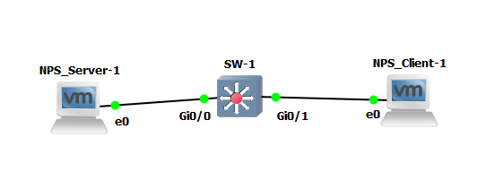

Wir verwenden drei virtuelle Maschinen im gleichen Subnetz:

- **NPS-Server** – Domain Controller + NPS Server (192.168.1.10/24)
- **SW01** – Cisco Switch (192.168.1.20/24) 
- **NPS-Client** – Test-Client (192.168.1.30/24)

**DNS:** nps-client.corp.example.com → 192.168.1.10

---

## 2. DC01 vorbereiten (AD + NPS + PKI)

### 2.1 Servernamen und IP einstellen

1. Computername ändern auf **DC01**
2. IP-Adresse: **192.168.1.10/24**
3. DNS-Server: **192.168.1.10**
4. Neustarten

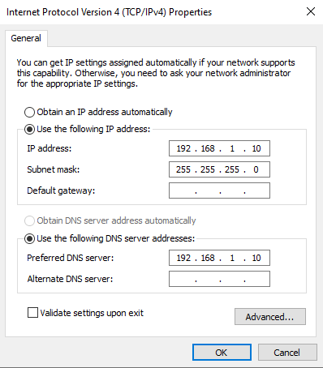

### 2.2 Active Directory Domain Services installieren

1. Server-Manager → `Rollen` → `Rollen hinzufügen`
2. `Active Directory Domain Services` auswählen
3. Domain: **corp.example.com**
4. Neustarten und mit `corp\Administrator` anmelden

### 2.3 NPS Rolle + Zertifikatdienste installieren

```
Server-Manager → Rollen hinzufügen:
✓ Active Directory Zertifikatdienste
✓ Netzwerkrichtlinien- und Zugriffsdienste → Netzwerkrichtlinienserver
```

---

## 3. PKI einrichten (Zertifikate für NPS)

### 3.1 Zertifikatvorlage für NPS erstellen

1. `certsrv.msc` → `Zertifikatvorlagen` → Rechtsklick → `Verwalten`
2. Vorlage **"RAS und IAS Server"** → Rechtsklick → **Duplizieren**
3. Name: **"NPS-Auth"**
4. Reiter **Sicherheit** → `RAS- und IAS-Server` → `Automatisch registrieren` ✅
5. `OK` → Vorlage publizieren

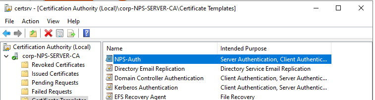

### 3.2 NPS Zertifikat anfordern

1. NPS-Computer zu Gruppe `RAS- und IAS-Server` hinzufügen
2. `mmc` → Zertifikate (Lokales Computerkonto) → Persönlich → Rechtsklick → `Anfordern`
3. Vorlage **"NPS-Auth"** auswählen

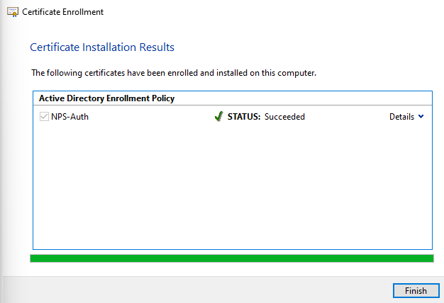

### 3.3 NPS im AD registrieren

1. `nps.msc` → Rechtsklick **NPS (lokal)** → **Im Active Directory registrieren**
2. `Ja` bestätigen

`Alternative` Falls das registieren nicht funktioniert: 
```
netsh nps add registeredserver corp.example.com NPS-Server
```

---

## 4. NPS Server konfigurieren

### 4.1 RADIUS Client (Cisco Switch) anlegen

1. `nps.msc` → `RADIUS Clients` → Rechtsklick → `Neuer RADIUS-Client`
2. Name: **Cisco-SW01**
3. Adresse: **192.168.1.20**
4. Freigabesecret: **cisco123**
5. Unter `Advanced` kann man **Cisco** als `Vendor` eingeben
6. Auf `OK` klicken

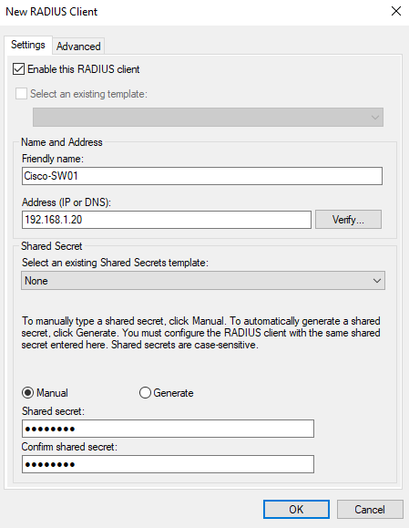

### 4.2 802.1X Netzwerkrichtlinie erstellen

1. `nps.msc` → Unter `NPS (Local)` → `RADIUS-Server für 802.1X-Verbindungen`
2. Assistent: **Sichere Ethernet-Verbindungen**
3. Auth-Methode: **PEAP** → **MS-CHAP v2**
4. Zertifikat: NPS-Zertifikat auswählen
5. Windows-Gruppe: **corp\Domain Users**

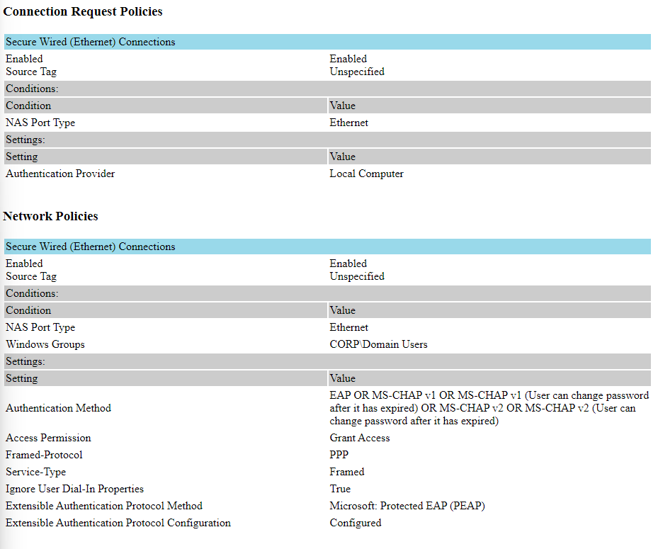

### 4.3 NPS Policy für Admins

### 4.3b NPS-Policy für Network-Admins (Privilege Level 15)

1. In `nps.msc` unter **Policies → Network Policies** eine neue Richtlinie **„Network-Admins“** erstellen. 
2. Bedingungen hinzufügen:  
   - **Windows Groups** = AD-Gruppe `Network-Admins` (zuvor hinzufügen) 
   - **Client-IPv4-Address** = die IP des NPS Servers `192.168.1.10`
3. **Access granted** auswählen, Checkbox **„Access is determined by user dial-in properties“** deaktivieren. 
4. Unter **Authentication Methods** **„Unencrypted authentication (PAP, SPAP)”** aktivieren und alles andere abwählen. 
5. Unter **Configure Constraints** alles bei default lassen.
6. Unter **Settings → Standard** den **Service-Type = NAS Prompt** hinzufügen. 
7. Unter **Settings → Vendor Specific** einen **Cisco-AV-Pair** mit `shell:priv-lvl=15` hinzufügen, damit Network-Admins auf dem Cisco direkt Privilege Level 15 bekommen. 

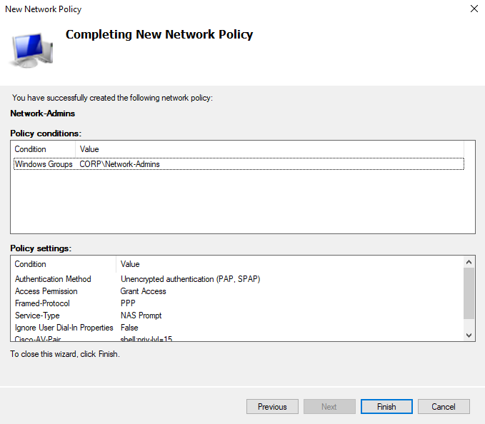

---

## 5. Cisco Switch SW01 konfigurieren

### 5.1 Basis-IP Konfiguration

```
conf t
interface vlan 1
 ip address 192.168.1.20 255.255.255.0
end
wr
```

### 5.2 AAA und 802.1X aktivieren

```
aaa new-model
!
aaa session-id common
radius server win_nps
address ipv4 192.168.1.10 auth-port 1645 acct-port 1646
key cisco123
!
aaa group server radius IAS
 server name win_nps
!
aaa authentication login userAuthentication local group IAS
aaa authorization exec userAuthorization local group IAS if-authenticated
aaa authorization network userAuthorization local group IAS
aaa accounting exec default start-stop group IAS
aaa accounting system default start-stop group IAS
!
privilege exec level 1 show config
!
ip radius source-interface Gi0/1
!
line vty 0 924
 authorization exec userAuthorization
 login authentication userAuthentication
 transport input ssh telnet
```
---
### Legende zur Cisco AAA-/RADIUS-Konfiguration

#### AAA Grundkonfiguration

- **`aaa group server radius IAS`**  
  Definiert eine RADIUS-Servergruppe mit dem Namen `IAS`, in der ein oder mehrere RADIUS-/NPS-Server zusammengefasst werden.

#### AAA Methodenlisten

- **`aaa authentication login userAuthentication local group IAS`**  
  Methodenliste `userAuthentication` für Logins: zuerst lokale Benutzer-Datenbank, falls kein Treffer, Anfrage an die RADIUS-Gruppe `IAS`.

- **`aaa authorization exec userAuthorization local group IAS if-authenticated`**  
  Methodenliste `userAuthorization` für Exec-Shell-Zugriff nach dem Login; Autorisierung lokal oder via `IAS`, `if-authenticated` erlaubt Exec grundsätzlich, wenn der Benutzer erfolgreich authentifiziert wurde.

- **`aaa authorization network userAuthorization local group IAS`**  
  Nutzt dieselbe Methodenliste `userAuthorization` für Netzwerk-Sessions (z.B. PPP/VPN), wieder lokal, dann `IAS`. 

- **`aaa accounting exec default start-stop group IAS`**  
  Aktiviert Exec-Accounting mit der Default-Liste; beim Start und Ende einer Exec-Session werden Accounting-Datensätze an die RADIUS-Gruppe `IAS` gesendet.

- **`aaa accounting system default start-stop group IAS`**  
  Aktiviert System-Accounting (z.B. System-Events, Reloads) und sendet Start/Stop-Ereignisse an `IAS`.

- **`aaa session-id common`**  
  Erzwingt eine einheitliche Session-ID über verschiedene AAA-Events hinweg, was die Korrelation in Logs und auf dem RADIUS-Server erleichtert.

#### Privilege- und Interface-Einstellungen

- **`ip radius source-interface Gi0/1`**  
  Legt fest, dass alle RADIUS-Pakete die IP-Adresse des Interfaces `Gi0/1` als Quelladresse verwenden, was für NPS-Client-Definitionen und Routing wichtig ist. 

#### VTY-Line-Konfiguration

- **`authorization exec userAuthorization`**  
  Verknüpft auf diesen VTY-Lines die Exec-Autorisierung mit der AAA-Methodenliste `userAuthorization`.

- **`login authentication userAuthentication`**  
  Verknüpft auf diesen VTY-Lines den Login-Prozess (Username/Passwort) mit der AAA-Methodenliste `userAuthentication`. 

---

## 6. WIN01 Client vorbereiten

### 6.1 Client IP + Domain Join

1. IP: **192.168.1.30/24**, DNS: **192.168.1.10**
2. Computername: **WIN01**
3. Domain join: **corp.example.com**
4. Neustarten, mit `corp\Administrator` anmelden

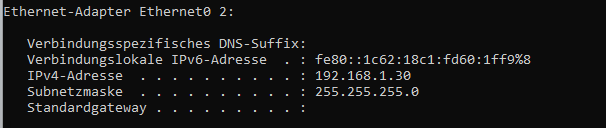

### 6.2 802.1X aktivieren

1. `services.msc` → **Wired AutoConfig** → **Automatisch** → Starten
2.  → `Netzwerk` → `Eigenschaften` des Ethenetadapters → `Authentifizierung` → IEEE 802.1X aktivieren

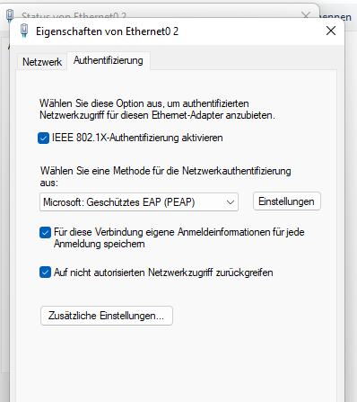

---

## 7. Testen und Verifikation

### 7.1 NPS Event Logs prüfen

1. Auf DC01: `Ereignisanzeige` → `Benutzerdefinierte Ansichten` → `Serverrollen` → `NPS`
2. Hier sollte man unter den **Information** Logs die erfolgreichen Zugriffe sehen.

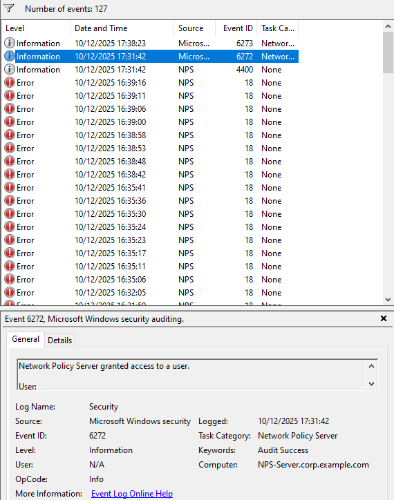

### 7.2 Connectivity Test

1. Auf dem Client sich als `sw_admin` anmelden. (Dieser User ist in der Gruppe **Network-Admins**)
2. wenn man sich nun mit Telnet verbindet, das Anmelden mit der User `sw_admin` möglich sein und dieser sollte außerdem noch priv 15 auf dem Switch haben sollen. 

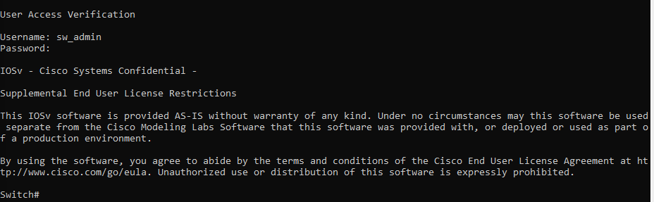
