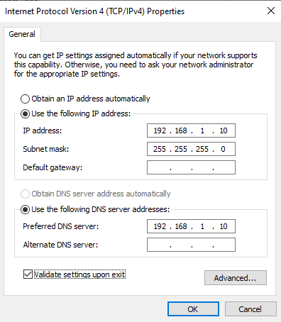

# Einfache PKI-Lab-Umgebung mit AD CS (Single-Tier PKI)

Dieses Dokument beschreibt, wie ich eine einfache PKI-Testumgebung mit Windows Server 2008 R2 aufgebaut habe.  
Ziel: Ein anderer Schüler soll die Schritte nachmachen können, ohne die Installation vorher gesehen zu haben.

> Hinweis: Wo „Screenshot:“ steht, kannst du später Screenshots einfügen.

---

## 1. Lab-Überblick

Wir verwenden vier virtuelle Maschinen im gleichen Subnetz:

- DC01 – Domain Controller
- CA01 – Root CA
- SRV1 – IIS Webserver 
- WIN01 – Client

IP-Adressen:

- DC01.corp.example.com: 192.168.1.10/24  
- CA01.corp.example.com: 192.168.1.11/24  
- SRV1.corp.example.com: 192.168.1.13/24  
- WIN01.corp.example.com: 192.168.1.14/24

Screenshot: kleines Netzdiagramm (4 VMs, IPs, Rollen).

---

## 2. DC01 vorbereiten (Active Directory + DNS)

### 2.1 Servernamen und IP einstellen

1. Computername ändern auf DC01
2. IP-Adressen konfigurieren wie oben geschrieben
3. neustarten


### 2.2 Forest/Domain corp.example.com erstellen

1. Im Servermanager domain installieren wie sonst auch
2. Domain = corp.example.com
3. neustarten

---

## 3. SRV1 vorbereiten (IIS / HTTP CDP & AIA)

### 3.1 SRV1 IP setzen und zur Domäne joinen

1. IP-Adressen konfigurieren so wie oben angeschrieben
2. Computername ändern
3. domain joinen
4. neustarten und dann mit dem Domain Admin anmelden

### 3.2 IIS Webserver installieren

1. Server-Manager → `Rollen` → `Rollen hinzufügen`.
2. `Webserver (IIS)` auswählen → installieren.

### 3.3 Ordner und Freigabe C:\CertEnroll

1. Auf SRV1 `C:\CertEnroll` erstellen.
2. Rechtsklick → `Eigenschaften` → Reiter `Freigabe` → `Erweiterte Freigabe`.
   - Haken bei „Diesen Ordner freigeben“.
   - Freigabename: `CertEnroll`.
   - `Permissions` → Gruppe `corp\Cert Publishers` hinzufügen → „Change“ erlauben.
3. Reiter `Security` → `Bearbeiten`:
   - `corp\Cert Publishers` hinzufügen → „Change“ erlauben.

Screenshot: Freigabeberechtigungen von CertEnroll.

### 3.4 Virtuelles Verzeichnis in IIS anlegen

1. `(IIS)-Manager` öffnen.
2. Unter „Sites“ → `Default Web Site` → Rechtsklick → `Virtuelles Verzeichnis hinzufügen…`.
3. Alias: `CertEnroll`  
   Physikalischer Pfad: `C:\CertEnroll`.
4. Danach in IIS auf `CertEnroll` → `Verzeichnisdurchsuchung` → `Aktivieren`.

Screenshot: IIS mit CertEnroll-Verzeichnis.

### 3.5 Double Escaping aktivieren (für Delta-CRLs)

1. Eingabeaufforderung als Admin auf SRV1 öffnen.
2. Ausführen:
   ```
   cd %windir%\system32\inetsrv
   appcmd set config "Default Web Site" /section:system.webServer/security/requestFiltering -allowDoubleEscaping:true
   iisreset
   ```

Screenshot: CMD mit erfolgreichem `appcmd`-Output.

### 3.6 DNS-Alias pki.corp.example.com erstellen

1. Auf DC01 als `corp\Administrator` → `dnsmgmt.msc` starten.
2. Unter Forward Lookup Zone -> In der Zone `corp.example.com` → Rechtsklick → `Neuer Alias (CNAME)…`.
3. Aliasname: `pki`  
   FQDN des Zielhosts: `SRV1.corp.example.com.` (Punkt am Ende nicht vergessen).

Screenshot: CNAME pki.corp.example.com.

---

## 4. CA01 vorbereiten (Enterprise Root CA)

### 4.1 CA01 IP setzen und zur Domäne joinen

1. IP-Adressen konfigurieren so wie oben angeschrieben
2. Computername ändern + domain joinen
3. neustarten und dann mit dem Domain Admin anmelden

Screenshot: CA01 in der Domäne.

### 4.2 CAPolicy.inf anlegen

1. Im Ordner `C:\Windows\CAPolicy.inf` eine neue Datei erstellen mit diesem Inhalt:

```
[Version]
Signature="$Windows NT$"

[PolicyStatementExtension]
Policies=InternalPolicy

[InternalPolicy]
OID=1.2.3.4.1455.67.89.5
Notice="Legal Policy Statement"
URL=http://pki.corp.example.com/cps.txt

[Certsrv_Server]
RenewalKeyLength=2048
RenewalValidityPeriod=Years
RenewalValidityPeriodUnits=10
LoadDefaultTemplates=0
AlternateSignatureAlgorithm=1
```

2. Sicherstellen, dass die Datei wirklich `CAPolicy.inf` heißt (.inf, nicht .txt).

Screenshot: Notepad mit CAPolicy.inf.

### 4.3 Enterprise Root CA installieren

1. Server-Manager auf CA01 öffnen → `Rollen` → `Rollen hinzufügen`.
2. `Active Directory-Zertifikatdienste` auswählen.
3. Nur `Zertifizierungsstelle` anhaken.
4. Einrichtungsart: `Unternehmens` (Enterprise).
5. CA-Typ: `Stammzertifizierungsstelle`.
6. „Neuen privaten Schlüssel erstellen“.
7. Krypto-Standardwerte belassen.
8. CA-Name: `corp-Root-CA`.
9. Gültigkeitsdauer: `10` Jahre.
10. Standardpfade für DB/Log beibehalten, installieren.

Screenshot: Dialog „CA-Namen konfigurieren“.

---

## 5. Nachkonfiguration der CA (CRLs, AIA/CDP, Auditing)

### 5.1 CRL-Intervalle setzen

Auf CA01, CMD als Admin öffnen:

```
certutil -setreg CA\CRLPeriodUnits 1
certutil -setreg CA\CRLPeriod "Weeks"
certutil -setreg CA\CRLDeltaPeriodUnits 1
certutil -setreg CA\CRLDeltaPeriod "Days"
```

Hiermit stellt man ein für wie lange die CRL und Delta-CRL gültig sind.

### 5.2 CRL-Overlap konfigurieren

```
certutil -setreg CA\CRLOverlapPeriodUnits 12
certutil -setreg CA\CRLOverlapPeriod "Hours"
```

Damit gibt es eine Überlappungszeit, in der Clients eine neue CRL holen können, bevor die alte abläuft.

### 5.3 Gültigkeit für ausgestellte Zertifikate

```
certutil -setreg CA\ValidityPeriodUnits 5
certutil -setreg CA\ValidityPeriod "Years"
```

Endentitätszertifikate sollen max. 5 Jahre gültig sein.

### 5.4 CA-Auditing aktivieren

```
certutil -setreg CA\AuditFilter 127
```

Dann in der lokalen Sicherheitsrichtlinie:

1. `secpol.msc` öffnen.
2. `Lokale Richtlinien` → `Überwachungsrichtlinie`.
3. `Überwachung des Objektzugriffs` → Erfolg + Fehler aktivieren.

Screenshot: Richtlinie „Überwachung des Objektzugriffs“.

---

## 6. AIA- und CDP-URLs konfigurieren

### 6.1 AIA (Authority Information Access)
Auf CA01: 
```
certutil -setreg CA\CACertPublicationURLs ^
"1:C:\Windows\system32\CertSrv\CertEnroll\%1_%3%4.crt\n2:ldap:///CN=%7,CN=AIA,CN=Public Key Services,CN=Services,%6%11\n2:http://pki.corp.example.com/CertEnroll/%1_%3%4.crt"

certutil -getreg CA\CACertPublicationURLs
```

Screenshot: certutil-Ausgabe und ggf. CA-Eigenschaften → Erweiterungen → AIA.

### 6.2 CDP (CRL Distribution Point)

```
certutil -setreg CA\CRLPublicationURLs ^
"65:C:\Windows\system32\CertSrv\CertEnroll\%3%8%9.crl\n79:ldap:///CN=%7%8,CN=%2,CN=CDP,CN=Public Key Services,CN=Services,%6%10\n6:http://pki.corp.example.com/CertEnroll/%3%8%9.crl\n65:file://\\Srv1.corp.example.com\CertEnroll\%3%8%9.crl"

certutil -getreg CA\CRLPublicationURLs
```

Screenshot: CA-Eigenschaften → Erweiterungen → CDP.

### 6.3 CA-Zertifikat und CRL veröffentlichen

```
cd C:\Windows\System32\CertSrv\CertEnroll
copy "CA01.corp.example.com_corp-Root-CA.crt" \\Srv1.corp.example.com\C$\CertEnroll
net stop certsvc && net start certsvc
```

Dann in `certsrv.msc`:

1. Rechtsklick auf „Widerrufene Zertifikate“ → `Alle Tasks` → `Veröffentlichen…`.
2. „Neue CRL“ auswählen.

---

## 7. WIN01-Client in die Domäne aufnehmen

1. IP-Adressen konfigurieren so wie oben angeschrieben
2. Computername ändern + domain joinen 
3. neustarten und dann mit dem Domain Admin anmelden

Screenshot: WIN01 als Mitglied der Domäne.

---

## 8. PKI-Gesundheit prüfen

### 8.1 Enterprise PKI (PKIView.msc)

Auf CA01:

1. `pkiview.msc` starten.
2. Unter „Enterprise PKI“ die `corp Root CA` auswählen.
3. Prüfen, dass CA-Zertifikat, AIA-URLs und CDP-URLs alle Status „OK“ anzeigen.
4. Auf `Enterprise PKI` rechtsklicken und dann über „Manage AD Containers“ die Einträge für NTAuth, AIA, CDP etc. kontrollieren.

Screenshot: PKIView mit allen Einträgen auf OK.

### 8.2 Testzertifikat einschreiben und prüfen

Auf CA01:

1. `certsrv.msc` öffnen.
2. Rechtsklick auf `Zertifikatvorlagen` → `Neu` → `Auszustellende Zertifikatvorlage`.
3. „Workstation Authentication“ auswählen.

Auf WIN01:

1. `mmc` starten → Snap-In „Zertifikate (Computerkonto)“ hinzufügen.
2. Unter `Persönlich` → `Zertifikate` → Rechtsklick → `Alle Tasks` → `Neues Zertifikat anfordern`.
3. „Active Directory-Richtlinie“ verwenden, „Workstation Authentication“ auswählen, einschreiben.

Screenshot: Erfolgreicher Abschluss des Zertifikatsanforderungsassistenten.

Zertifikat exportieren und prüfen:

1. `WIN01.corp.example.com`-Zertifikat ohne privaten Schlüssel als `C:\win01.cer` exportieren.
2. CMD als Admin:

```
cd \
certutil -url C:\win01.cer
```

3. Zuerst „CRLs (from CDP)“ → `Retrieve` → Status sollte „Verified“ sein.
4. Dann „Certs (from AIA)“ → `Retrieve` → ebenfalls „Verified“.
5. Danach:

```
certutil -verify -urlfetch C:\win01.cer
```

6. Ausgabe durchscrollen und prüfen, dass Kette und Sperrstatus erfolgreich verifiziert werden.

