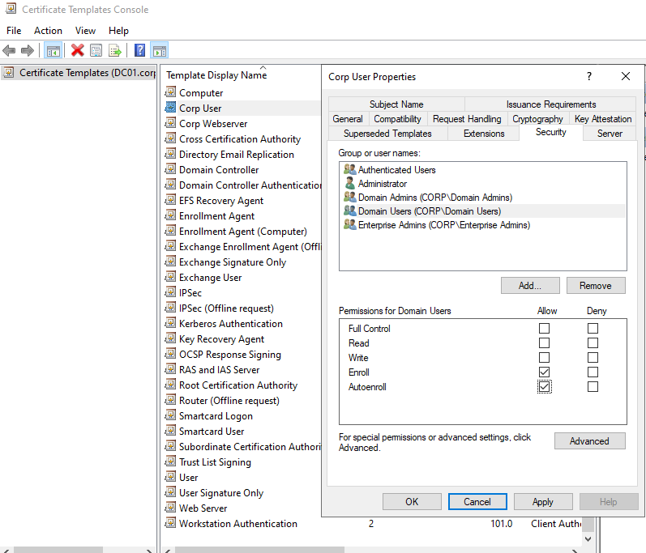
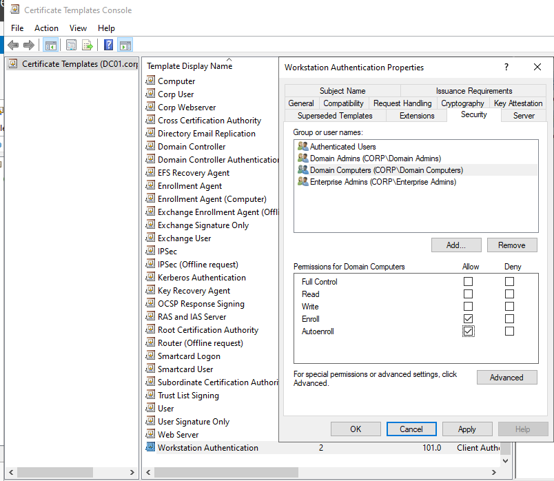
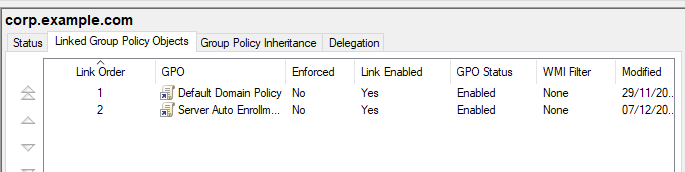
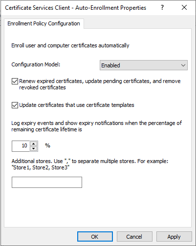
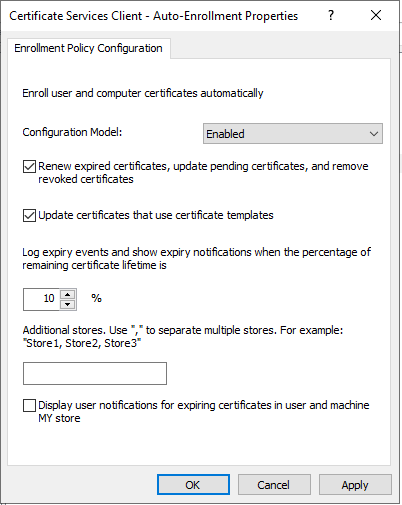
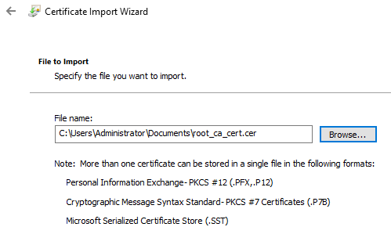
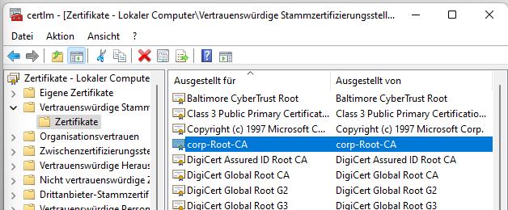

# Configure GPO for certification services

Erforschen Sie, wie das Root-Zertifikat in der Domäne publiziert und an alle Systeme verteilt werden kann. Konfigurieren Sie das Auto-enrollment für Domänen-Computer und -User.
 Dokumentieren Sie Ihre Ergebnisse in Form eines HowTo.

---

## Voraussetzungen

Die Topologie von den vorherigen Modulen einfach weiterverwenden. 

---

## 1. Auto-Enrollment für Serverzertifikate konfigurieren

0. Certificate Templates anpassen.
- auf der CA -> certsrv.msc öffnen
- Certificate Templates > rechtsclick > "manage"
- die Templates die auto enrolled werden sollen (das template **"corp User"**, und **"Workstation Authentication"**)
- diese templates rechtsclicken > "properties"
- im Reiter "Security" die jeweilige Gruppe auswählen und "Autoenroll" anhaken
   - bei corp user die Gruppe **"Domain Users"**
   - bei Workstation Authentication die Gruppe **"Domain Computers"** 
- dann > apply
*(!Wichtig) das Corp_User template erwartet das der user eine Email eingetragen hat!!*

   

   

1. Öffne auf einem Domänencontroller die **Group Policy Management** Konsole.
2. Erstelle eine neue GPO und verknüpfe sie mit der Domäne bzw. der OU, in der die Serverobjekte liegen. 

3. Rechtsklick auf die GPO → **Edit**  
4. Navigiere zu:  
   **Computer Configuration** → **Policies** → **Windows Settings** → **Security Settings** → **Public Key Policies**  
5. Doppelklicke auf **Certificate Services Client – Auto-Enrollment**  
6. Setze:
   - **Configuration Model** auf **Enabled**.
   - Aktiviere **Renew expired certificates, update pending certificates, and remove revoked certificates**.
   - Aktiviere **Update certificates that use certificate templates**  
7. Bestätige mit **OK**  

Diese Konfiguration sorgt dafür, dass Computerzertifikate auf den Zielservern automatisch angefordert, erneuert und verwaltet werden, basierend auf den konfigurierten Zertifikatvorlagen

---

## 2. Auto-Enrollment für Benutzerzertifikate konfigurieren

1. In derselben GPO im Group Policy Management Editor navigiere zu:  
   **User Configuration** → **Policies** → **Windows Settings** → **Security Settings** → **Public Key Policies**  
2. Doppelklicke auf **Certificate Services Client – Auto-Enrollment**  
3. Setze:
   - **Configuration Model** auf **Enabled**.
   - Aktiviere **Renew expired certificates, update pending certificates, and remove revoked certificates**.
   - Aktiviere **Update certificates that use certificate templates**  
4. Bestätige mit **OK** und schließe den Group Policy Management Editor  

Damit werden Benutzerzertifikate ebenfalls automatisch ausgestellt und erneuert, sofern passende Vorlagen für Benutzer konfiguriert sind

---

## 3. Gruppenrichtlinie auf Servern aktualisieren

Damit die Auto-Enrollment-Einstellungen wirksam werden:

1. Warte den normalen GPO-Refresh ab oder führe auf den Zielservern eine Aktualisierung aus, z.B. mit:  
   `gpupdate /force` in einer administrativen Eingabeaufforderung oder PowerShell  
2. Nach der Aktualisierung versuchen die Server bzw. Benutzer beim nächsten An- oder Abmelden, Zertifikate gemäß den Richtlinien und Vorlagen zu beziehen

---

## 4. Verteilung von Zertifikaten per GPO (Trusted Root / SSL)

Dieses Szenario wird verwendet, um vorhandene Zertifikate (z.B. Root-CA-Zertifikate oder öffentliche SSL-Zertifikate von AD FS/Webservern) auf Clientcomputer zu verteilen.

### 4.1 GPO vorbereiten

1. Öffne **Group Policy Management** auf einem Domänencontroller.  
2. Erstelle eine neue GPO.  
3. Rechtsklick auf die GPO → **Edit**.  

### 4.2 Zertifikat in „Trusted Root Certification Authorities“ importieren

1. Navigiere im Editor zu:  
   **Computer Configuration** → **Policies** → **Windows Settings** → **Security Settings** → **Public Key Policies**.  
2. Rechtsklick auf **Trusted Root Certification Authorities** → **Import**.  

3. Im **Certificate Import Wizard**:
   - Klicke auf der Willkommensseite auf **Next**.
   - Gib auf der Seite **File to Import** den Pfad zur Zertifikatdatei an, und klicke **Next**.  
   - Wähle **Place all certificates in the following store** und stelle sicher, dass der Store **Trusted Root Certification Authorities** verwendet wird, dann **Next**.  
   - Kontrolliere die Zusammenfassung und klicke **Finish**.  
4. Wiederhole den Importvorgang für alle weiteren zu verteilenden Zertifikate.  

Diese GPO sorgt dafür, dass das/ die importierten Zertifikat(e) als vertrauenswürdige Stammzertifizierungsstellen auf allen Computern angewendet werden, die in den Geltungsbereich der GPO fallen.

---

## 5. Geltungsbereich und Sicherheitsfilterung prüfen

- Stelle sicher, dass die GPO mit den richtigen OUs, Sites oder der Domäne verknüpft ist, sodass alle relevanten Computer/Benutzer erfasst werden.  
- Prüfe ggf. die **Security Filtering** der GPO und stelle sicher, dass die Zielcomputer die Berechtigung **Apply group policy** haben

---

## 6. Funktionstest auf einem Client

1. Führe auf einem Test-Client `gpupdate /force` aus  
2. Öffne anschließend **certmgr.msc** (für Benutzerzertifikate) bzw. **certlm.msc** (für Computerzertifikate) und prüfe:
   - Unter **Trusted Root Certification Authorities → Certificates**, ob das verteilte Root-/SSL-Zertifikat vorhanden ist.  
   - Unter **Personal → Certificates**, ob das Auto-Enrollment-Zertifikat (Computer oder Benutzer) ausgestellt wurde  

Wenn die Zertifikate korrekt erscheinen, ist die Verteilung per GPO und Auto-Enrollment erfolgreich umgesetzt
