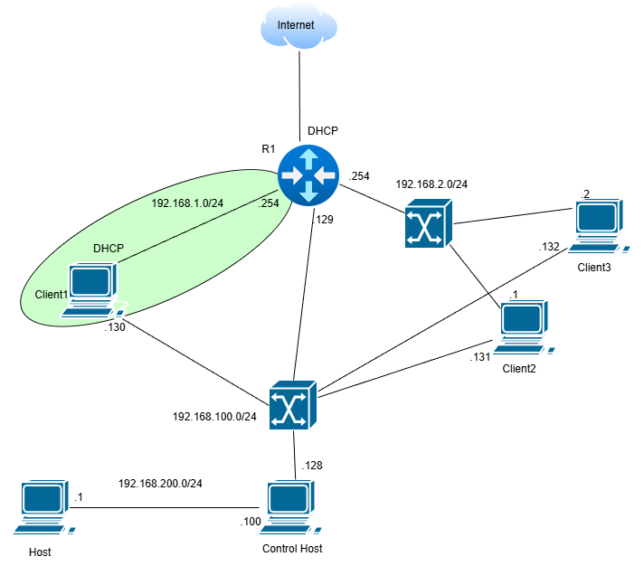
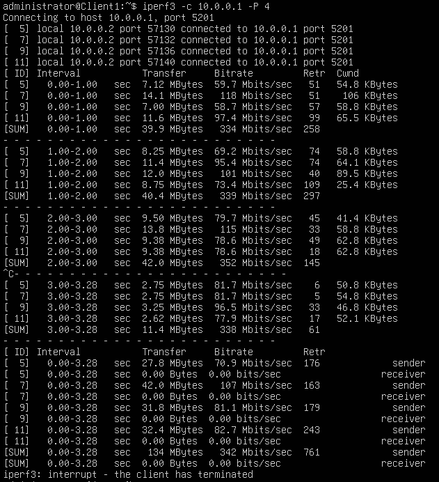
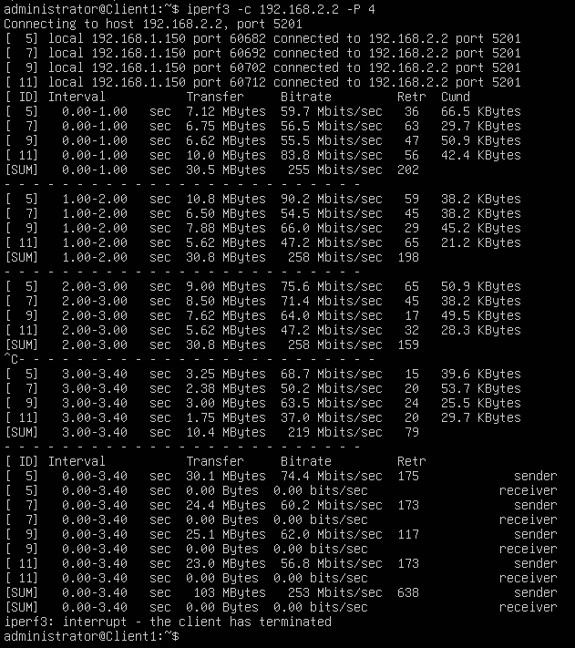
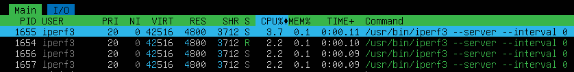

# WireGuard Dual-Stack VPN

## TOPO

## Plan
Aufbauend auf einer bestehenden Netzwerkumgebung (z. B. aus vorherigen BS-Aufgaben).

Wir konfigurieren einen WireGuard Dual-Stack (IPv4 + IPv6) VPN-Tunnel zwischen Client1 und Client3. Die Konfiguration wird über ein Ansible-Skript automatisiert, das WireGuard installiert, Schlüssel generiert und die Konfigurationsdateien erstellt. Client3 agiert als Listener (Server-Seite), Client1 als Connector (Client-Seite).

- VPN-Subnetz: IPv4 10.0.0.0/24, IPv6 fd0d:86fa:c3bc::/64
- Endpoint: Client3 hört auf Port 51820 (IP: 192.168.2.2)

Nach der Konfiguration testen wir den Durchsatz mit iperf und die CPU-Auslastung mit htop.

## Client3 (Listener)
| Interface | IP-Adressen                  | Rolle      |
|-----------|------------------------------|------------|
| wg0      | 10.0.0.1/24, fd0d:86fa:c3bc::1/64 | VPN-Interface |
| ens38    | 192.168.2.2 (Beispiel-IP)  | Extern    |

### Konfiguration (via Ansible-Skript)
- Installiere WireGuard: `apt install wireguard`
- Erstelle Verzeichnis: `/etc/wireguard` mit Modus 0700
- Generiere privaten Schlüssel: `wg genkey > /etc/wireguard/private.key` (mit umask 077)
- Setze Berechtigungen: `chmod 0600 /etc/wireguard/private.key`
- Generiere öffentlichen Schlüssel: `cat /etc/wireguard/private.key | wg pubkey > /etc/wireguard/public.key`
- Hole öffentlichen Schlüssel von Client1 (via Ansible slurp und delegate_to)
- Erstelle Konfigurationsdatei `/etc/wireguard/wg0.conf`:
`[Interface]`
`Address = 10.0.0.2/24, fd0d:86fa:c3bc::2/64`
`PrivateKey = <Inhalt von private.key>`
`[Peer]`
`PublicKey = <Öffentlicher Schlüssel von Client3>`
`AllowedIPs = 10.0.0.1/32, fd0d:86fa:c3bc::1/128`
`Endpoint = 192.168.2.2:51820`
`PersistentKeepalive = 25`
- Setze Berechtigungen: `chmod 0600 /etc/wireguard/wg0.conf`
- Starte Service: `systemctl enable --now wg-quick@wg0`

### Nach Konfiguration
- Überprüfe Status: `wg show`
- Jetzt [TESTEN](#testen)

## Client1 (Connector)
| Interface | IP-Adressen                  | Rolle      |
|-----------|------------------------------|------------|
| wg0      | 10.0.0.2/24, fd0d:86fa:c3bc::2/64 | VPN-Interface |
| ens37    | 192.168.1.x (Beispiel-IP)   | Extern    |

### Konfiguration (via Ansible-Skript)
- Installiere WireGuard: `apt install wireguard`
- Erstelle Verzeichnis: `/etc/wireguard` mit Modus 0700
- Generiere privaten Schlüssel: `wg genkey > /etc/wireguard/private.key` (mit umask 077)
- Setze Berechtigungen: `chmod 0600 /etc/wireguard/private.key`
- Generiere öffentlichen Schlüssel: `cat /etc/wireguard/private.key | wg pubkey > /etc/wireguard/public.key`
- Hole öffentlichen Schlüssel von Client3 (via Ansible slurp und delegate_to)
- Erstelle Konfigurationsdatei `/etc/wireguard/wg0.conf`:
`[Interface]`
`Address = 10.0.0.1/24, fd0d:86fa:c3bc::1/64`
`ListenPort = 51820`
`PrivateKey = <Inhalt von private.key>`
`[Peer]`
`PublicKey = <Öffentlicher Schlüssel von Client1>`
`AllowedIPs = 10.0.0.2/32, fd0d:86fa:c3bc::2/128`
- Setze Berechtigungen: `chmod 0600 /etc/wireguard/wg0.conf`
- Starte Service: `systemctl enable --now wg-quick@wg0`

### Nach Konfiguration
- Überprüfe Status: `wg show`
- Stelle sicher, dass der Tunnel aufbaut (Ping über VPN-IPs testen)
- Jetzt [TESTEN](#testen)

## Router (Ubuntu mit GUI)
Falls ein Router dazwischen benötigt wird (z. B. aus BS1.1), stelle sicher, dass Routing für die VPN-Subnetze aktiviert ist und Firewalls UDP-Port 51820 durchlassen.

| Interface | IP          | LAN Segment |
|-----------|-------------|-------------|
| ens37     | 192.168.1.254 | Lan_1-1   |
| ens38     | 192.168.2.254 | Lan_2-1   |

### Konfiguration
- IP-Konfiguration wie in der Tabelle (via GUI oder netplan)
- Routing aktivieren: Entkommentiere `net.ipv4.ip_forward=1` in `/etc/sysctl.conf` und lade mit `sysctl -p`
- Teste Ping zwischen Client1 und Client3 über externe IPs
- Eventuell Firewall anpassen: Erlaube UDP 51820

## Testen
### Tunnel-Verbindung Testen
- Auf beiden Clients: `wg show` (sollte Peers und Handshakes anzeigen)

Bild zeigt den Status des WireGuard-Interfaces und verbundene Peers.

- Ping-Test: Von Client1 zu Client3 über VPN-IPs (z. B. `ping 10.0.0.1` und `ping fd0d:86fa:c3bc::1`)

### Durchsatz Testen mit iperf
- Installiere iperf auf beiden: `apt install iperf3`
- Auf Client3 (Server): `iperf3 -s` (IPv4)
- Auf Client1 (Client): `iperf3 -c 10.0.0.1 -P 4`
- Erwarteter Output: Zeigt Bandbreite in Mbits/sec (z. B. 100-500 Mbits/sec je nach Netzwerk)

Bild zeigt den gemessenen Datendurchsatz über den VPN-Tunnel. Wie wir hier sehen können macht es keinen deutlichen Unterschied im throughput.

### CPU-Auslastung Testen mit htop
- Installiere htop: `sudo apt install htop`
- Während iperf läuft: Starte `htop` auf beiden Clients
- Überwache CPU-Nutzung des iperf-Prozesses (sollte niedrig sein, z. B. <10% auf moderner Hardware)

Bild zeigt die CPU-Auslastung während des iperf-Tests. Hier sehen wir zwar einen kleinen aber dennoch betrachtlichen unterschied. Während der iperf test durch die öffentliche/external IP eine auslastung von 6.6% zeigt, sehen wir, dass die Auslastung beim VPN-Tunnel 3.7% beträgt. 