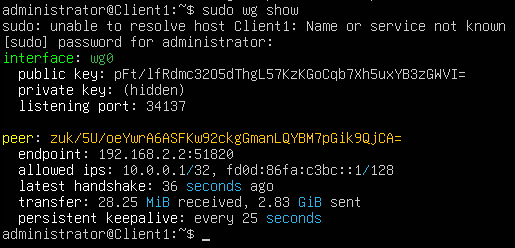
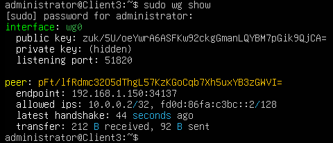
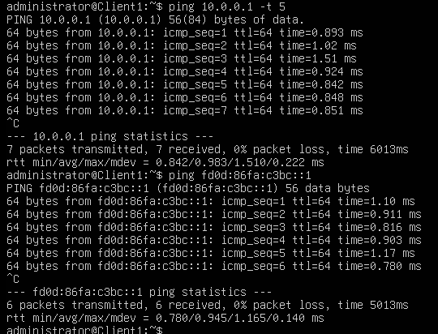
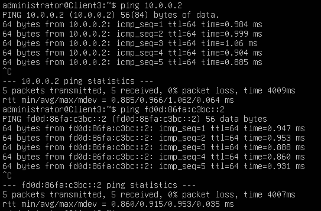

## TOPO
```
             Internet
                |
                |
Client 1 --- Router --- Client 2
```
## Router setup
- Interfaces Konfigurieren
    LAN1: 192.168.1.x/24
    LAN2: 192.168.2.x/24

    LAN 1/2 Default gateway : x.x.x.254 -> am router

- Routing aktivieren: Entkommentiere `net.ipv4.ip_forward=1` in `/etc/sysctl.conf` und lade mit `sysctl -p`

## iptables
setze dns server auf client1 und 2
```
sudo resolvectl dns ens37 8.8.8.8 1.1.1.1 
```

```
sudo iptables -t nat -A POSTROUTING -o <internet interface> -j MASQUERADE
```

```
sudo iptables -A FORWARD -i <local> -o <internet> -j ACCEPT
sudo iptables -A FORWARD -i <internet> -o <local> -j ACCEPT
```

iptables persistent machen

```
sudo apt-get install iptables-persistent
sudo netfilter-persistent save
```

## Wiregurad

- install (client 1 und client 2)

    ```
    sudo apt update
    sudo apt install -y wireguard
    ```

- Wire guard verzeichniss anlegen (beide)

    ```
    sudo mkdir -p /etc/wireguard
    sudo chmod 700 /etc/wireguard
    ```

- Private Keys erzeugen (beide clients)

    ```
    umask 077
    wg genkey | sudo tee /etc/wireguard/private.key
    sudo chmod 600 /etc/wireguard/private.key
    ```

- Public Keys erzugen (beide clients)
    ```
    sudo cat /etc/wireguard/private.key | wg pubkey | sudo tee /etc/wireguard/public.key
    ```

- public keys austauschen (Client1 <--> Client2)
    ```
    cat /etc/wireguard/public.key
    ```

    diesen Schüssel des jeweiligen Clients dann im unteren schritt einfügen

- Wireguard konfigurieren

    Client2 (Listener)
    ```
    sudo nano /etc/wireguard/wg0.conf
    ```

    ```
    [Interface]
    Address = 10.0.0.1/24, fd0d:86fa:c3bc::1/64
    ListenPort = 51820
    PrivateKey = <CLIENT3_PRIVATE_KEY>

    [Peer]
    PublicKey = <CLIENT1_PUBLIC_KEY>
    AllowedIPs = 10.0.0.2/32, fd0d:86fa:c3bc::2/128
    ```
    Sichern:
    ```
    sudo chmod 600 /etc/wireguard/wg0.conf
    ```
    
    ---

    Client1 (Connector)
    ```
    sudo nano /etc/wireguard/wg0.conf
    ```

    ```
    [Interface]
    Address = 10.0.0.2/24, fd0d:86fa:c3bc::2/64
    PrivateKey = <CLIENT1_PRIVATE_KEY>

    [Peer]
    PublicKey = <CLIENT3_PUBLIC_KEY>
    AllowedIPs = 10.0.0.1/32, fd0d:86fa:c3bc::1/128
    Endpoint = 192.168.2.1:51820
    PersistentKeepalive = 25
    ```

    wieder sichern:
    ```
    sudo chmod 600 /etc/wireguard/wg0.conf
    ```

- Wireguard starten

    auf beiden clients:
    ```
    sudo systemctl enable wg-quick@wg0
    sudo systemctl start wg-quick@wg0
    ```

    command zum neustarten:
    ```
    sudo systemctl restart wg-quick@wg0
    ```

- Prüfen
    Status
    ```
    sudo wg show
    ```

    Ping:
    ```
    ping 10.0.0.1   # von Client1
    ping 10.0.0.2   # von Client2

    ping6 fd0d:86fa:c3bc::1
    ping6 fd0d:86fa:c3bc::2

    ```

- Debuggen
    Die Router firewall blockiert udb
    -> einfachste lösung:
    ```
    sudo ufw disable
    ```


## Testen
### Tunnel-Verbindung Testen
- Auf beiden Clients: `wg show` (sollte Peers und Handshakes anzeigen)



Bild zeigt den Status des WireGuard-Interfaces und verbundene Peers.

- Ping-Test: Von Client1 zu Client3 über VPN-IPs (z. B. `ping 10.0.0.1` und `ping fd0d:86fa:c3bc::1`)



### Durchsatz Testen mit iperf
- Installiere iperf auf beiden: `apt install iperf3`
- Auf Client3 (Server): `iperf3 -s` (IPv4)
- Auf Client1 (Client): `iperf3 -c 10.0.0.1 -P 4`
- Erwarteter Output: Zeigt Bandbreite in Mbits/sec (z. B. 100-500 Mbits/sec je nach Netzwerk)


Bild zeigt den gemessenen Datendurchsatz über den VPN-Tunnel. Wie wir hier sehen können macht es keinen deutlichen Unterschied im throughput.


### CPU-Auslastung Testen mit htop
- Installiere htop: `sudo apt install htop`
- Während iperf läuft: Starte `htop` auf beiden Clients
- Überwache CPU-Nutzung des iperf-Prozesses (sollte niedrig sein, z. B. <10% auf moderner Hardware)


Bild zeigt die CPU-Auslastung während des iperf-Tests. Hier sehen wir zwar einen kleinen aber dennoch betrachtlichen unterschied. Während der iperf test durch die öffentliche/external IP eine auslastung von 6.6% zeigt, sehen wir, dass die Auslastung beim VPN-Tunnel 3.7% beträgt. 