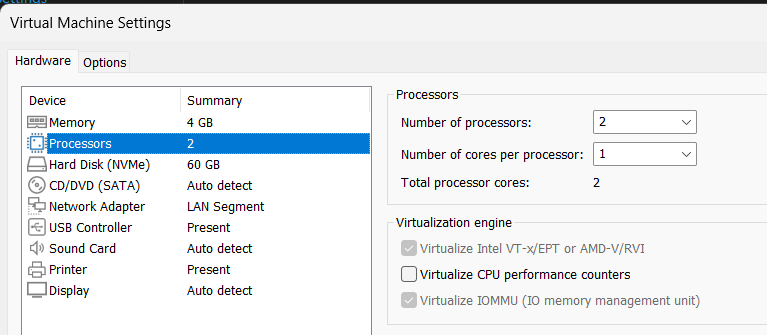
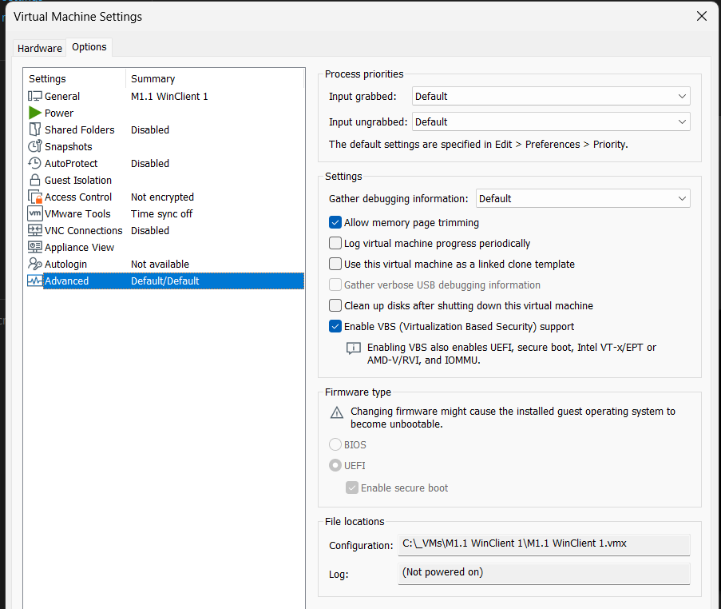
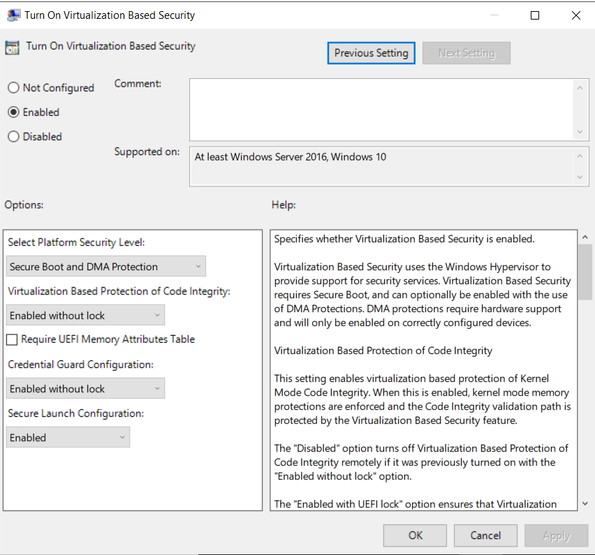
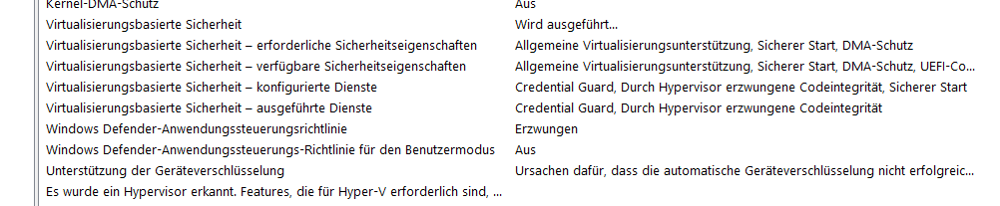
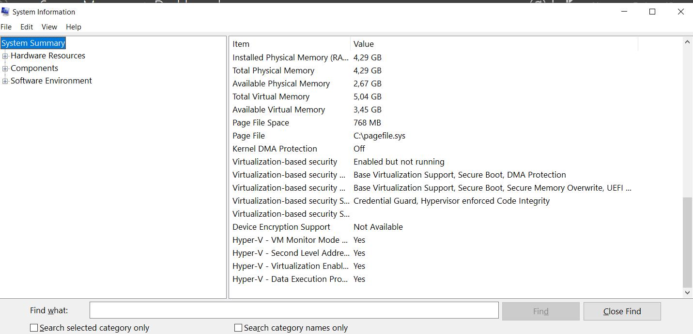
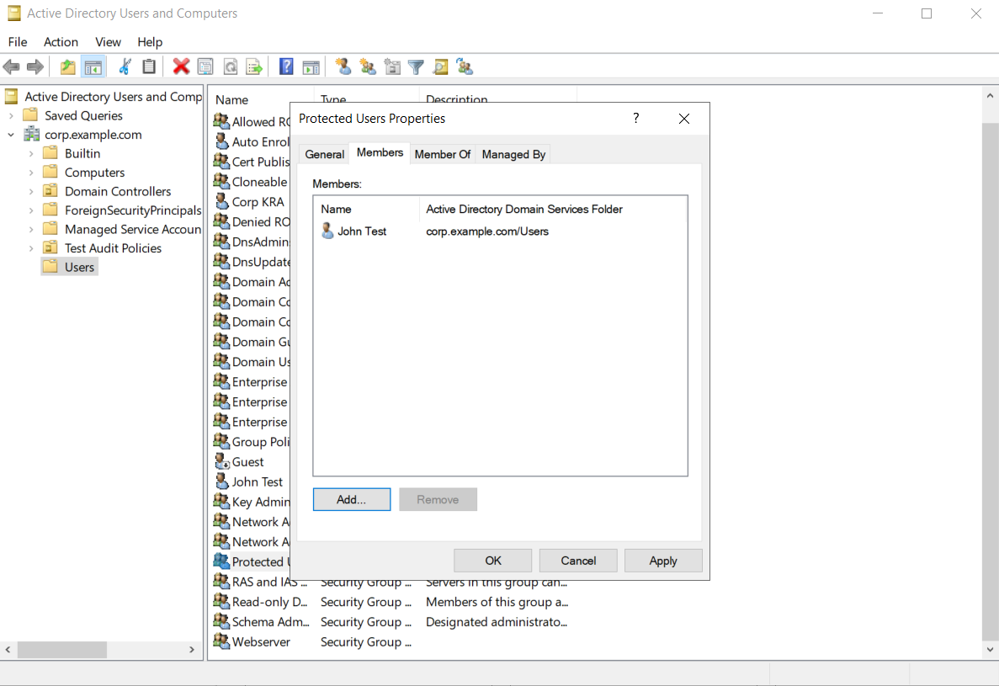

# Credential Guard und Protected User

## Plan
 Login-Daten sind das bevorzugte Einfallstor für alle Arten von Angriffen auf System und ganze Netze. Schutzmechanismen für Windows umfassen…
- Credential Guard
- Protected Users Security Group
 

Diese schauen wir uns geneauer an. Wie man sie implementiert und was für Funktionen diese haben

## Credential Guard
Normalerweise speichert Windows deine Passwörter oder „Anmelde-Tokens“ (digitale Schlüssel) im Arbeitsspeicher. Wenn sich ein Hacker Zugriff auf dein System verschafft, könnte er diese Schlüssel stehlen.

Credential Guard nutzt Virtualisierung, um diese sensiblen Daten in einem isolierten Bereich zu verstecken.

Der Hauptzweck ist der Schutz vor Identitätsdiesbahl. Es schützt vor allem gegen 
- Pass-the-Hash: Ein Angreifer stiehlt nicht dein Passwort, sondern den daraus berechneten Hash, um sich damit gegenüber anderen Servern als du auszugeben.

- Pass-the-Ticket: Ähnlich wie Pass-the-Hash, nur mit Kerberos-Tickets in Firmennetzwerken.

### Konfiguration

Vorraussetzungen (Es kann sein, dass VMWare das nicht supported):
VM / Settings:
- Hardware / Processors:
    - Virtualize Intel VT-x/EPT or AMD-V/RVI
    -  Virtualize IOMMU /IO memory management unit) anhaken!
    
    
- Options / Advanced:
    - Settings / Enable VBS (Virtualization Based Security) support
    - Firmware type / UEFI + Enable secure boot anhaken!
    
    
VBS enablen mit einer GPO:
Unter Group Policy Management folgende Policy suchen: Computer Configuration\Policies\Administrative Templates\System\Device Guard

### Testen
msinfo.exe:

Falls die Einstellungen für die Vorraussetzungen nicht angezeigt werden in VMWare wird VBS nicht supported und msinfo sieht so aus:

## Protected User
Es handelt sich um eine spezielle Sicherheitsgruppe im Active Directory. Wenn du einen Benutzer in diese Gruppe verschiebst, wendet Windows automatisch bestimmte Sicherheitsregeln für dieses Konto an. Wie z.B.

- NTLM wird als Anmeldemethode komplett blockiert. Nur Kerberos ist erlaubt
- Verkürzte Ticket Expiry Time für das TGT
- Passwörter werden nicht mehr im Cache gespeichert

Um einen User in die Gruppe der Protected User hinzuzufügen, muss man diesen lediglich in die AD-Gruppe "Protected Users" hinzufügen.

