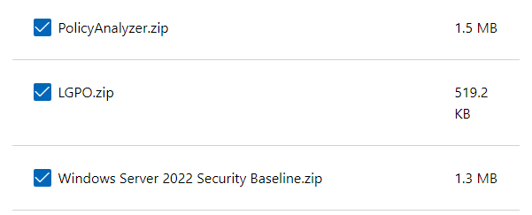

# 3.2 - Windows Security Baseline
Implementieren Sie eine umfassende Security-Konfiguration von Windows Server mithilfe der aktuellen Security Baseline. Dieser Satz an Group Policy Rules kann mithilfe des Microsoft Security Compliance Toolkits konfiguriert und angewendet werden.

Ich habe den DC1-1 aus B1 verwendet (Es wird ein NAT Adapter für Downloads benötigt)

## Tools downloaden

Microsoft Security Compliance Toolkit auf dem Server downloaden:

https://www.microsoft.com/en-us/download/details.aspx?id=553194

folgende Tools auswählen und entzippen:

## Baseline im AD Anwenden

- Kopieren des gesamten Inhaltes des Ordners 
`Windows Server-2022-Security-Baseline\templates`
in den policy definitions Store:
`C:\Windows\SYSVOL\sysvol\<domain-name>\Policies\PolicyDefinitions`

- Gruppenrichtlinienverwaltung öffnen (gpmc.msc)

- Neue leere GPO namens Windows Security Baseline erstellen -> rechtsklick Import Settings -> Ordner Windows Server-2022-Security-Baseline\GPOs auswählen -> GPO auswählen (in diesem Fall MSFT Windows Server 2022 -Domain Controller)

- GPO aktivieren ( Details -> Objektstatus -> Aktiviert)

- GPO mit OU (hier Domain Controllers)verknüpfen per drag and drop GPO auf OU ziehen

## Überprüfung

- Policy Analyzer starten (PolicyAnalyzer.exe)
- Über Add -> 

