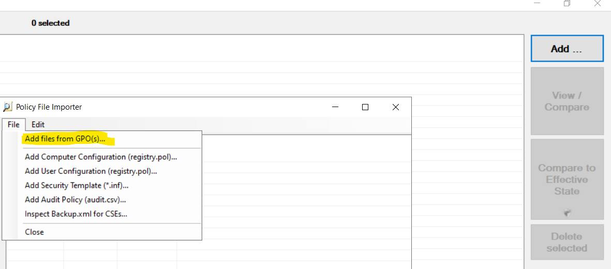
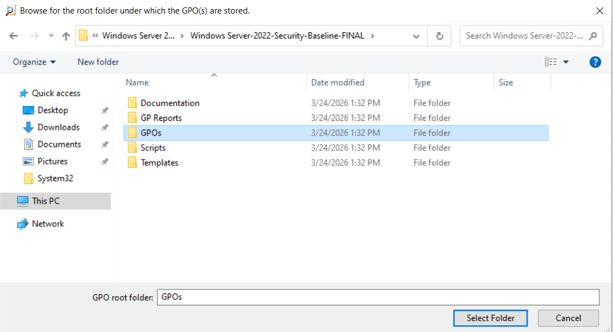
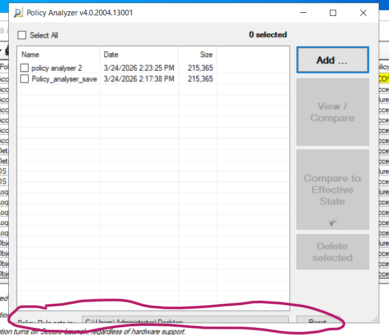
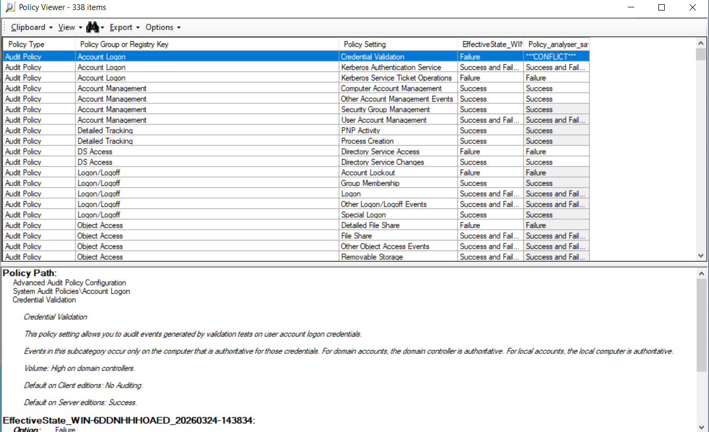

# 3.2 - Windows Security Baseline

Implementieren Sie eine umfassende Security-Konfiguration von Windows Server mithilfe der aktuellen Security Baseline. Dieser Satz an Group Policy Rules kann mithilfe des Microsoft Security Compliance Toolkits konfiguriert und angewendet werden.

Ich habe den DC1-1 aus B1 verwendet (Es wird ein NAT Adapter für Downloads benötigt)

## Tools downloaden

Microsoft Security Compliance Toolkit auf dem Server downloaden:

[https://www.microsoft.com/en-us/download/details.aspx?id=553194](https://www.microsoft.com/en-us/download/details.aspx?id=553194)

folgende Tools auswählen und entzippen:

## Baseline im AD Anwenden

- Kopieren des gesamten Inhaltes des Ordners
`Windows Server-2022-Security-Baseline\templates`
in den policy definitions Store:
`C:\Windows\SYSVOL\sysvol\<domain-name>\Policies\PolicyDefinitions`

- Gruppenrichtlinienverwaltung öffnen (gpmc.msc)

- Neue leere GPO namens Windows Security Baseline erstellen -> rechtsklick Import Settings -> Ordner Windows Server-2022-Security-Baseline\GPOs auswählen -> GPO auswählen (in diesem Fall MSFT Windows Server 2022 -Domain Controller)

- GPO aktivieren ( Details -> Objektstatus -> Aktiviert)

- GPO mit OU (hier Domain Controllers)verknüpfen per drag and drop GPO auf OU ziehen

## Überprüfung

- Policy Analyzer starten (PolicyAnalyzer.exe)
- "ADD" die "Windows Security Baseline" GPO's einfügen ->

    

    dann:

    

    die GPOS sollten aufgezählt werden. Das GPO Set (die liste der GPOs in diesem Fall die Baselines) im vorgeschlagenen ordner abspeichern. Falls sie an einem bestimmeten ort abgespeichert werden sollen muss dieser ort ganz unten in der software ausgewählt werden:

    

    dann wird wie im screenshot zu sehen das set unter dem eingegebenen Namen angezeigt.

- Das set anhacken und rechts "View / Compare" oder "Compare to Effective State" anclicken.
  - view / compare zeigt ein einzelnes set an oder vergleicht 2 sets miteinander.
  - Compare to Effective State erstellt ein neues Set das der Derzeitigen Konfiguration am System entspricht und vergleicht es mit dem ausgewähltem Set.

- In diesem Fenster werden alle Policies aufgezählt:

    

    hier werden conflikte mit "**CONFLICT**" gehighlighted. alles was grau makiert ist heisst dass Werte unterschiedlich sind in den jeweiligen policies.
