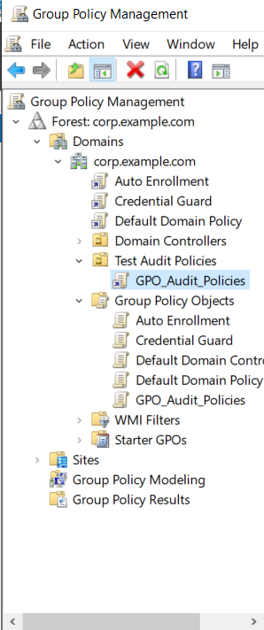
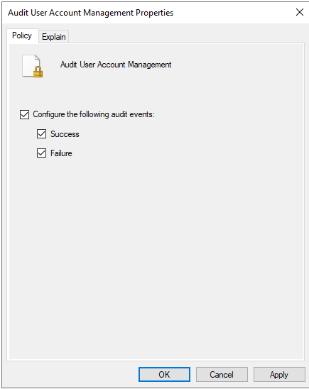
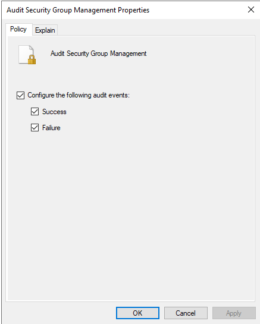
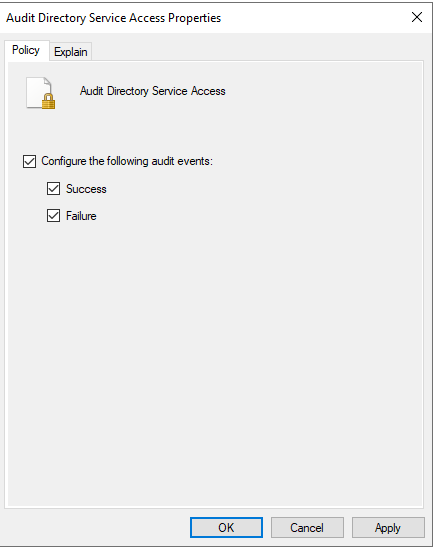
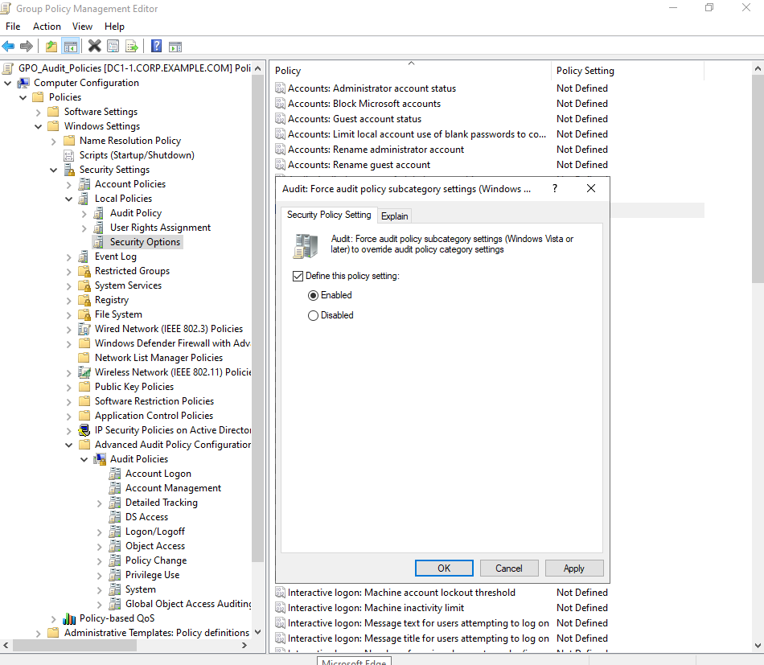
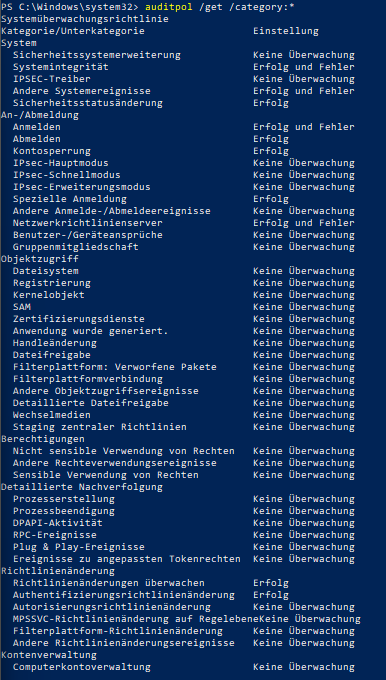
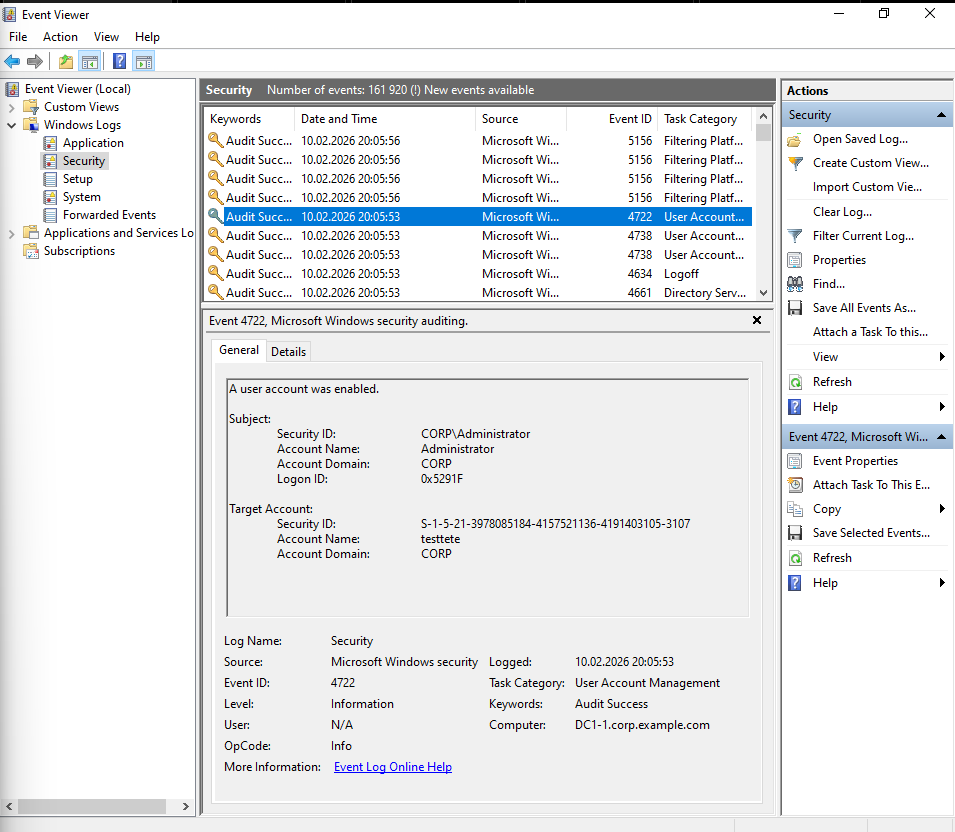
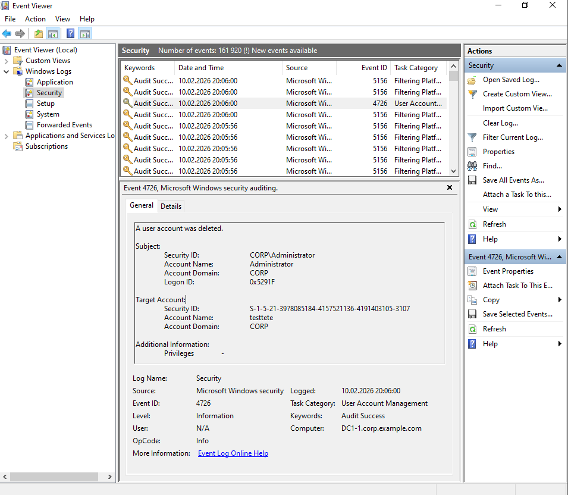

# Advanced Security Audit Policies

## Einführung

Früher gab es in Windows nur 9 grobe Kategorien für die Sicherheitsüberwachung. Das Problem dabei war: Wenn man eine Kategorie aktivierte, wurde man mit unzähligen unwichtigen Ereignissen überflutet (sogenanntes „Log-Spamming“).

Die modernen Advanced Security Audit Policies (Erweiterte Überwachungsrichtlinien) lösen dieses Problem:

- Höhere Genauigkeit: Anstatt 9 grober Kategorien hast du nun über 50 feine Unterkategorien (z. B. gezielt nur für Kerberos-Anmeldungen oder Gruppenänderungen).

- Saubere Logs: Du protokollierst nur das, was für deine Analyse wirklich relevant ist. Dein Sicherheitsprotokoll bleibt übersichtlich und wertvoller Speicherplatz wird nicht verschwendet.

Sobald du eine Einstellung unter "Advanced Audit Policy Configuration" aktivierst, ignoriert Windows die klassischen "Audit Policies" (unter Local Policies), sofern die entsprechende "Force"-Option gesetzt ist.

## Konfiguration

Unter Group Policy Management eine neue GPO anlegen z.b. GPO_Audit_Policies und mit der entsprechenden OU verknüpfen bei dem man das aktiviert haben will. In diesem Fall habe ich eine Test OU erstellt und John Doe ist ein User in der OU.

## Audit User Account Management

Pfad: Computer Configuration/Policies/Windows Settings/Security Settings/Advanced Audit Policy Configuration/Audit Policies/Account Management

Name: Audit User Account Management

Info: Überwacht alle direkten Interaktionen mit Benutzerkonten, wie zum Beispiel das Erstellen, Ändern, Löschen oder Umbenennen von User-Accounts.

## Audit Kerberos Authentication Service

Pfad: Computer Configuration/Policies/Windows Settings/Security Settings/Advanced Audit Policy Configuration/Audit Policies/Account Logon

Name: Audit Kerberos Authentication Service

Info: Protokolliert die Ticket-Anforderungen (TGTs) an den Kerberos-Authentifizierungsdienst, um Anmeldevorgänge auf Protokollebene zu überwachen.

## Audit Security Group Management

Pfad: Computer Configuration/Policies/Windows Settings/Security Settings/Advanced Audit Policy Configuration/Audit Policies/Account Management

Name: Audit Security Group Management

Info: Erfasst jede Änderung an Sicherheitsgruppen, insbesondere wenn Mitglieder hinzugefügt oder entfernt werden oder die Gruppe selbst modifiziert wird.

## Audit Directory Service Changes

Pfad: Computer Configuration/Policies/Windows Settings/Security Settings/Advanced Audit Policy Configuration/Audit Policies/DS Access

Name: Audit Directory Service Changes

Info: Dokumentiert detaillierte Änderungen an Objekten im Active Directory (z. B. Attributänderungen), sofern für diese Objekte eine Überwachung (SACL) konfiguriert wurde

## Enforcement

Damit die granularen "Advanced"-Einstellungen die alten Standard-Kategorien sicher überschreiben, musst du diese Option setzen:

## Testen

Jetzt müssen wir nur noch testen beim User. Vorher noch mit gpupdate /force die GPOs Updaten in der Powershell.
Mit dem Cmdlet `auditpol /get /category:*` kann man schauen welche Audit Policies gerade aktiv sind:

Event Logs können nun im Event Viewer vom Server angeschaut werden. Wie z.B. wenn ein Account erstellt wird:

oder gelöscht wird:

Diese Event Logs wurden künstlich erstellt enfach User erstellen und löschen!
