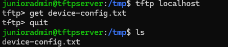
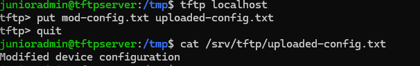

# BS 3.4

## Angabe: 
Betreibe einen TFTP-Server für die Sicherung der Configs von Infrastruktur-Devices und sichere ihn durch AppArmor durch die Erstellung eines eigenen Profils ab. Der Server und die Absicherung wird entweder mit einem TFTP-Client oder mit einem enstprechenden Infrastruktur-Device getestet. Zum Schluss ist die Vorgangsweise und das erstellte Profil im Dossier dokumentiert.

Siehe:
- Linux-Server, Das umfassende Handbuch, 7., aktualisierte Auflage, Rheinwerk Verlag, 2023, Kapitel 30.3
- https://oneuptime.com/blog/post/2026-01-15-setup-tftp-server-ubuntu/view 


## TFTP-Server Konfiguration

Ein TFTP-Server (Trivial File Transfer Protocol) ermöglicht den einfachen, verbindungslosen Transfer kleiner Dateien über UDP, vor allem für Boot-Images, Firmware-Updates oder Konfigurationsdateien in Netzwerken. Durch die Hinzufügung von AppArmor zu einem TFTP-Server wird der Prozess (tftpd-hpa) durch ein Mandatory Access Control (MAC)-Profil eingeschränkt, das Dateizugriffe, Netzwerkoperationen und privilegierte Aktionen präzise regelt. AppArmor verhindert, dass der TFTP-Server Dateien außerhalb eines definierten Verzeichnisses (/srv/tftp) liest oder schreibt, blockt ungewollte Netzwerkzugriffe (z. B. UDP-Port 69) und protokolliert Verstöße im Audit-Log. Dadurch mindert sich das Risiko von Exploits, da TFTP von Haus aus unsicher ist (keine Authentifizierung).

Der TFTP Server soll auf einem Linux Server aufgesetzt werden. Zum Anfang des Installationprozesses sollte man: 

```
sudo apt update && sudo apt upgrade
sudo apt install tftpd-hpa
```

Unter dem Pfad **/etc/default/tftpd-hpa** ist eine Datei welche verändert werden soll um so auszusehen: 

```
TFTP_USERNAME="tftp"
TFTP_DIRECTORY="/srv/tftp"
TFTP_ADDRESS="0.0.0.0:69"
TFTP_OPTIONS="--secure"
```

Zunächst soll dem tftp User die richtigen Berechtigungen zugewiesen werden mit und außerdem muss eine Datei namens running-config unter dem Pfad angelegt werden, da TFTP selber aus Sicherheitsgründen keine Dateien erstellt: 

```
chmod 755 /srv/tftp/
chown tftp:tftp /srv/tftp
touch /srv/tftp/running-config
```

Nachdem diese Änderung ausgeführt wurden sollte der Service neugestartet werden: 
`sudo systemctl restart tftpd-hpa`

## AppArmor Konfiguration

Um AppArmor zu konfigurieren muss man zuerst die folgende Bibliothek herunterladen: 

```
sudo apt install apparmor-utils
```

AppArmor funktioniert über Profile, welche jeweils Regeln für Programme definieren. Dafür muss man, wie unten beschrieben ein Profil definieren. Diese Profiles sollten immer unter **/etc/apparmor.d/** liegen. Ein Profile für TFTP würde ungefähr so aussehen mit dem Namen **usr.sbin.in.tftpd** (beschreibt den Pfad zum tftp executable): 
```
# apparmor.d - Full set of apparmor profiles
abi <abi/4.0>,
include <tunables/global>
@{user_download_dirs} = /srv/tftp/
@{server_bin} = /usr/sbin/in.tftpd
profile tftp /usr/sbin/in.tftpd {
    include <abstractions/base>
    include <abstractions/nameservice>
    include <abstractions/user-download-strict>
    network inet dgram,
    network inet stream,
    network inet6 dgram,
    network inet6 stream,
    network netlink raw,
    @{server_bin} mr,
    include if exists <local/tftp>
}
```
natürlich muss nun, damit das obrige Profile wirkt, auch unter dem Pfad /etc/apparmor.d/abstractions/user-download-strict folgende Datei liegen:
```
abi <abi/4.0>,
owner @{HOME}/@{XDG_DESKTOP_DIR}/ w,
owner @{HOME}/@{XDG_DOWNLOAD_DIR}/ w,
owner @{HOME}/@{XDG_DESKTOP_DIR}/ r,
owner @{HOME}/@{XDG_DESKTOP_DIR}/** rwkl,
@{user_download_dirs} = /var/backups
owner @{user_download_dirs}/ rw,
owner @{user_download_dirs}/** rwkl,
include if exists <abstractions/user-download-strict.d>
```
Sobald diese Config nun auf /etc/apparmor.d/tftp liegt, kann man mit:

`sudo aa-enforce /etc/apparmor.d/usr.sbin.in.tftpd`
das Profil aktivieren, und mit
`sudo aa-complain /etc/apparmor.d/usr.sbin.in.tftpd`
wieder deaktivieren. Oder verfizieren:
`sudo aa-status`
Ein Test kann natürlich mit einer Verbindung per tftp-Client geregelt werden.

### Testen der Config

#### Testdatei erstellen
echo "Test configuration backup" | sudo tee /srv/tftp/device-config.txt

#### Mit TFTP-Client downloaden

cd /tmp
tftp localhost
tftp> get device-config.txt
tftp> quit
cat device-config.txt  # Sollte "Test configuration backup" anzeigen



#### Test datei hochladen 

**Testdatei für Upload**

`echo "Modified device configuration" > /tmp/mod-config.txt`
Da tftp keine eigenen create rechte hat (ist sicherer) muss auch die uploaded-config.txt Datei vorhanden sein und dem user tftp gehören 


**Upload zum Server**
```
tftp localhost
tftp> put mod-config.txt uploaded-config.txt
tftp> quit
```

**Überprüfen ob Datei angekommen ist**
```
sudo ls -la /srv/tftp/uploaded-config.txt
sudo rm /srv/tftp/uploaded-config.txt  # Aufräumen
```


