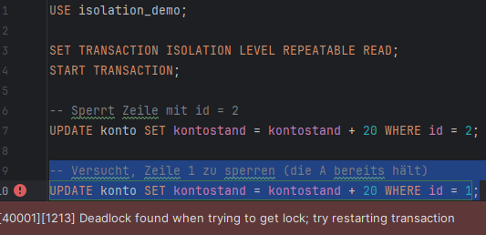

# **Deadlock**

# Inhanlt
- [Plan](#plan)
- [Simulate Deadlock](#deadlock-simulieren)


## Plan

Wir wollen einen Deadlock in MySQL simulieren

Die Datenbank ist [**"MySQL"**](https://www.mysql.com/de/) welche auf einer Ubuntu-VM realisiert wird.


**Dummy Table mit dummy Daten:**
```
CREATE DATABASE isolation_demo;
USE isolation_demo;

CREATE TABLE konto (
  id INT PRIMARY KEY,
  kontostand DECIMAL(10,2)
);

INSERT INTO konto VALUES (1, 100.00);
INSERT INTO konto VALUES (2, 200.00);
```
**mit diesen Table und Daten wird gearbeitet!**
- ## Deadlock Simulieren
    - wir benötigen zwei Sessions die sich gegenseitig recources sperren

        Session A:

        ```
        USE isolation_demo;

        SET TRANSACTION ISOLATION LEVEL REPEATABLE READ;
        START TRANSACTION;

        -- Sperrt Zeile mit id = 1
        UPDATE konto SET kontostand = kontostand + 10 WHERE id = 1;

        -- Kurz warten, bis Session B ihre erste Sperre hat
        -- (du kannst z. B. ein paar Sekunden manuell warten)
        ```

        Session B:
        ```
        USE isolation_demo;

        SET TRANSACTION ISOLATION LEVEL REPEATABLE READ;
        START TRANSACTION;

        -- Sperrt Zeile mit id = 2
        UPDATE konto SET kontostand = kontostand + 20 WHERE id = 2;
        ```

        Session A (selbe transaktion):
        ```
        -- Versucht, Zeile 2 zu sperren (die B bereits hält)
        UPDATE konto SET kontostand = kontostand + 10 WHERE id = 2;
        ```
        
        Session B (auch in der selben transaktion von vorher):
        ```
        -- Versucht, Zeile 1 zu sperren (die A bereits hält)
        UPDATE konto SET kontostand = kontostand + 20 WHERE id = 1;
        ```
        **Deadlock!**
        
        