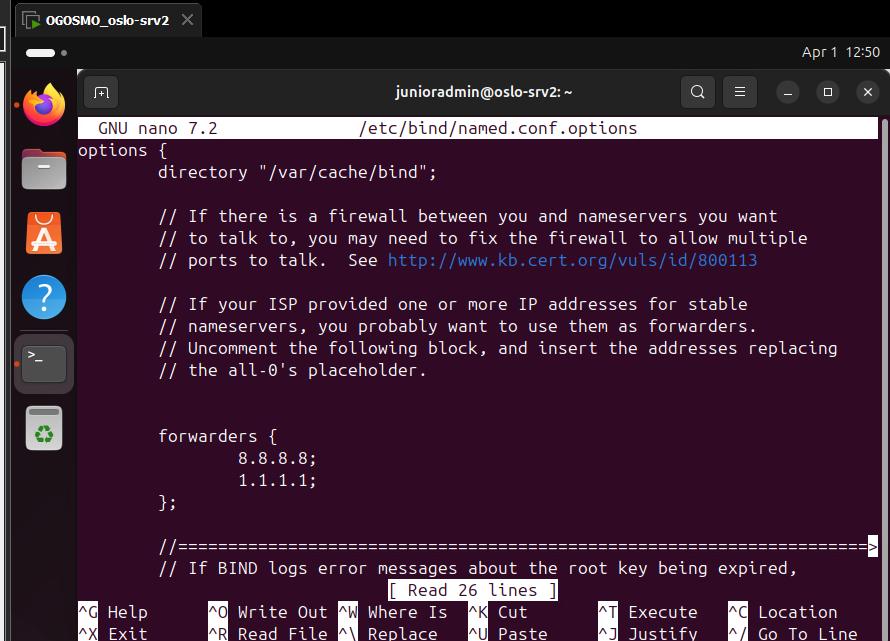
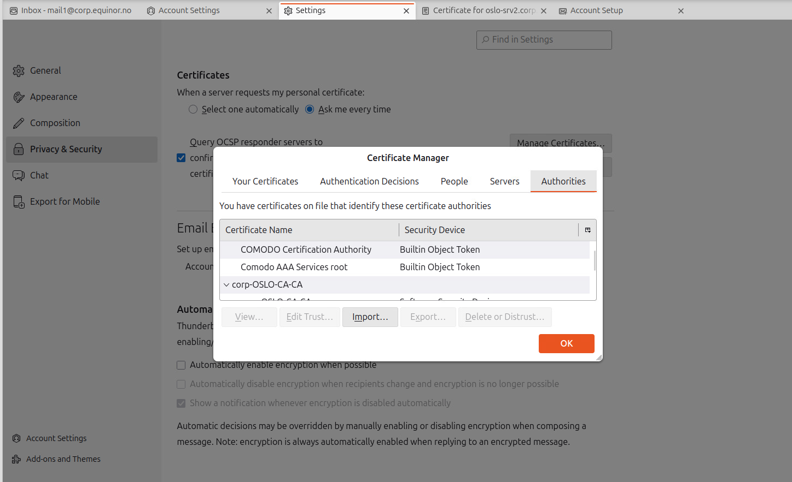

# oslo-srv2

- [oslo-srv2](#oslo-srv2)
  - [BIND9](#bind9)
    - [Instalation](#instalation)
    - [Configuration](#configuration)
    - [Service neustarten](#service-neustarten)
  - [Postfix](#postfix)
    - [Installieren](#installieren)
    - [Postfix konifigurieren](#postfix-konifigurieren)
    - [Authentication](#authentication)
      - [CA Root Zertifikat](#ca-root-zertifikat)
      - [oslo-srv2 Webserver Zertifikat](#oslo-srv2-webserver-zertifikat)
    - [receipiant Policing](#receipiant-policing)
      - [Postgrey instalation](#postgrey-instalation)
  - [Dovecot (Postfix IMAP/POP3 server)](#dovecot-postfix-imappop3-server)
    - [Dovecot instalation](#dovecot-instalation)
    - [Dovecot Konfiguration](#dovecot-konfiguration)
  - [Thunderbird](#thunderbird)
  - [Prometheus Monitoring service](#prometheus-monitoring-service)
    - [Node exporter Instalation](#node-exporter-instalation)
    - [Automatisches Starten](#automatisches-starten)
    - [Service aktiviren und starten](#service-aktiviren-und-starten)

## BIND9

Ein DNS-Server in der DMZ soll als DNS-Forwarder für das gesammte Active-Direcoty dienen.

Source: [Official BIND9 Guide](https://ubuntu.com/server/docs/how-to/networking/install-dns/)

### Instalation

```bash
sudo apt install bind9
```

### Configuration

in der ``/etc/bind/named.conf.options`` forwarder eintragen:

- 8.8.8.8
- 1.1.1.1

``sudo nano /etc/bind/named.conf.options``

```bash
options {
    forwarders {
        1.2.3.4;
        5.6.7.8;
    };
};
```

Schliussendlich soll das File so ausehen:



### Service neustarten

```bash
sudo systemctl restart bind9.service
```

---

## Postfix

benötigte dns records:

- mx record von domain zu alias
- A record von Hostname auf IP
- PTR record von IP auf Hostname
- CNAME record von alias auf Hostname

Postfix ist ein MTA (Mail Transfer Agent). Er kümmert sich um den Versand und den Empfang von E-Mails zwischen Servern.

Source: [Official Postfix Guide](https://ubuntu.com/server/docs/how-to/mail-services/install-postfix/)

### Installieren

```bash
sudo apt install postfix
```

- Im dialoge "``Internet Site``" asuwählen.
- die domain angeben: ``mail.corp.equinor.no``
- und falls notwendig einen "postmaster account" erstellen : ``steve``

### Postfix konifigurieren

unter dem Pfad: ``/etc/postfix/main.cf`` folgendes einfügen:

PS:*das ist der fertige Inhalt NACH der Konfiguration*

```bash
############################################################
# Postfix main.cf - oslo-srv2 (corp.equinor.no)
############################################################

# --- Identität & Netzwerk ---
myhostname          = mail.corp.equinor.no
myorigin            = /etc/mailname
mydestination       = $myhostname, corp.equinor.no, localhost.$mydomain, localhost
mynetworks          = 127.0.0.0/8 [::ffff:127.0.0.0]/104 [::1]/128 10.1.0.0/24 10.2.0.0/24 10.3.2.0/24 10.3.3.0/24 10.3.1.0/24
inet_interfaces     = all
inet_protocols      = all
relayhost           = 
biff                = no
append_dot_mydomain = no
readme_directory    = no
compatibility_level = 3.6

# --- TLS Parameter ---
smtpd_tls_cert_file = /etc/ssl/certs/oslo-srv2.crt
smtpd_tls_key_file  = /etc/ssl/private/oslo-srv2.key
smtpd_tls_security_level = encrypt

smtp_tls_CApath     = /etc/ssl/certs/root-ca.crt
smtp_tls_session_cache_database = btree:${data_directory}/smtp_scache
smtp_tls_note_starttls_offer = yes

# --- SASL Authentifizierung (Dovecot) ---
smtpd_sasl_type             = dovecot
smtpd_sasl_path             = private/auth
smtpd_sasl_auth_enable      = yes
smtpd_sasl_security_options = noanonymous
smtpd_sasl_local_domain     = 
broken_sasl_auth_clients    = yes

# --- Lokale Zustellung & Maildir ---
home_mailbox        = Maildir/
mailbox_size_limit  = 0
recipient_delimiter = +
alias_maps          = hash:/etc/aliases
alias_database      = hash:/etc/aliases

# --- Relay & Banner ---
smtpd_banner = $myhostname ESMTP $mail_name (Ubuntu)
smtpd_relay_restrictions = permit_mynetworks permit_sasl_authenticated defer_unauth_destination

# --- Empfänger-Restriktionen (Spam-Schutz) ---
smtpd_recipient_restrictions =
    permit_sasl_authenticated,
    permit_mynetworks,
    reject_non_fqdn_sender,
    reject_non_fqdn_recipient,
    reject_unknown_sender_domain,
    reject_unknown_recipient_domain,
    reject_unauth_destination,
    reject_rbl_client zen.spamhaus.org=127.0.0.[2..11],
    reject_rbl_client ix.dnsbl.manitu.net=127.0.0.2,
    check_policy_service inet:127.0.0.1:10023,
    reject_unverified_recipient,
    permit
```

### Authentication

benötigte ssl Zertifikate:

- ``root Zertifikat`` der CA
- ``oslo-srv2 Webserver Zertifikat`` von der CA ausgestellt

#### CA Root Zertifikat

dieses kann von der CA exportiert werden und mittels einer belibigen übertragungsart auf oslo-srv2 in ``/etc/ssl/certs/root-ca.crt`` gebracht werden.

auf der CA exportieren:

```shell
certutil -ca.cert root-ca.cer
```

in der [angeführten Postfix konfiguration](#postfix-konifigurieren) wird das root Zertifikat folgendermasem agegeben:

```bash
smtp_tls_CApath     = /etc/ssl/certs/root-ca.crt
```

---

#### oslo-srv2 Webserver Zertifikat

dieses muss manuell von der CA mittels einer ``CSR`` (Certificate signing Request) erstellt werden

``CSR`` erstellen: ``sudo nano ./openssl.conf``:

```bash
[req]
distinguished_name = req_distinguished_name
req_extensions = v3_req
prompt = no

[req_distinguished_name]
C = NO
L = Oslo
O = Equinor
CN = oslo-srv2.corp.equinor.no

[v3_req]
keyUsage = digitalSignature, keyEncipherment
extendedKeyUsage = serverAuth
subjectAltName = @alt_names

[alt_names]
DNS.1 = oslo-srv2.corp.equinor.no
DNS.2 = mail.corp.equinor.no
DNS.3 = smtp.corp.equinor.no
DNS.4 = imap.corp.equinor.no
DNS.5 = pop3.corp.equinor.no
```

dann folgenden command ausführen:

```bash
openssl req -new -out oslo-srv2.csr -newkey rsa:2048 -nodes -keyout oslo-srv2.key -config openssl.conf
```

das ``oslo-srv.csr`` file auf die CA bringen.

auf der CA folgenden befehl ausführen:

```shell
certreq -submit -attrib "CertificateTemplate:OsloMailServer" Downloads\oslo-srv2.csr
```

- Eine Dialogbox wird angezeigt.
- Wählen Sie Ihre CA aus.
- Wenn die Vorlage korrekt eingerichtet ist, werden Sie sofort aufgefordert, die Ausgabedatei zu speichern.
- Speichern Sie sie als ``oslo-srv2-signed.cer``
  
Verschiebe das **neue Zertifikat** oslo-srv2 nach ``/etc/ssl/certs/`` und den privaten **Schlüssel** nach ``/etc/ssl/private``.

in der [angeführten Postfix konfiguration](#postfix-konifigurieren) werden der schlüssel und das Zertifikat folgendermasen angegeben:

```bash
smtpd_tls_cert_file = /etc/ssl/certs/oslo-srv2.crt
smtpd_tls_key_file  = /etc/ssl/private/oslo-srv2.key
```

### receipiant Policing

Bestimmt welche mails angenommen werden und welche abgelehnt.

in der [angeführten Postfix konfiguration](#postfix-konifigurieren) stehen folgende Policies:

```bash
smtpd_recipient_restrictions =
    permit_sasl_authenticated,
    permit_mynetworks,
    reject_non_fqdn_sender,
    reject_non_fqdn_recipient,
    reject_unknown_sender_domain,
    reject_unknown_recipient_domain,
    reject_unauth_destination,
    reject_rbl_client zen.spamhaus.org=127.0.0.[2..11],
    reject_rbl_client ix.dnsbl.manitu.net=127.0.0.2,
    check_policy_service inet:127.0.0.1:10023,
    reject_unverified_recipient,
    permit
```

damit: ``check_policy_service inet:127.0.0.1:10023`` funktioniert muss noch ein lokaler service instaliert werden:

#### Postgrey instalation

```bash
#instalieren
sudo apt install postgrey

#starten
sudo systemctl start postgrey

#überprüfen
ps ax | grep postgray #unter "-inet" sollte mit der konfig übereinstimmen 
```

## Dovecot (Postfix IMAP/POP3 server)

Dovecot ist ein MDA (Mail Delivery Agent) und ein IMAP/POP3-Server. Er verwaltet die E-Mails, sobald sie auf deinem Server angekommen sind.

### Dovecot instalation

instalation:

```bash
sudo apt install dovecot-imapd dovecot-pop3d
```

### Dovecot Konfiguration

in der Datei: ``/etc/dovecot/conf.d/10-mail.conf``:

```bash
mail_location = maildir:~/Maildir
```

in der Datei: ``/etc/dovecot/conf.d/10-master.conf``:

```bash
service auth{
  ...
  # Postfix smtp-auth
  nix_listener /var/spool/postfix/private/auth {
    mode = 0660
    user = postfix
    group = postfix
  }
}
```

in der Datei: ``/etc/dovecot/conf.d/10-ssl.conf``:

```bash
ssl = required
ssl_cert = </etc/ssl/certs/oslo-srv2-bundle.crt
ssl_key = </etc/ssl/private/oslo-srv2.key
ssl_ca = </etc/ssl/certs/root-ca.pem
```

**ACHTUNG!**: hier muss noch eine chain (bundle) der Zertifikate erstellt werden und das root-ca.crt in ein .pem umgewandelt werden!

```bash
# Convert DER/Binary to PEM/Text
sudo openssl x509 -inform DER -in /etc/ssl/certs/root-ca.crt -out /etc/ssl/certs/root-ca.pem

# Create the bundle using the PEM version
sudo cat /etc/ssl/certs/oslo-srv2.crt /etc/ssl/certs/root-ca.pem | sudo tee /etc/ssl/certs/oslo-srv2-bundle.crt
```

dieses bundle dann in der ``/etc/dovecot/conf.d/10-ssl.conf`` einbinden!

## Thunderbird

auf den client oslo-mail1 und oslo-mail2 muss das .pem certificat als trust eingefügt werden damit thunderbird sich nicht aufregt!

unter: ``settings -> privacy & security -> Certificates ->manage certificates -> authorities -> import``



## Prometheus Monitoring service

### Node exporter Instalation

```bash
wget https://github.com/prometheus/node_exporter/releases/download/v1.10.2/node_exporter-1.10.2.linux-amd64.tar.gz
tar xvfz node_exporter-1.10.2.linux-amd64.tar.gz
```

### Automatisches Starten

Eine neue service File erstellen

```bash
sudo nano /etc/systemd/system/prometheus-node-exporter.service
```

diesen inhalt hineingeben:

```bash
[Unit]
Description=Prometheus Node Exporter
Wants=network-online.target
After=network-online.target

[Service]
Type=simple
User=root
Group=root
ExecStart=/home/junioradmin/node_exporter-1.10.2.linux-amd64/node_exporter

Restart=always
RestarSec=5s
ProtectSystem=strict
NoNewPrivileges=true
PrivateTmp=true

[Install]
WantedBy=multi-user.target
```

### Service aktiviren und starten

```bash
#systemd neu laden
sudo systemctl daemon-reload

#service für autostart enablen  
sudo systemctl enable prometheus-node-exporter.service

#service starten
sudo systemctl start prometheus-node-exporter.service
```
