# Modul 4.2 - Implementieren von DFS

Zuletzt bearbeitet am: 7. April 2026 01:52
Erstellt am: 6. April 2026 21:49

# Aufgabenstellung

---

# Challenge-Lab: Implementieren Sie in einer AD-Umgebung mit zwei Standorten (Headquarter und Branch) je einen Dateiserver pro Standort und einen Client im Branch Office.

Erstellen Sie auf beiden Servern eine identische Verzeichnisstruktur mit mehreren Unterverzeichnissen und restriktiven Zugriffsberechtigungen für verschiedene Benutzergruppen (AGDLP).

Geben Sie diese Unterverzeichnisse frei und nehmen Sie diese in einen ad-integrierten DFS-Namespace auf. Lassen sie die freigegebenen Verzeichnisse zwischen den Servern (einzeln) replizieren.

Stellen Sie den DFS-Namespace auf einem Client mittels "Laufwerkzuordnung" durch eine GPO bereit (der Namespace soll als Netzlaufwerk automatisch bei Benutzeranmeldung verbunden werden).

Sichern sie die Dateidienste bestmöglich ab.

Testen Sie den Client-Zugriff auf den DFS-Namespace und die "site-awareness" des Zugriffs.

---

## A - Skill :: Configure a DFS Namespace

# R&D : Erkunden Sie, wie ein DFS Namespace erstellt und konfiguriert wird und wie mit seiner Hilfe File Services serverübergreifend integriert werden können. Implementieren Sie einen serverübergreifenden DFS-Namespace, der serverunabhängig über einen Domänenpfad aufgerufen werden kann.

Stichwörter: Role service, namespace types, folders and folder targets, DFS replication targets

siehe Exam Ref 70-740, Installation, Storage  and Compute with Windows Server 2016, Craig Zacker, Pearson Education, 2017, Ch2

---

## B - Skill :: Configure DFS Replication

# R&D : Erkunden Sie den DFS-Replikationsdienst und seine Konfiguration und entdecken Sie, wie er hilft Dateidienste für Branch Offices zu verbessern. Implementieren Sie eine DFS-Replikation in einer einfachen AD-Topologie mit zwei Standorten.

Stichwörter: Role service, replication group, replication scheduling, staging, RDC settings

siehe Exam Ref 70-740, Installation, Storage  and Compute with Windows Server 2016, Craig Zacker, Pearson Education, 2017, Ch2

# Durchführung

---

### Phase 1: Installation der Rollendienste

Bevor Sie beginnen, müssen die notwendigen Dienste auf beiden Servern installiert werden.

1. Öffnen Sie den **Server-Manager** auf `oslo-dc2` und `sv-rodc`.
2. Wählen Sie **Rollen und Features hinzufügen**.
3. Navigieren Sie zu **Serverrollen** -> **Datei- und Speicherdienste** -> **Datei- und iSCSI-Dienste**.
4. Installieren Sie:
    - **DFS-Namespaces**
    - **DFS-Replikation**

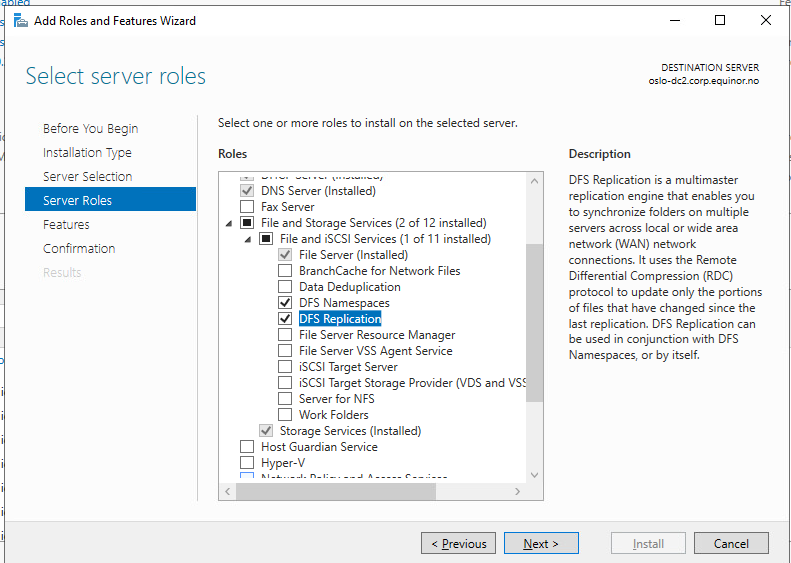

---

### Phase 2: Verzeichnisstruktur und Berechtigungen (AGDLP)

Erstellen Sie auf beiden Servern die gleiche Struktur (z.B. `D:\Shares\Marketing` und `D:\Shares\HR`).

> **THEORIE-SLOT: Das AGDLP-Prinzip**
Um restriktive und wartbare Berechtigungen umzusetzen, nutzt man AGDLP:
> 
> - **A**ccounts (Benutzer) werden Mitglied von...
> - **G**lobalen Gruppen (z.B. `G_Marketing_Users`). Diese kommen in...
> - **D**omain **L**ocal Gruppen (z.B. `DL_Marketing_ReadWrite`). Diese erhalten...
> - **P**ermissions (NTFS-Berechtigungen) auf den Ordner.

**Schritte:**

1. Erstellen Sie die Verzeichnisse lokal.
2. Vergeben Sie NTFS-Berechtigungen basierend auf Ihren Domain Local Gruppen.
3. Geben Sie die Ordner frei (Share-Berechtigungen: "Jeder" -> "Vollzugriff", die Einschränkung erfolgt über NTFS).

### AGDLP-Struktur

#### Gruppen & Accounts

GG_Linux:

- Benedikt Theuretzbachner / theuretzbachner / Ganzgeheim123!
- Karun Sandhu / sandhu / Ganzgeheim123!

GG_Windows:

- Jan Wilimek / wilimek / Ganzgeheim123!
- Mohammad Danesh / danesh / Ganzgeheim123!

Domain Local Gruppen

- DL_Linux_R
- DL_Linux_W
- DL_Windows_R
- DL_Windows_W

Ordner (auf oslo-dc2 UND sv-rodc erstellen)

C:\Shares\Linux

C:\Shares\Windows

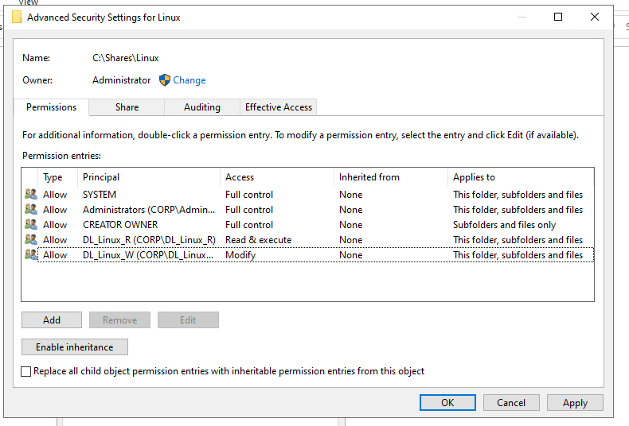

---

### Phase 3: Implementieren des DFS-Namespace (Skill A)

Ein Namespace bündelt verschiedene Freigaben unter einem logischen Pfad.

1. Öffnen Sie die **DFS-Verwaltung** auf `oslo-dc2`.
2. Rechtsklick auf **Namespaces** -> **Neuer Namespace**.
3. **Server:** `oslo-dc2`.
4. **Name:** z.B. `Public`. Der Pfad lautet dann `\\IhrDomainName\Public`.
5. **Namespace-Typ:** Wählen Sie **Domänenbasierter Namespace** (für AD-Integration und Hochverfügbarkeit).
6. **Namespace-Server hinzufügen:** Fügen Sie nach der Erstellung `sv-rodc` als weiteren Namespace-Server hinzu, damit der Namespace auch lokal im Branch Office verfügbar ist, wenn die WAN-Leitung steht.

RK auf den Namespace (\\corp.equinor.no\OS) / Add Namespace Server…

> **THEORIE-SLOT: Namespace-Typen**
> 
> - **Domänenbasiert:** Speichert die Konfiguration im Active Directory. Erlaubt die Nutzung des Domänennamens im Pfad (`\\contoso.com\DFS`).
> - **Eigenständig (Stand-alone):** Speichert die Konfiguration in der Registry des Servers. Der Pfad nutzt den Servernamen (`\\Server01\DFS`).

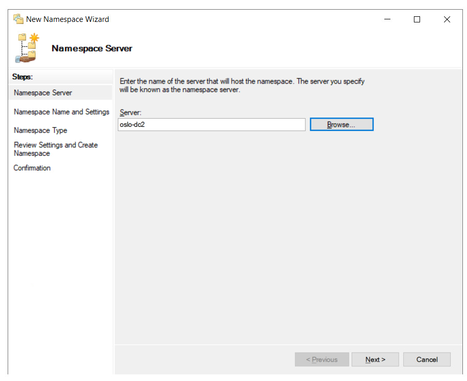

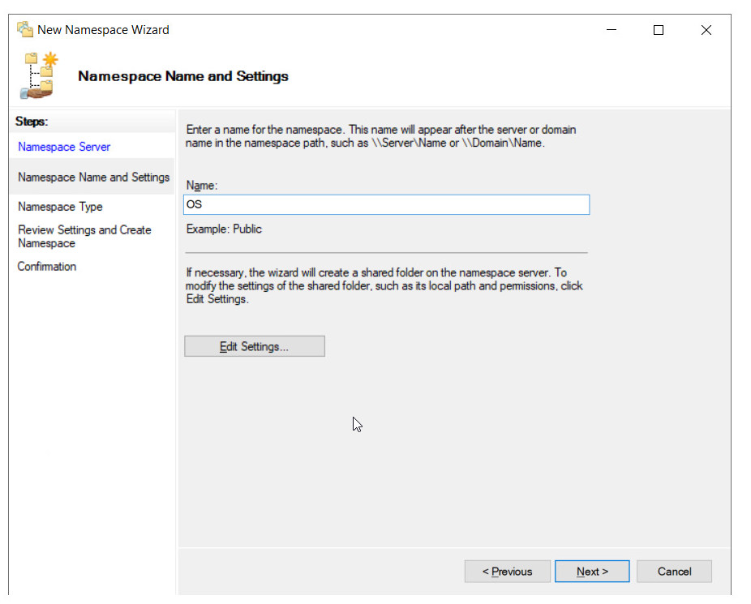

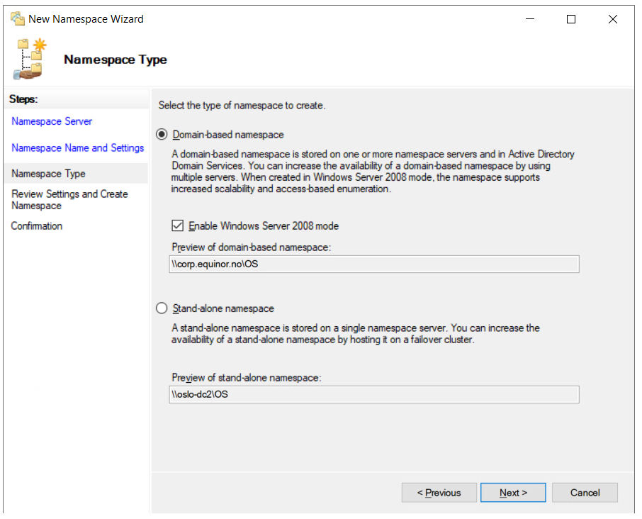

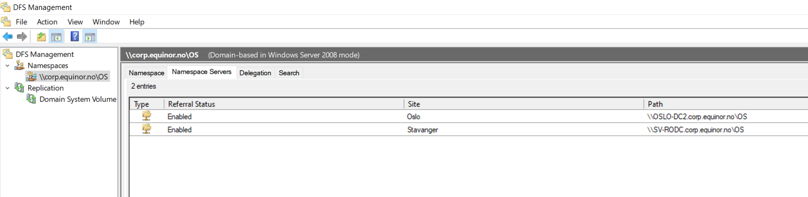

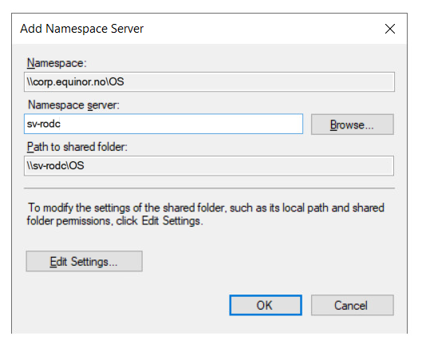

---

### Phase 4: DFS-Replikation konfigurieren (Skill B)

Damit die Daten zwischen HQ und Branch synchron bleiben.

1. In der DFS-Verwaltung: Rechtsklick auf **Replikation** -> **Neue Replikationsgruppe**.
2. **Typ:** Replikationsgruppe für Veröffentlichung (Multipurpose).
3. **Name:** z.B. `RG_Marketing`.
4. **Mitglieder:** Fügen Sie `oslo-dc2` und `sv-rodc` hinzu.
5. **Topologie:** Wählen Sie **Hub-and-Spoke** oder **Full Mesh** (bei zwei Servern ist beides faktisch eine direkte Verbindung).
6. **Replikationszeitplan:** Wählen Sie "Kontinuierlich" für maximale Aktualität oder schränken Sie die Bandbreite für die Geschäftszeiten ein.
7. **Primäres Mitglied:** Wählen Sie `oslo-dc2` (der Server, dessen Datenstand zuerst repliziert wird).
8. **Replizierte Ordner:** Wählen Sie den lokalen Pfad (z.B. `D:\Shares\Marketing`).

> **THEORIE-SLOT: Staging und RDC**
> 
> - **Staging-Ordner:** Ein Zwischenspeicher, in dem DFS-R Dateien komprimiert und vorbereitet, bevor sie übertragen werden. Die Größe sollte mindestens so groß sein wie die 32 größten Dateien im Ordner.
> - **Remote Differential Compression (RDC):** Ein Algorithmus, der nur die geänderten Blöcke einer Datei überträgt, anstatt die gesamte Datei neu zu senden.
1. **Pfade der Ordner auf anderen Members:**
- **Server auswählen:** In der Liste sehen Sie den Server `sv-rodc`. Sein Status steht wahrscheinlich auf „Nicht festgelegt“ (Not Set).
- **Bearbeiten:** Markieren Sie `sv-rodc` und klicken Sie auf die Schaltfläche **Bearbeiten...** (Edit...).
- **Pfad angeben:**
    - Stellen Sie sicher, dass das Häkchen bei **Aktiviert** (Enabled) gesetzt ist.
    - Geben Sie unter **Lokaler Pfad des replizierten Ordners** den Pfad auf dem `sv-rodc` ein (z. B. `D:\Shares\Marketing`).
    - **Tipp:** Verwenden Sie idealerweise exakt denselben Pfad wie auf dem ersten Server, um die Verwaltung übersichtlich zu halten.
- **Bestätigen:** Klicken Sie auf **OK**. Der Status in der Liste ändert sich nun auf „Aktiviert“.
- **Weiter:** Klicken Sie auf **Weiter** (Next), um die Konfiguration abzuschließen.

### So veröffentlichst du die Ordner im Namespace

1. **DFS-Verwaltung öffnen:** Gehe zu **Namespaces** -> `\\corp.equinor.no\OS`.
2. **Neuer Ordner:** Rechtsklick auf den Namespace-Namen -> **Neuer Ordner...**.
3. **Name vergeben:** Gib den Namen ein, den die Benutzer sehen sollen (z. B. "Marketing" oder "Daten").
4. **Ziel hinzufügen:** Klicke auf **Hinzufügen...**.
    - Gib den Pfad zur Freigabe auf dem ersten Server an: `\\oslo-dc2\Marketing`.
    - Klicke erneut auf **Hinzufügen...** und gib den Pfad des zweiten Servers an: `\\sv-rodc\Marketing`.
5. **Verknüpfung bestätigen:** Da du die Replikation bereits in "Teil B" eingerichtet hast, erkennt DFS meist, dass diese Ziele repliziert werden. Falls eine Abfrage zur Replikation erscheint, kannst du diese bestätigen oder (da bereits konfiguriert) überspringen.

Jetzt sollte der Pfad `\\corp.equinor.no\OS\Marketing` sofort sichtbar und erreichbar sein.

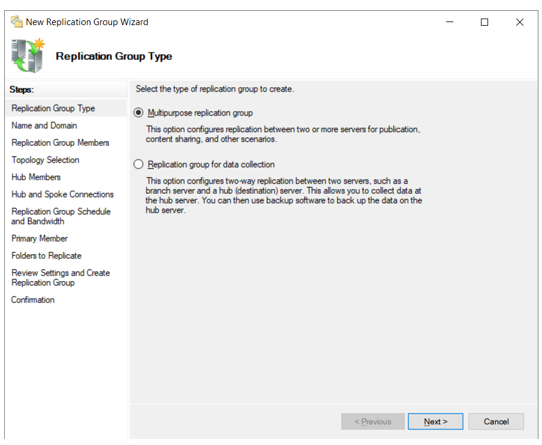

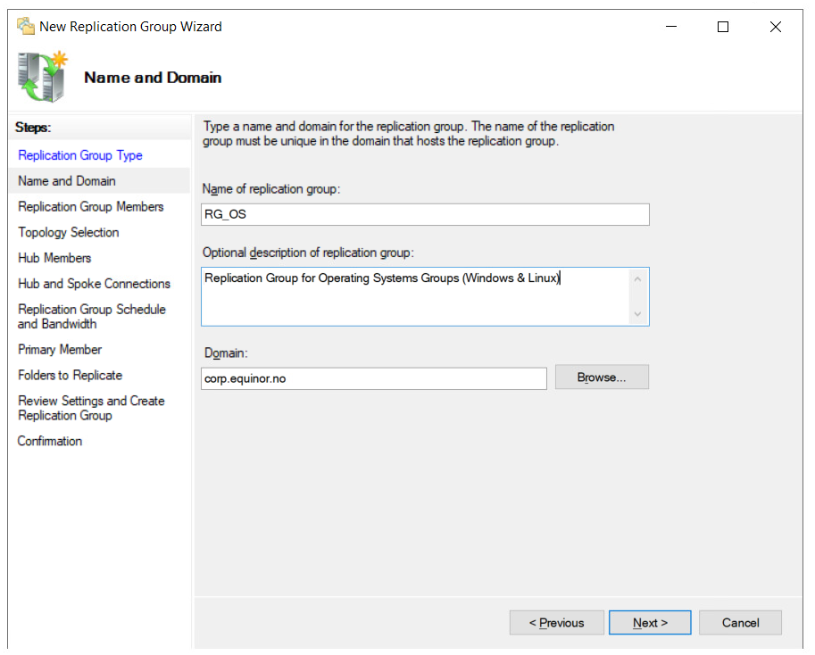

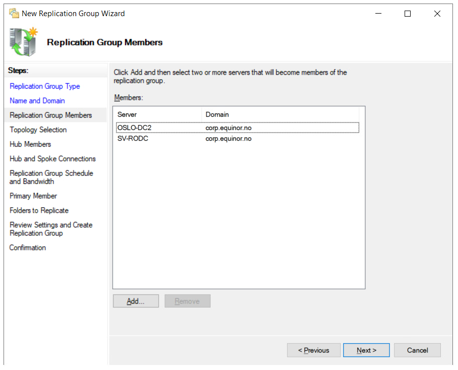

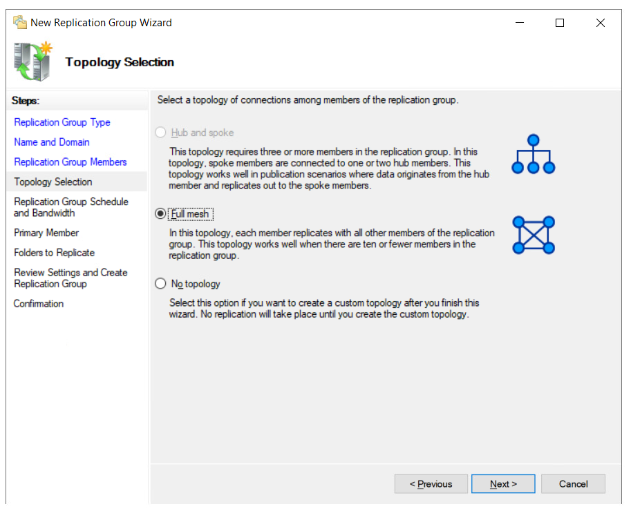

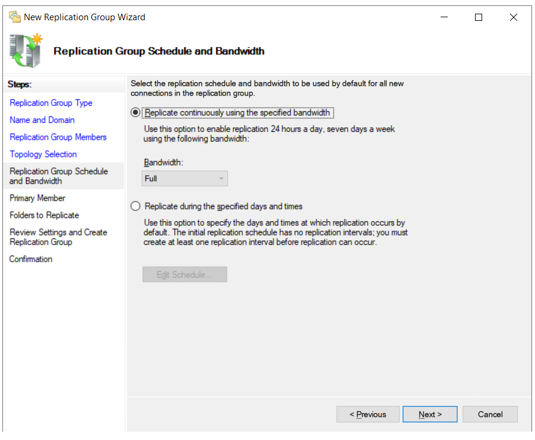

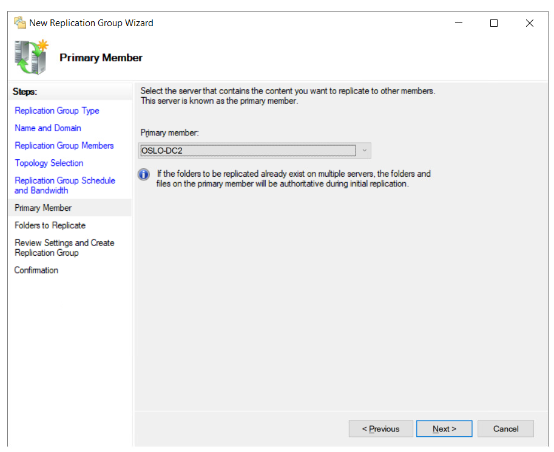

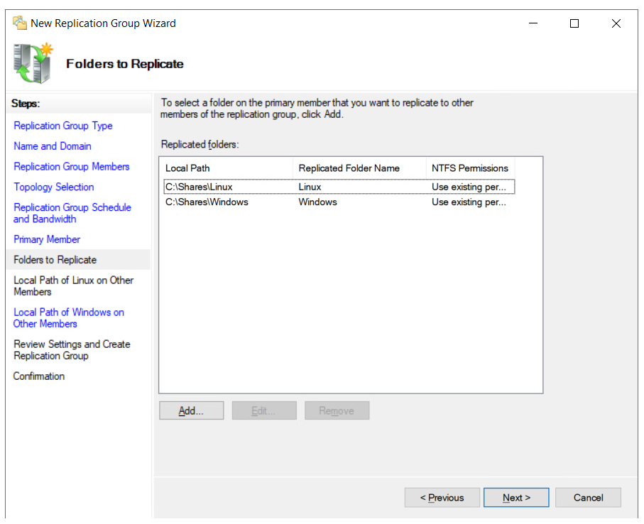

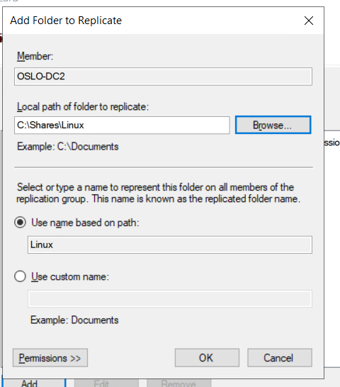

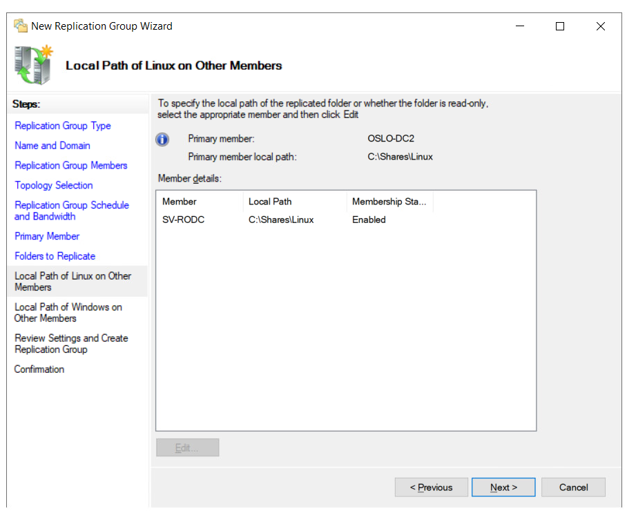

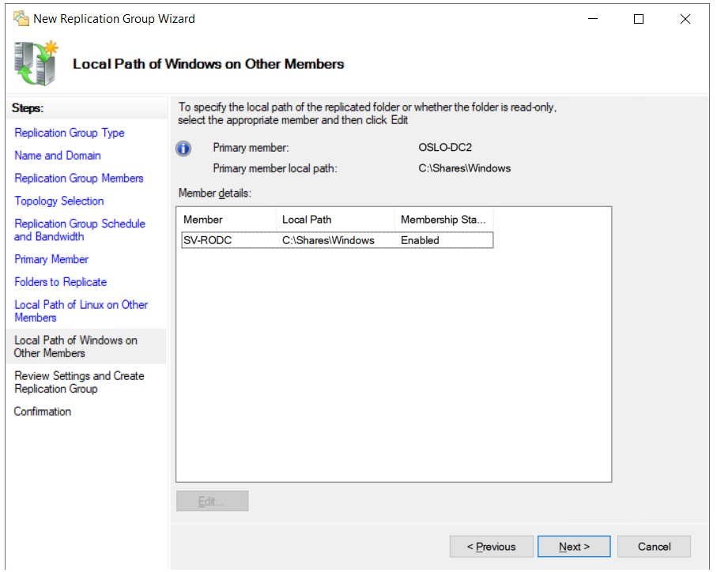

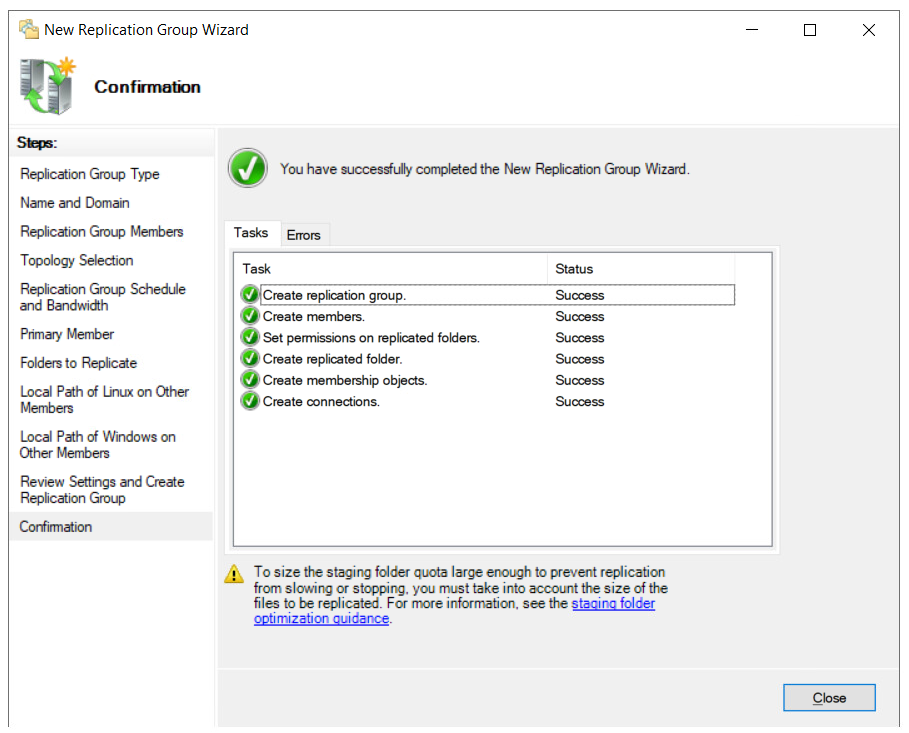

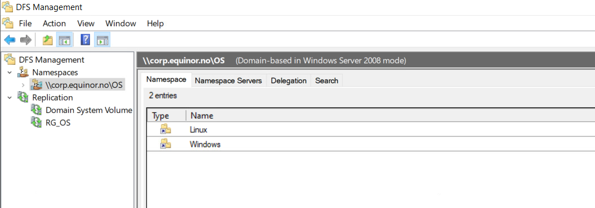

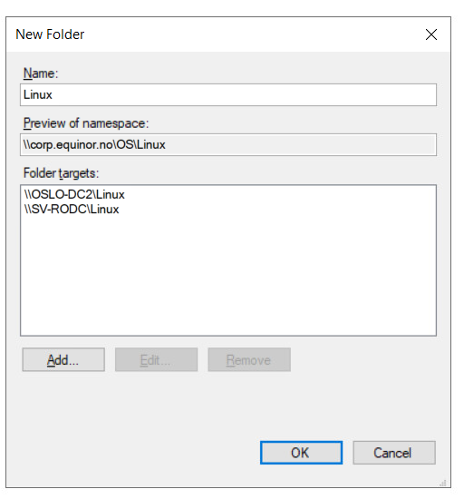

---

### Phase 5: GPO-Bereitstellung (Laufwerkzuordnung)

1. Öffnen Sie die **Gruppenrichtlinienverwaltung**.
2. Erstellen Sie ein neues GPO (z.B. `DFS-Drive-Mapping`).
3. Navigieren Sie zu: **Benutzerkonfiguration** -> **Einstellungen** -> **Windows-Einstellungen** -> **Laufwerkzuordnungen**.
4. Neu -> Zugeordnetes Laufwerk:
    - **Aktion:** Aktualisieren
    - **Speicherort:** `\\IhrDomainName\Public`
    - **Beschriftung:** Unternehmensdaten
    - **Laufwerkbuchstabe:** z.B. `S:`
5. Verknüpfen Sie das GPO mit der OU Ihrer Benutzer.

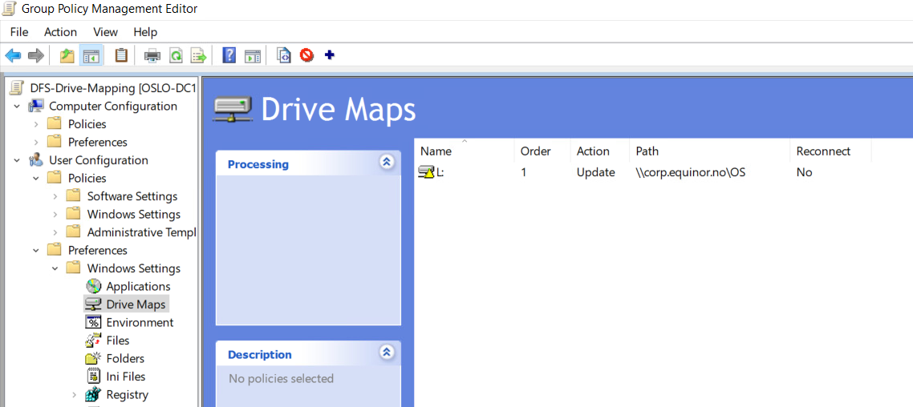

# Test

---

### Phase 7: Testen der Site-Awareness

DFS nutzt die Active Directory Sites, um Clients zum nächstgelegenen Server zu leiten.

1. Melden Sie sich an einem Client im **Branch Office** an.
2. Öffnen Sie das Netzlaufwerk `S:`.
3. Erstellen Sie eine Testdatei. Prüfen Sie, ob diese auf `oslo-dc2` erscheint (Replikationstest).

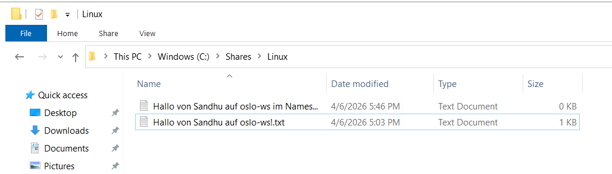

1. **Site-Awareness prüfen:**
    - Öffnen Sie eine Eingabeaufforderung.
    - Geben Sie `dfsutil /pktinfo` ein.
        
        dfsutil installieren, siehe: [https://www.how2shout.com/how-to/how-to-install-dfsutil-command-line-tool-on-windows-11.html](https://www.how2shout.com/how-to/how-to-install-dfsutil-command-line-tool-on-windows-11.html)
        
        `Add-WindowsCapability -Online -Name Rsat.FileServices.Tools~~~~0.0.1.0`
        
    - Sie sollten sehen, dass der "Active" Target-Server der `sv-rodc` ist, da sich der Client in derselben AD-Site befindet wie der RODC.

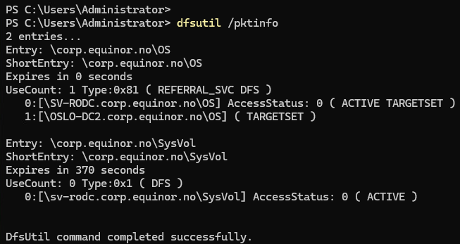

dfsutil /pktinfo auf sv-ws

> **Wichtiger Hinweis aus der Referenz (70-741):**
Die Kosten der Standorte (Site Costs) in Active Directory bestimmen, welchen DFS-Zielserver ein Client wählt. Stellen Sie sicher, dass die Subnetze in "AD Sites and Services" korrekt zugewiesen sind.
>