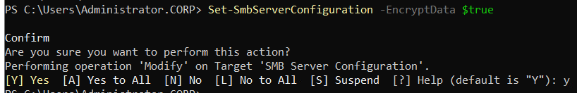

# Modul 4.3 - File Service Security

Zuletzt bearbeitet am: 7. April 2026 00:58
Erstellt am: 7. April 2026 00:56

# Aufgabenstellung

---

# R&D: Dateidienste abzusichern bedeutet sowohl auf Protokollebene (SMBv3) für bestmögliche Sicherheit zu sorgen, weiters den Zugriff auf Dateiserver nach best practice abzusichern (Least Privilege Prinzip, konsistenter Einsatz des AGDLP-Prinzips) und schließlich auch den Zugriff auf die Dateidienste zu überwachen (Advanced Auditing). Ergänzen Sie Ihre Dateiserver-Topologie mit diesen Features und Konfigurationen mithilfe der unten angeführten Referenzen. 

# Durchführung

---

### Phase 1: Protokollsicherheit mit SMBv3

SMBv3 (Server Message Block) bietet moderne Sicherheitsfeatures wie die Verschlüsselung am „Draht“, ohne dass komplexe VPNs oder IPsec-Konfigurationen nötig sind.

1. **SMB-Verschlüsselung aktivieren:**
    - **Global für einen Server (PowerShell):**
        
        `Set-SmbServerConfiguration -EncryptData $true`
        
    - **Pro Freigabe (PowerShell):**
        
        `Set-SmbShare -Name "Marketing" -EncryptData $true`
        
    - **Via DFS-Verwaltung:** Rechtsklick auf den Namespace -> **Eigenschaften** -> **Erweitert**. Hier kann die Verschlüsselung für den Zugriff auf den Namespace erzwungen werden.

Überprüfung: `Get-SmbServerConfiguration`

1. **SMB-Signierung erzwingen:**
    - Erstellen/Bearbeiten Sie ein GPO: `Computerkonfiguration` -> `Windows-Einstellungen` -> `Sicherheitseinstellungen` -> `Lokale Richtlinien` -> `Sicherheitsoptionen`.
    - Aktivieren Sie: **Microsoft-Netzwerk (Server): Kommunikation digital signieren (immer)**.

> **THEORIE-SLOT: SMBv3 Encryption & Signing**
> 
> - **Signing (Signierung):** Verhindert "Man-in-the-Middle"-Angriffe, indem die Integrität der Pakete sichergestellt wird.
> - **Encryption (Verschlüsselung):** Schützt die Daten vor dem Mitlesen im Netzwerk. Seit Windows Server 2016 nutzt SMBv3 den hocheffizienten AES-128-GCM Algorithmus, der durch moderne CPUs hardwarebeschleunigt wird und somit kaum Performance-Einbußen verursacht.

---

### Phase 2: Zugriffssicherheit & Least Privilege

Hier nutzen wir das **AGDLP-Prinzip** konsequent und aktivieren Funktionen, die Informationen vor unbefugten Augen verbergen.

1. **Access-Based Enumeration (ABE) aktivieren:**
    - In der **DFS-Verwaltung**: Rechtsklick auf Ihren Namespace -> **Eigenschaften** -> Reiter **Erweitert**.
    - Setzen Sie den Haken bei **Abstimmungsbasierte Enumeration aktivieren** (Access-Based Enumeration).
    
    
    
2. **Berechtigungen nach „Least Privilege“:**
    - Entfernen Sie die Gruppe "Jeder" oder "Authentifizierte Benutzer" aus den NTFS-Berechtigungen.
    - Nutzen Sie nur die **Domain Local** Gruppen aus Ihrem AGDLP-Modell.
    - Ein Benutzer erhält nur *Leserechte*, wenn er keine *Schreibrechte* für seine Aufgabe benötigt.

> **THEORIE-SLOT: Access-Based Enumeration (ABE)**ABE sorgt dafür, dass Benutzer nur die Dateien und Ordner sehen, für die sie auch mindestens Leseberechtigung haben. Ordner, auf die sie keinen Zugriff haben, werden im Explorer komplett ausgeblendet. Dies erschwert das „Ausspähen“ der Verzeichnisstruktur durch Angreifer oder neugierige Mitarbeiter.
> 

---

### Phase 3: Überwachung (Advanced Auditing)

Um zu wissen, wer wann auf welche Datei zugegriffen (oder es versucht) hat, müssen wir das erweiterte Auditing konfigurieren.

1. **GPO für Advanced Audit Policy:**
    - Pfad: `Computerkonfiguration` -> `Richtlinien` -> `Windows-Einstellungen` -> `Sicherheitseinstellungen` -> `Erweiterte Überwachungsrichtlinienkonfiguration`.
    - Navigieren Sie zu **Objektzugriff** und aktivieren Sie:
        - **Dateisystem überwachen** (Erfolg & Fehlgeschlagen).
        - **Handle-Bearbeitung überwachen** (optional, für detaillierte Analysen).
    
    
    
2. **SACL (System Access Control List) setzen:**
    - Das GPO allein reicht nicht. Sie müssen dem Ordner sagen, was er loggen soll.
    - Rechtsklick auf den Datenordner (z.B. `D:\Shares\Marketing`) -> **Eigenschaften** -> **Sicherheit** -> **Erweitert** -> Reiter **Überwachung**.
    - Fügen Sie z.B. die Gruppe "Jeder" hinzu und wählen Sie die Ereignisse "Löschen" oder "Schreiben", die protokolliert werden sollen.
    
    
    
    Muss laut Gemini nur auf einem der beiden Server konfiguriert werden, da (NTFS-)Änderungen über DFS repliziert werden.
    

> **THEORIE-SLOT: Advanced Auditing vs. Standard Auditing**
> 
> 
> Im Gegensatz zum alten "Objektzugriff überwachen" erlaubt das **Advanced Auditing**, gezielt nur Dateizugriffe zu loggen, ohne das Eventlog mit unnötigen Informationen über andere Objekttypen zu fluten. Dies schont die Performance des Servers und die Kapazität des Security-Logs.
>