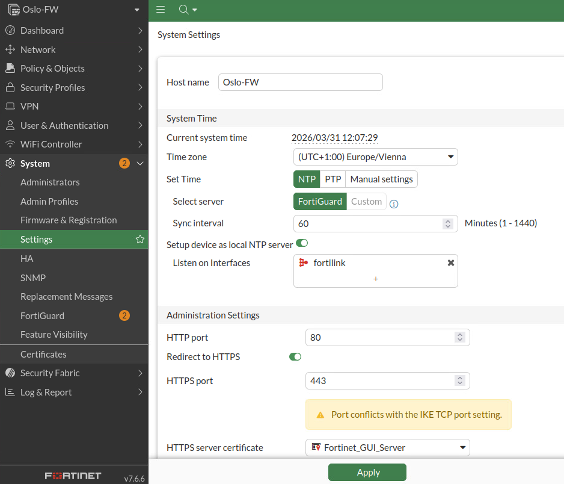
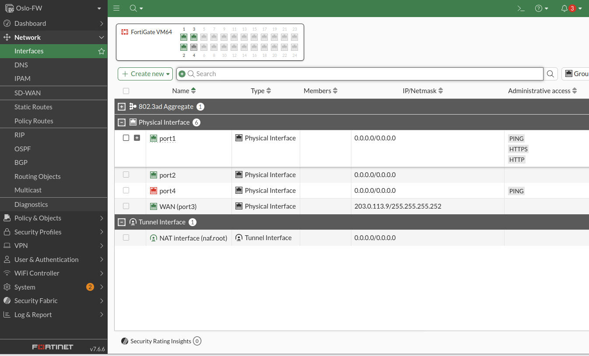
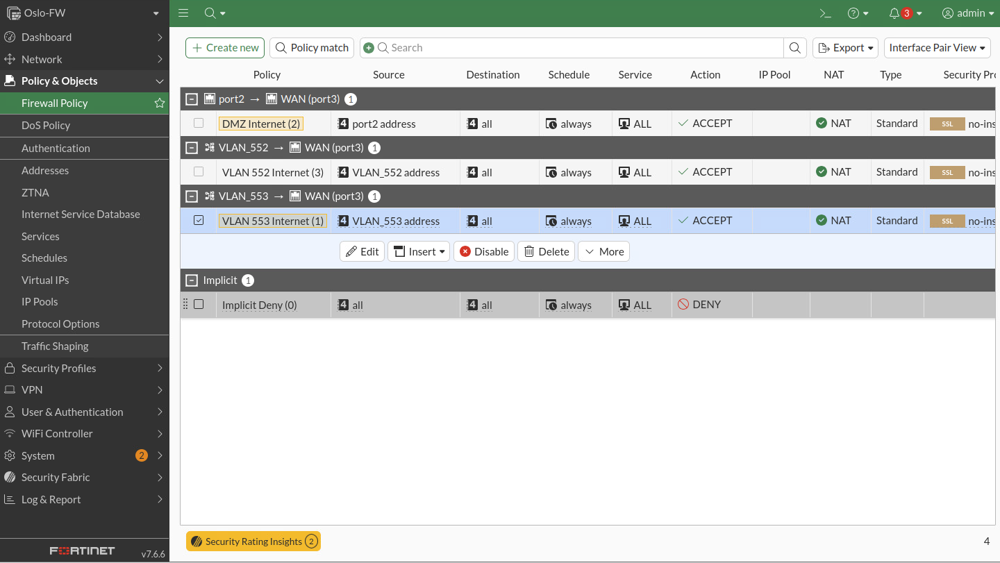

# oslo-fw

Dient als Firewall des Oslo Standorts.

- [oslo-fw](#oslo-fw)
  - [First login](#first-login)
  - [GUI-Verbindung](#gui-verbindung)
  - [Konfiguration (Mittels GUI)](#konfiguration-mittels-gui)
    - [Lizenz hochladen](#lizenz-hochladen)
    - [Default Konfig der Fortigate mittel GUI](#default-konfig-der-fortigate-mittel-gui)
    - [Neue Firewall Policy erstellen](#neue-firewall-policy-erstellen)

## First login

- Username und Passwort setzen
- **Default User**:
  - Username: admin
  - Passwort: \<leerlassen\>

## GUI-Verbindung

- script um ein Interface der Fortigate zu konfigurieren um auf die GUI zuzugreifen. Und LAN seitige VLANS konfigurieren. [Link zum Script](../../../Scripts/Oslo/oslo-fw.txt)

- Mittels eines dritten Hosts (Bsp. oslo-ansible) auf die Fortigate mittels der IP im script verbinden.

GUI verbindung steht.

## Konfiguration (Mittels GUI)

### Lizenz hochladen

am Rechner der Verbindung zum Web-Gui hat:

- File mit der ".lic" Endung erstellen
- Lizenz einfügen
- hochladen mittels WEB-GUI
- automatischer reboot der Firewall
- Anmelden
- File system check -> NEIN (braucht mehrere Stunden)
- Default setup ausführen lassen:
  - nein zu "FortiConverter"
  - automatic updated nicht ändern
  - Dashboard setup: Optimal

### Default Konfig der Fortigate mittel GUI

Links im Reiter "Sytem" dann -> "Settings":

- Hostname und Timezone Ändern:
  
  

Links im Reiter "Network" dann -> "Interfaces":

- Interfaces Überprüfen:

  

  einfach nur schauen ob alles passt.

### Neue Firewall Policy erstellen

Links im Reiter "Policy & Objects" dann -> "Firewall Policy":

- Create a new Policy:

    
