# oslo-rds1

- [oslo-rds1](#oslo-rds1)
  - [RDS Installation](#rds-installation)
  - [Session Collection erstellen](#session-collection-erstellen)
  - [Session Collection konfigurieren](#session-collection-konfigurieren)
  - [FSLogix](#fslogix)
    - [File Share erstellen](#file-share-erstellen)
    - [FSLogix Installation](#fslogix-installation)
    - [FSLogix konfigurieren](#fslogix-konfigurieren)
  - [RDS RD Licensing](#rds-rd-licensing)
    - [RDLS Installation](#rdls-installation)
    - [RDLS Konfiguration](#rdls-konfiguration)
  - [High Availibility für RDS](#high-availibility-für-rds)
    - [HA für RDS Session Host](#ha-für-rds-session-host)
    - [HA für RDS Connection Broker](#ha-für-rds-connection-broker)
      - [SQL Server Installation](#sql-server-installation)
    - [Phase 1: Pre-requisites \& Planning](#phase-1-pre-requisites--planning)
    - [Phase 2: The Installation Wizard](#phase-2-the-installation-wizard)
    - [Phase 3: Database Engine Configuration](#phase-3-database-engine-configuration)
    - [Phase 4: Post-Install "Must-Dos"](#phase-4-post-install-must-dos)
      - [1. Install SSMS](#1-install-ssms)
      - [2. Open the Firewall](#2-open-the-firewall)
      - [3. Memory Capping](#3-memory-capping)
      - [SQL Server Konfiguration](#sql-server-konfiguration)
    - [Phase 1: The SQL Prerequisites](#phase-1-the-sql-prerequisites)
    - [Phase 2: The DNS "Shared Name"](#phase-2-the-dns-shared-name)
    - [Phase 3: The HA Configuration Wizard](#phase-3-the-ha-configuration-wizard)
    - [Phase 4: Adding the Second Broker](#phase-4-adding-the-second-broker)
    - [Phase 5: The "Certificate" Trap](#phase-5-the-certificate-trap)
        - [](#)
    - [HA für RDS RD Licensing](#ha-für-rds-rd-licensing)
    - [HA für RDS Web Acces](#ha-für-rds-web-acces)
  - [Remote Apps](#remote-apps)

## RDS Installation

Im Server Manager die anderen RDS-Server hinzufügen (ggf. auch eine Server Grupp erstellen). Dann Installatino wie folgt (MS Book p. 416):

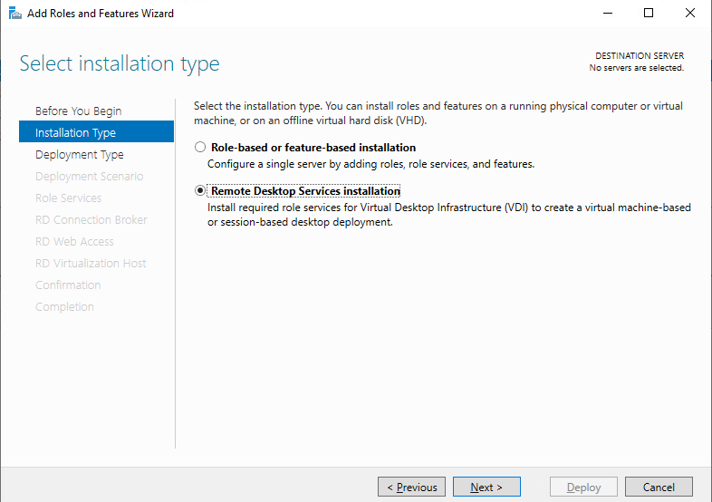
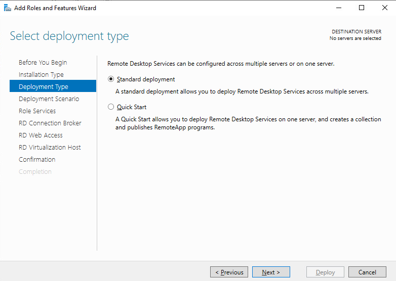
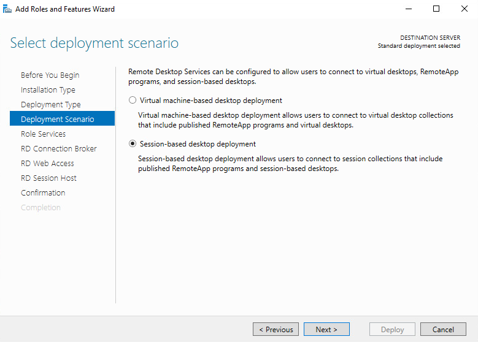
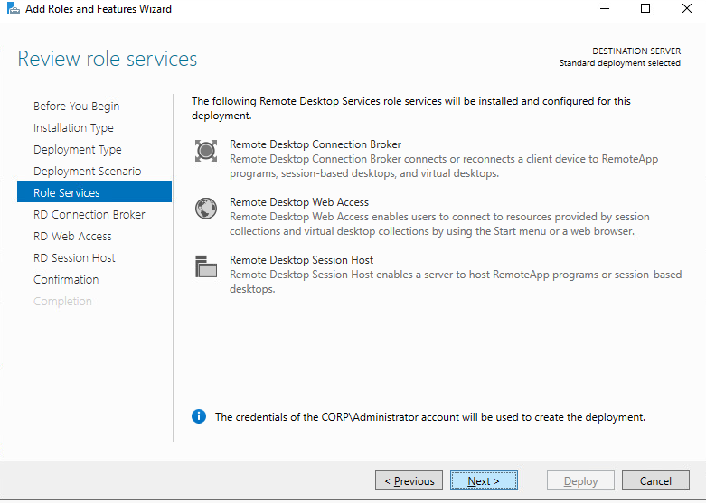
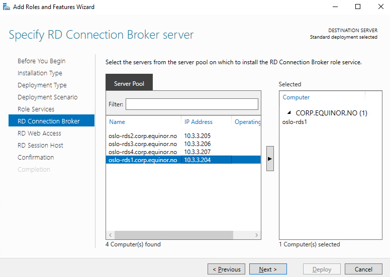
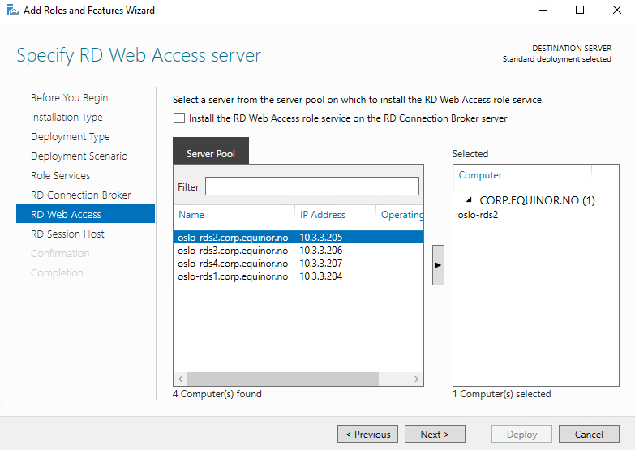
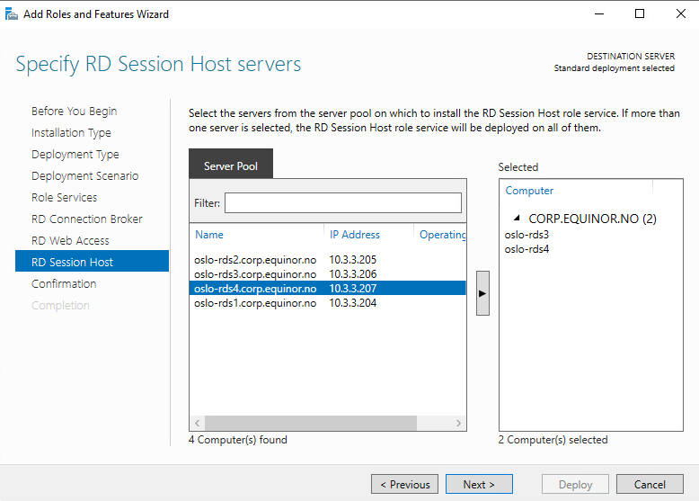
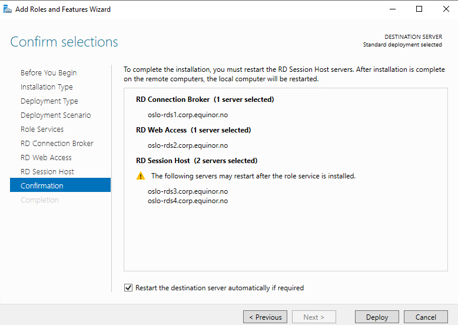
Select "restart if required" -> Deploy
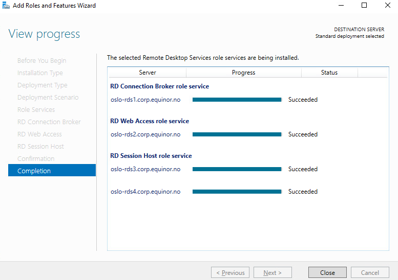

## Session Collection erstellen

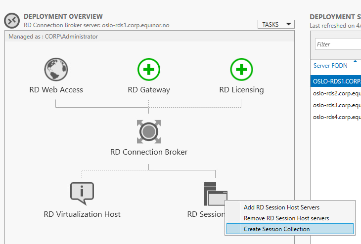
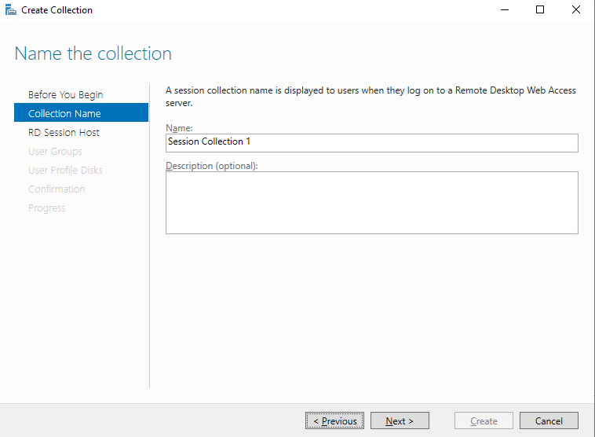
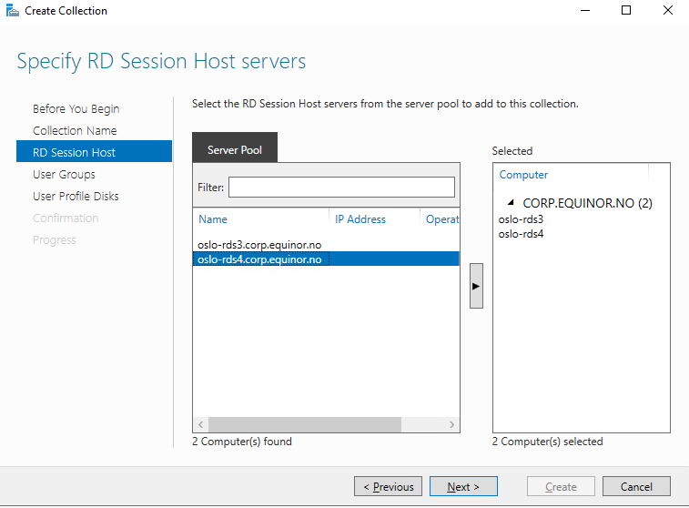
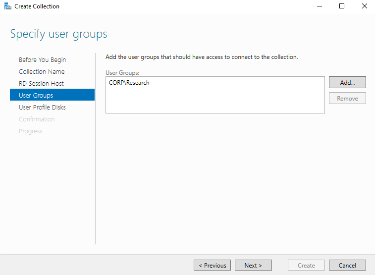
Remove "Domain Users", add specific groups (e.g. "Research") -> Access Regulation
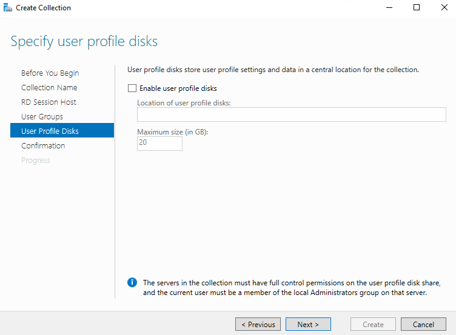
User Profile Dissk (UPDs) deaktivieren, weil später FSLogix stattdessen (moderner).
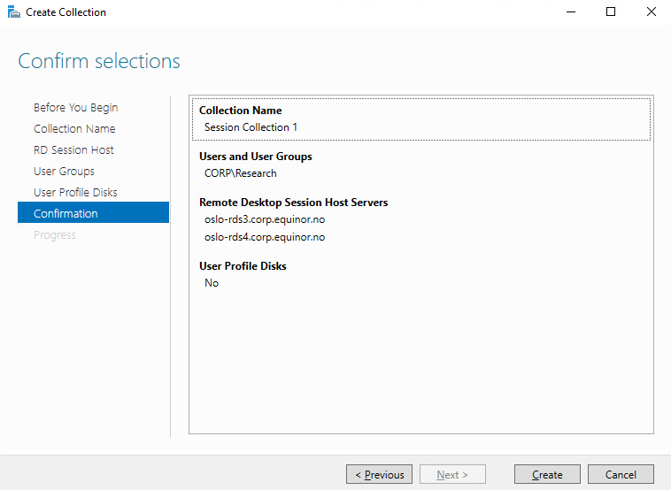
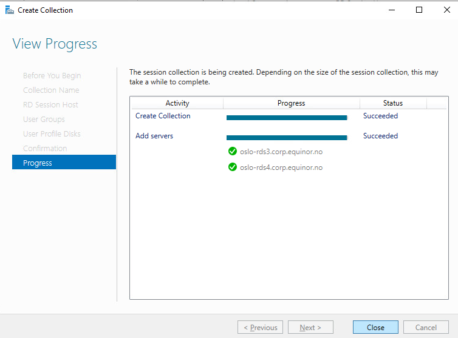

## Session Collection konfigurieren

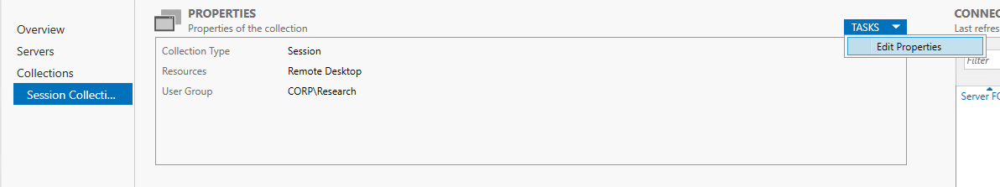
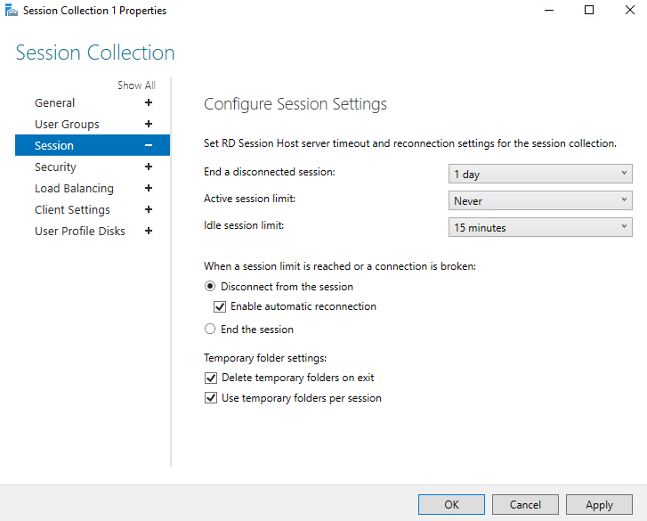
Default Settings, außer:

- **End a disconnected Session** - 1 day - Beendete Sessions werden noch für 1 Tag aufbewahrt. Zum Beispiel um Ressourcen zu sparen, da sonst alle Sessions weiterlaufen.
- **Idle session limit** - 15 minutes - Nach 15 Minuten Inaktivität wird die Session disconnected. Vergleichbar mit Desktop Lock Screen

*Müsste man nicht machen (default ist Never), aber warun nicht.*

## FSLogix

### File Share erstellen

Auf einem Server (hier oslo-dc2) einen File Share erstellen:
`C:\FSLogix_Profiles` erstellen und als `Profiles$` sharen
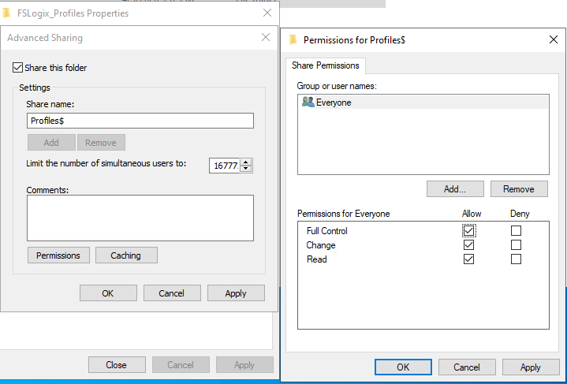
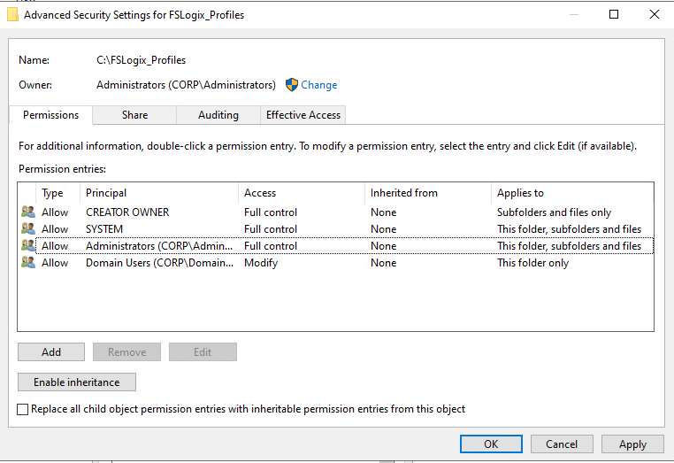
Inheritance disablen

### FSLogix Installation

[Download](https://learn.microsoft.com/en-us/fslogix/how-to-install-fslogix)

Den Installer auf jeden RDS Session Hosts ausführen und danach neustarten.

### FSLogix konfigurieren

1. Import Templates
    Copy `fslogix.admx` to `C:\Windows\PolicyDefinitions` and `fslogix.adml` to the `en-US` subfolder on your Domain Controller (hier oslo-dc1).
2. The "Must-Have" Settings
    Create a GPO linked to the OU containing your RD Session Hosts. Navigate to:
    `Computer Configuration > Policies > Administrative Templates > FSLogix > Profile Containers`

| Setting | Value | Why? |
| :--- | :--- | :--- |
| **Enabled** | Enabled | Turns the engine on. |
| **VHD location** | `\\YourServer\Profiles$` | Points the agent to your SMB share. |
| **Size in MBs** | `30000` (example) | Limits the disk size (30GB is usually plenty). |
| **Virtual Disk Type** | **VHDX** | VHDX is more resilient to corruption than standard VHD. |
| **Delete local profile...** | Enabled | Cleans up the C: drive if a local profile already exists. |
| **Prevent login on failure** | Enabled | Stops "Temp Profiles." If the disk won't mount, the user can't log in. |

Falls **Virtual Disk Type** nicht vorhanden ist:

1. In the same GPO, go to: **Computer Configuration > Preferences > Windows Settings > Registry**.
2. Right-click and select **New > Registry Item**.
3. Configure it as follows:
    - **Action:** Update
    - **Hive:** `HKEY_LOCAL_MACHINE`
    - **Key Path:** `SOFTWARE\FSLogix\Profiles`
    - **Value Name:** `VirtualDiskType`
    - **Value Type:** `REG_SZ`
    - **Value Data:** `vhdx` (Type this in lowercase)

## RDS RD Licensing

### RDLS Installation

To install an RD Licensing server, perform the following steps:

1. In Server Manager, in the navigation pane, click Remote Desktop Services.
2. On the Overview page, in the Deployment Overview area, click RD Licensing.
3. In the Add RD Licensing Servers Wizard, on the Select A Server page, double-click the server you want to configure as an RD Licensing server and click Next. (hier oslo-rds1)
4. On the Confirmation page, click Add.
5. Wait until the installation is complete and click Close.

### RDLS Konfiguration

To set the licensing mode for an RDS deployment, Setforn the following steps:

1. In Server Manager, in the navigation pane, click Remote Desktop Services.
2. On the Overview page, in the Deployment Overview area, click Tasks and click Edit Deployment Properties.
3. In the Deployment Properties window, in the navigation pane, click RD Licensing.
4. On the RD Licensing page, select Per Device or Per User and click OK. (hier Per User)

**License kann nicht installiert werden, da keine Lizenzen für RDS vorhanden sind.**

## High Availibility für RDS

### HA für RDS Session Host

Ist automatisch konfiguriert, wenn mehrere Session Hosts in einer Session Collection vorhanden sind.

### HA für RDS Connection Broker

To prepare the RD Connection Broker role service for high availability, you need to do the following:

- Install and Configure a server running Microsoft SQL Server 2008 R2 or newer. The RD Connection Broker servers must have permission to create a database on the server.
- Install the SQL Server Native Client on all RD Connection Broker servers. The RD Connection Broker servers use this to connect to the SQL database.
- Configure a static IP address on all RD Connection Broker servers. This is required to implement DNS round robin for load balancing.
- Configure a DNS round robin record for the RD Connection Broker servers. Select a name that is meaningful, such as rds.adatum.com.

#### SQL Server Installation

Installing Microsoft SQL Server is a bit more involved than a "Next, Next, Finish" wizard if you want it to actually perform well and stay secure. Since you're already neck-deep in RDS and FSLogix, you'll likely want this for a database-backed app or perhaps even an FSLogix Cloud Cache setup later.

Here is the professional way to get SQL Server up and running.

### Phase 1: Pre-requisites & Planning

Don't just run the `.exe` yet. SQL Server is picky about its environment.

- **Service Account:** Create a dedicated Domain User account (e.g., `SVC_SQL`) to run the services. Using "Local System" is a security risk.
- **Storage Best Practice:** If possible, use three separate drives: 
  - **C:** OS and SQL Binaries.
  - **D:** Data files (`.mdf`).
  - **L:** Log files (`.ldf`). (Logs are write-intensive; separating them prevents them from choking your data throughput).
- **Software:** You’ll need the SQL Server ISO and the **SQL Server Management Studio (SSMS)** installer (they are separate downloads now).

### Phase 2: The Installation Wizard

1. Mount the ISO and run `setup.exe`.
2. In the **SQL Server Installation Center**, click **Installation** (left side) and then **New SQL Server stand-alone installation**.
3. **Feature Selection:** For most standard setups, you only need:
    - **Database Engine Services**
    - (Optional) Client Tools SDK
    - *Note: Do NOT install everything. It just increases your attack surface.*
4. **Instance Configuration:** * **Default Instance:** Used if this is the only SQL install on the server (accessible via `ServerName`).
    - **Named Instance:** Used for multiple installs (accessible via `ServerName\InstanceName`).
5. **Server Configuration (Crucial):**
    - Assign your `SVC_SQL` account to the **SQL Server Database Engine**.
    - **Collation Tab:** Ensure this matches what your specific application requires (usually `SQL_Latin1_General_CP1_CI_AS`). Changing this later is a nightmare.
  
### Phase 3: Database Engine Configuration

This is the "brain" of the install.

1. **Authentication Mode:** Choose **Mixed Mode** if you need legacy apps to connect via a username/password. Choose **Windows Authentication** for maximum security.
2. **SQL Server Administrators:** Click **Add Current User** so you don't lock yourself out of your own database.
3. **Data Directories:** Point your Data, Log, and Backup directories to those separate drives you created in Phase 1.
4. **TempDB:** SQL Server 2022+ usually auto-configures this well, but ensure you have multiple TempDB files if you have a high-core count CPU (usually 1 file per core, up to 8).

### Phase 4: Post-Install "Must-Dos"

#### 1. Install SSMS

The SQL installer doesn't include the management UI anymore. Download and install **SQL Server Management Studio** separately to actually interact with your databases.

#### 2. Open the Firewall

By default, Windows Server blocks SQL traffic. You need to open **TCP Port 1433** in the Windows Defender Firewall to allow remote connections.

#### 3. Memory Capping

SQL Server is "greedy"—it will take every megabyte of RAM available on the server and never give it back.

1. Open SSMS.
2. Right-click the Server Name > **Properties** > **Memory**.
3. Set the **Maximum server memory** to leave at least 4GB for the Windows OS itself.

#### SQL Server Konfiguration

Setting up **High Availability (HA)** for the RD Connection Broker is the most complex part of an RDS deployment because it shifts the "brains" of your farm from a local file to a central SQL Database.

Since you've already installed SQL Server, you are halfway there. Here is the step-by-step blueprint to link your brokers together.

### Phase 1: The SQL Prerequisites

The Connection Broker doesn't use a standard login; it uses the **Computer Accounts** of the broker servers themselves to talk to SQL.

1. **Create a Security Group:** In Active Directory, create a group (e.g., `RDS_Brokers`) and add the computer accounts of all your intended Broker servers to it.
2. **SQL Permissions:** * Open SQL Server Management Studio (SSMS).
    - Go to **Security > Logins** and add the `RDS_Brokers` group (or each individual computer account).
    - Give this group the **`dbcreator`** server role (this allows the first broker to create the database automatically).
3. **Firewall:** Ensure **TCP Port 1433** is open on the SQL server.

### Phase 2: The DNS "Shared Name"

You need a single name that users connect to, which points to *all* your brokers.

1. In your DNS Manager, create a new **Host (A) Record**.
2. **Name:** Give it a generic name (e.g., `RDS-Broker.yourdomain.local`).
3. **IP Address:** Enter the IP of **Broker 1**.
4. Create a *second* A-record with the **exact same name** but point it to the IP of **Broker 2**.
    - *This creates "DNS Round Robin." When a client asks for the broker, DNS will rotate between the two IPs.*

### Phase 3: The HA Configuration Wizard

Now, go to your primary RD Connection Broker and open **Server Manager**.

1. Navigate to **Remote Desktop Services > Overview**.
2. Right-click the **RD Connection Broker** icon and select **Configure High Availability**.
3. Choose **Dedicated Database Server**.
4. **The Connection String (The "Magic" Step):** This is the part everyone gets wrong. You must use the correct driver installed on your server. Since it is 2026, use the **ODBC Driver 18** (or 17) for SQL Server:

> `DRIVER={ODBC Driver 18 for SQL Server};SERVER=SQLServerName;Trusted_Connection=Yes;APP=Remote Desktop Services Connection Broker;Database=RDCB_Database;TrustServerCertificate=Yes`

- **DNS Name:** Enter the shared DNS name you created in Phase 2 (`RDS-Broker.yourdomain.local`).

### Phase 4: Adding the Second Broker

Once the first broker successfully moves its data to SQL, you can add your redundant "spare" broker.

1. In the same **Overview** screen, right-click the **RD Connection Broker** icon again.
2. Select **Add RD Connection Broker Server**.
3. Select your second server from the list.
4. The wizard will automatically install the Broker role and point it to the SQL database you just configured

### Phase 5: The "Certificate" Trap

Once you have HA enabled, your brokers are now identified by that shared DNS name (`RDS-Broker`).

- **Problem:** If your SSL certificate only lists the server's individual hostname (e.g., `Broker01.local`), users will get a certificate mismatch error when they try to connect.
- **Fix:** You must deploy a **Subject Alternative Name (SAN)** certificate or a **Wildcard** certificate that includes the shared name (`RDS-Broker.yourdomain.local`). Apply this in the **Edit Deployment Properties > Certificates** section of Server Manager.

#####

Troubles:

- SPN stuff:
  
  ```cmd
  setspn -s TERMSRV/RDS-Broker OSLO-RDS1
  setspn -s TERMSRV/RDS-Broker.corp.equinor.no OSLO-RDS1
  setspn -s TERMSRV/RDS-Broker OSLO-RDS11
  setspn -s TERMSRV/RDS-Broker.corp.equinor.no OSLO-RDS11
  ```

- GPO stuff:
  - Credential Guard und Windows Server Baselines deaktivieren
  - Neue GPO für Restircted Groups auf den Brokers

### HA für RDS RD Licensing

To add an RD Licensing server, perform the following steps:

1. In Server Manager, in the navigation pane, click Remote Desktop Services.
2. On the Overview page, in the Deployment Overview area, right-click RD Licensing and click Add RD Licensing Servers.
3. In the Add RD Licensing Servers Wizard, on the Select A Server page, double-click the server you want to configure as an RD Licensing server and click Next.
4. On the Confirmation page, click Add.
5. Wait until the installation is complete and click Close.

Bei Per User Licensing, wie hier, braucht es für HA zwar mehrere RD Licensing Server, jedoch bedarf es nicht mehr Konfiguration, da es reicht, dass es RD Session Host einen RD Licensin Server erreichen kann. Die Lizenzen werden nur überprüft, nicht aber wie bei Per Device Licensing, auf das Gerät direkt angewendet.

### HA für RDS Web Acces

To add an RD Web Access server, perform the following steps:

1. In Server Manager, in the navigation pane, click Remote Desktop Services.
2. On the Overview page, right-click RD Web Access and click Add RD Web Access Servers.
3. In the Add RD Web Access Servers Wizard, on the Select A Server page, double-click the server you want to configure as an RD Web Access server and click Next.
4. On the Confirmation page, click Add.
5. Wait until the installation is complete and click Close.
6. Configure your load-balancing solution with the IP address of the new RD Web Access server.

## Remote Apps

Neue Session Collection, da entweder Session-based Virutal Desktops oder Remote Apps in einer SC, nicht beides.

Dann die Applications installieren:

- Session Host muss im Install Mode sein (wird teilweise duch ``.msi`` selbst geregelt, sonst über control panel -> install remote desktop app)
- remote app in sc publishen und konfigurieren:
  - user acces rights
  - default file extensions
  - ...


