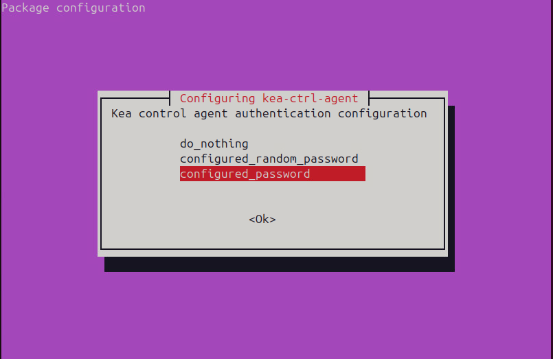
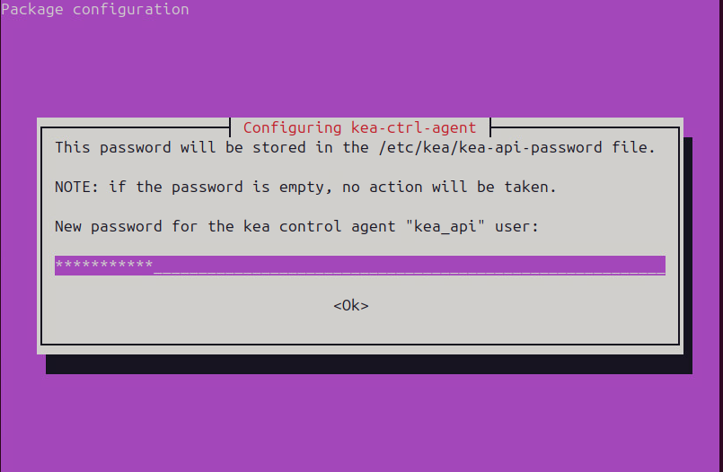
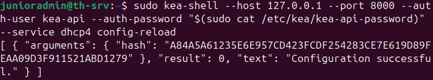

# th-srv

- [th-srv](#th-srv)
  - [KeaDHCP](#keadhcp)
    - [KeaDHCP-instalation](#keadhcp-instalation)
  - [Prometheus](#prometheus)
    - [Prometheus-Instalation](#prometheus-instalation)
  - [Grafana](#grafana)
    - [Grafana-Instalation](#grafana-instalation)
    - [Grafana Starten](#grafana-starten)
    - [Grafana first login](#grafana-first-login)

## KeaDHCP

Wir benutzen ISC-KEA statt ISC-DHCP, weil ISC-DHCP seit 2022 **end-of-life** erreicht hat. **Außerdem** sind 2 DHCP standorte in Throndheim Fragwürdig. (th-dc1 und th-srv haben beide nach Topologie eine DHCP funktion)

Source: [Official Ubuntu Guide](https://ubuntu.com/server/docs/how-to/networking/install-isc-kea/)

### KeaDHCP-instalation

instaliere:

```bash
sudo apt install kea
```

im instalationsdialouge:



configure_password -> Kea Agent arbeitet mit einen definierten passwort

PS:*wenn kein Passwort erwüncht ist -> do nothing auswählen*

dann:



Config file ``/etc/kea/kea-dhcp4.conf``:

```json
{
    "Dhcp4": {
        "interfaces-config": {
            "interfaces": ["ens33"]
        },
        "control-socket": {
            "socket-type": "unix",
            "socket-name": "/run/kea/kea4-ctrl-socket"
        },
        "lease-database": {
            "type": "memfile",
            "lfc-interval": 3600
        },
        "valid-lifetime": 600,
        "max-valid-lifetime": 7200,
        "subnet4": [{
            "id": 1,
            "subnet": "10.2.0.0/24",
            "pools": [{
                "pool": "10.2.0.1 - 10.2.0.200"
            }],
            "option-data": [{
                    "name": "routers",
                    "data": "10.2.0.254"
                },
                {
                    "name": "domain-name-servers",
                    "data": "10.2.0.201"
                },
                {
                    "name": "domain-name",
                    "data": "remote.corp.equinor.no"
                }
            ]
        }]
    }
}
```

kea service neustarten:

```bash
sudo kea-shell --host 127.0.0.1 --port 8000 --auth-user kea-api --auth-password "$(sudo cat /etc/kea/kea-api-password)" --service dhcp4 config-reload
```

dann drücke `ctlr` + `d` um den Command zu beenden. Wenn alles richtig funktioniert sollte eine ausgabe folgendermasen ausehen:



## Prometheus

Source: [Offcial Prometheus Guide](https://prometheus.io/docs/prometheus/latest/getting_started/)

### Prometheus-Instalation

Prometheus herunterladen von [Download Link](https://prometheus.io/download/) und entpacken:

```bash
tar xvfz prometheus-*.tar.gz
cd prometheus-*
```

Nodes hinzufügen:

in ``prometheus.yml``:

```yml
global:
  scrape_interval:     15s 

  external_labels:
    monitor: 'codelab-monitor'


scrape_configs:
  - job_name: 'prometheus'


    scrape_interval: 5s

    static_configs:
      - targets: ['<DMZ - oslo-srv2 muss noch NAT konfiguriert werden>:9090'] #hier das target angeben.
```

Prometheus starten:

```bash
./prometheus --config.file=prometheus.yml
```

!!ACHTUNG!!: PEOMETHEUS NOCH ALS SERVOCE STARTEN -> FEHLT

unter dem port ``9090`` ist das Prometheus Dashboard erreichbar.

## Grafana

Source:

- [Grafana Official Instalation Guide](https://grafana.com/docs/grafana/latest/setup-grafana/installation/debian/)
- [Grafana Official Starting Guide](https://grafana.com/docs/grafana/latest/setup-grafana/start-restart-grafana/)
- [Grafana Official Sign-In Guide](https://grafana.com/docs/grafana/latest/setup-grafana/sign-in-to-grafana/)

### Grafana-Instalation

Prerequisits instalieren:

```bash
sudo apt-get install -y apt-transport-https wget gnupg
```

GPK keys importieren:

```bash
sudo mkdir -p /etc/apt/keyrings
sudo wget -O /etc/apt/keyrings/grafana.asc https://apt.grafana.com/gpg-full.key
sudo chmod 644 /etc/apt/keyrings/grafana.asc
```

Repository hinzufügen:

```bash
echo "deb [signed-by=/etc/apt/keyrings/grafana.asc] https://apt.grafana.com stable main" | sudo tee -a /etc/apt/sources.list.d/grafana.list
```

Repositories Updated:

```bash
sudo apt-get update
```

Grafana Enterprise instalieren:

```bash
sudo apt-get install grafana-enterprise
```

### Grafana Starten

Grafana Service enablen und starten:

```bash
sudo systemctl daemon-reload
sudo systemctl start grafana-server
sudo systemctl enable grafana-server.service
```

Grafana status überprüfen:

```bash
sudo systemctl status grafana-server
```

### Grafana first login

- auf port ``3000`` befindet sich die *Grafana* landing page.
- Default-Credentials: admin / admin
- nach dem ersten einloggen nues passwort definieren.
  - Passwort: junioradmin
