# VPN: oslo-fw \<---> sv-vpn

- [VPN: oslo-fw \<---\> sv-vpn](#vpn-oslo-fw-----sv-vpn)
  - [Übersicht](#übersicht)
  - [Konfiguration](#konfiguration)
    - [oslo-fw](#oslo-fw)
      - [oslo-fw Tunnel Konfiguration](#oslo-fw-tunnel-konfiguration)
      - [Oslo-fw Policy Konfiguration](#oslo-fw-policy-konfiguration)
    - [sv-vpn](#sv-vpn)
      - [sv-vpn Tunnel Konfiguration](#sv-vpn-tunnel-konfiguration)
      - [sv-vpn Policy Konfiguration](#sv-vpn-policy-konfiguration)

## Übersicht

Ein VPN zwischen [oslo-fw](../../Oslo/oslo-fw/oslo-fw.md) und [th-fw](../../Stavanger/sv-vpn/sv-vpn.md)

Um Site-to\_Site Conectivity zwischen den Standorten "Oslo" und "Tronheim" zu ermöglichen.

## Konfiguration

### oslo-fw

konfiguration des VPNs auf der Fortigate Firewall oslo-fw:

#### oslo-fw Tunnel Konfiguration

- in der Gui der Fortinet Firewall oslo-fw, unter dem Reiter "VPN" dann -> "VPN Tunnels" eien neuen VPN-Tunnel erstellen:
  
  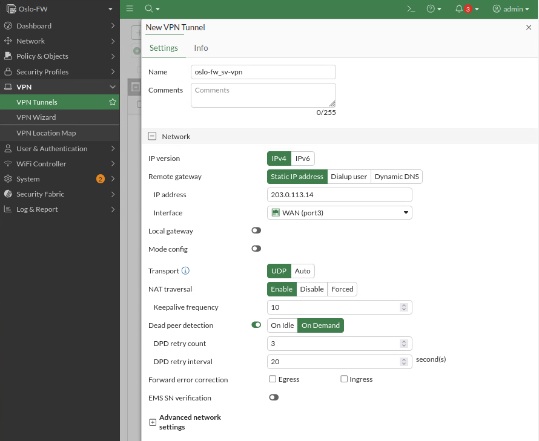
  
  hier das Netzwerk und Interface angeben:
  - Adresse: ``203.0.113.14``
  - Interface: ``WAN``
  
  transport auf ``UDP`` setzen

  der rest sollte standardmässig gleich wie im screenshot sein.
  
- dannach:
  
  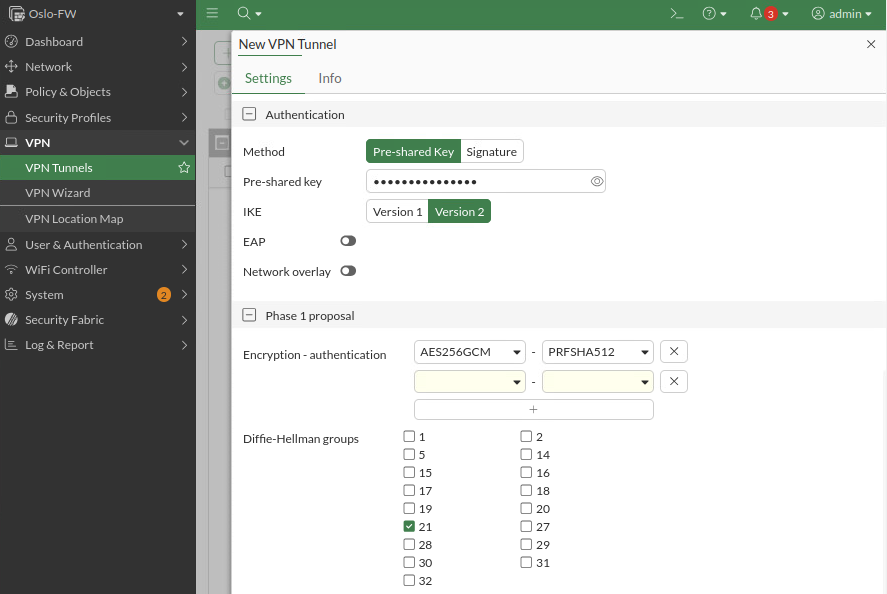

  hier den Pre-Shared key eingeben und die Attribute wie im Screenshot konfigurieren.

  - Pre-Shared-Key: Junioradmin123!

- bei denn "Phase 2 Selectors" auf "Create" drücken:
  
  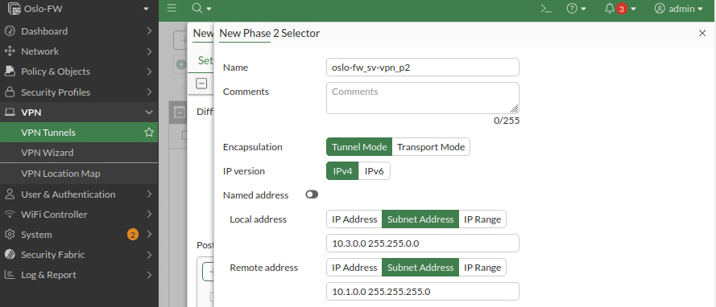

  hier wie im Screenshot die Attribute setzen.

- weiter den Phase 2 Selector konfigurieren:

  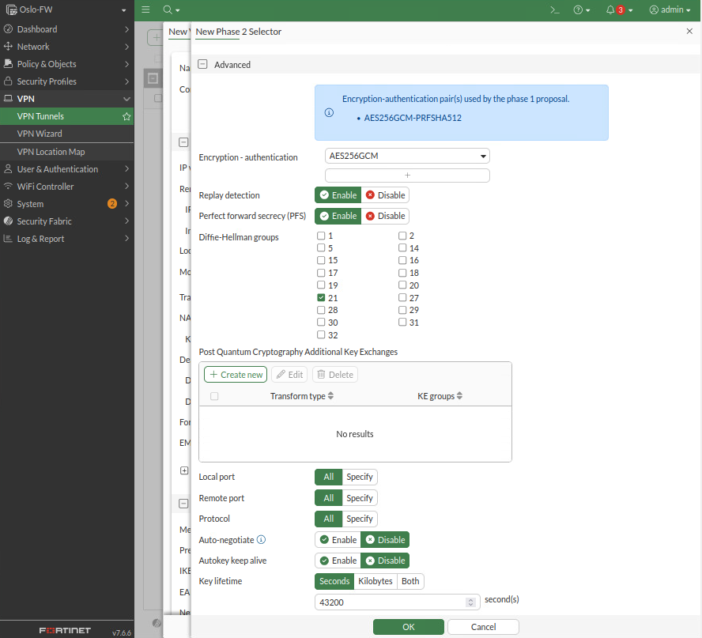
  
  wie im Screenshot konfigurueren und ok drücken.
  
---

#### Oslo-fw Policy Konfiguration

es müssen insgesammt 4 Policies erstellt werden.

- Vlan552 inbound
- Vlan552 outbound
- Vlan553 inbound
- Vlan553 outbound

um Traffic über den VPN einzuschränken.

- In der Fortinet GUI von oslo-fw unter dem Reiter "Policy & Objects" dann -> "Firewall Policy" eine neue Erstellen:

  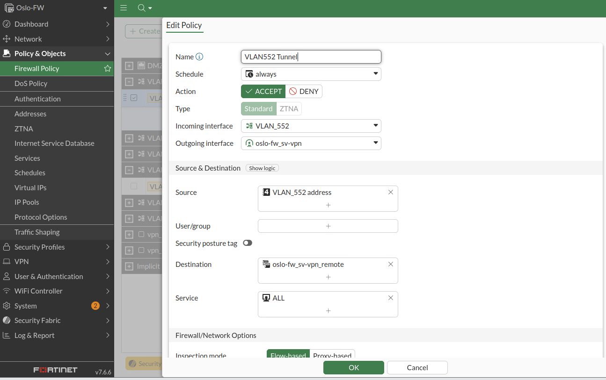
  
  Hier wie im screenshot konfigurieren. ACHTUNG! Pro Netzwerk muss ein eigenes Adressenobjekt erstellt werden.

  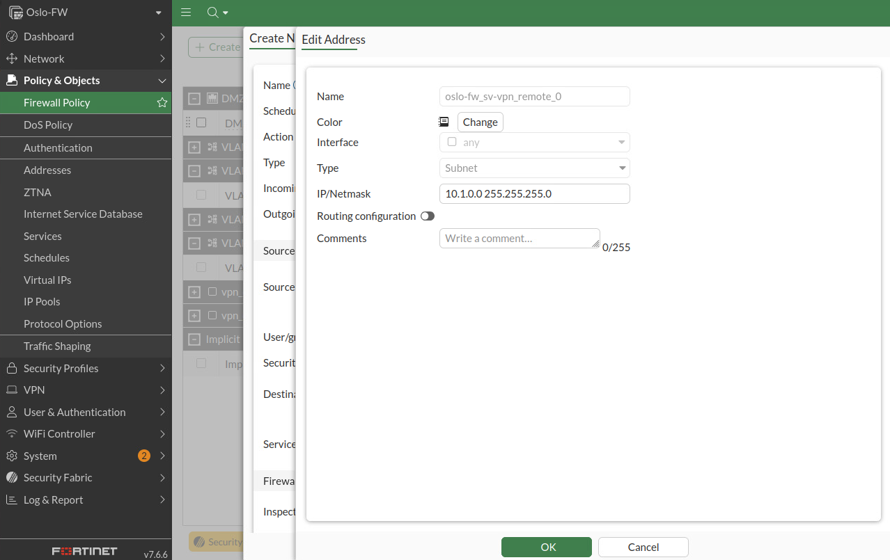

  sollten mehrere dieser Objekte benötigt werden, so können diese in einer sogenannten "Address Group" zusammen gebündelt werden:

  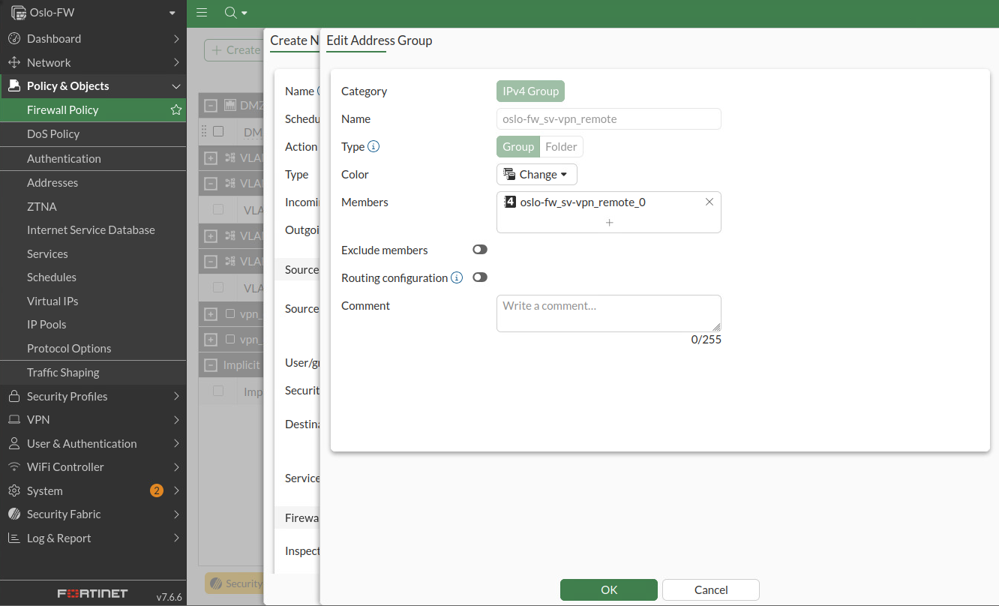

Nachdem alle Policies erstellt wurden, muss noch eine static-Route erstellt werden, um das das entfernte netz, hinter dem VPN erreichen zu können.

- Links im reiter "Network" dann -> "Static Routes" eine neue Route erstellen:

  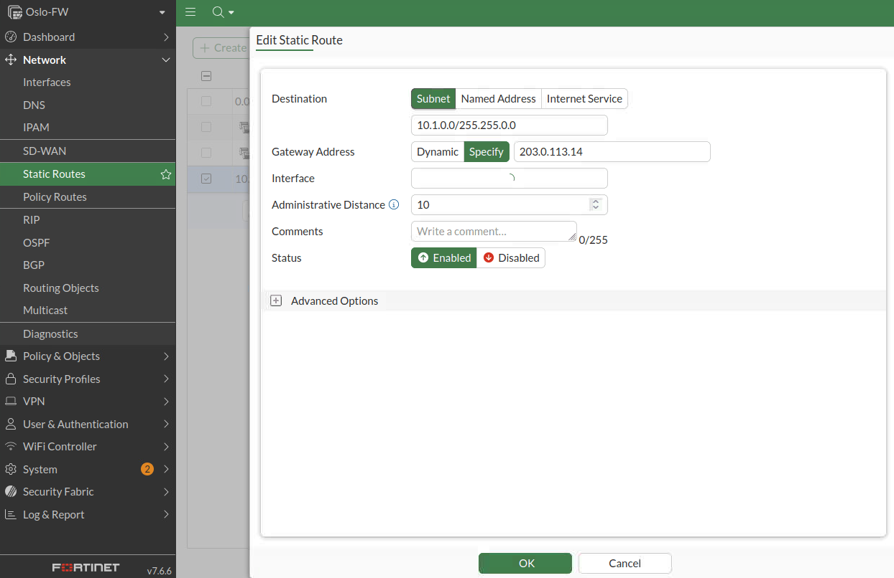

  wie im screenshot konfigurieren.

---

### sv-vpn

#### sv-vpn Tunnel Konfiguration

konfiguration des VPNs auf der PFSense Firewall sv-vpn:

- in der GUI unter dem Reiter "VPN" dann -> "IPsec":

  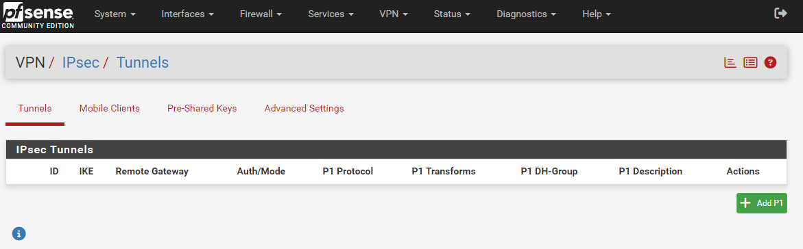

  hier auf "Add P1" drücken (Phase 1 IPsec VPN)

- dannach:
  
  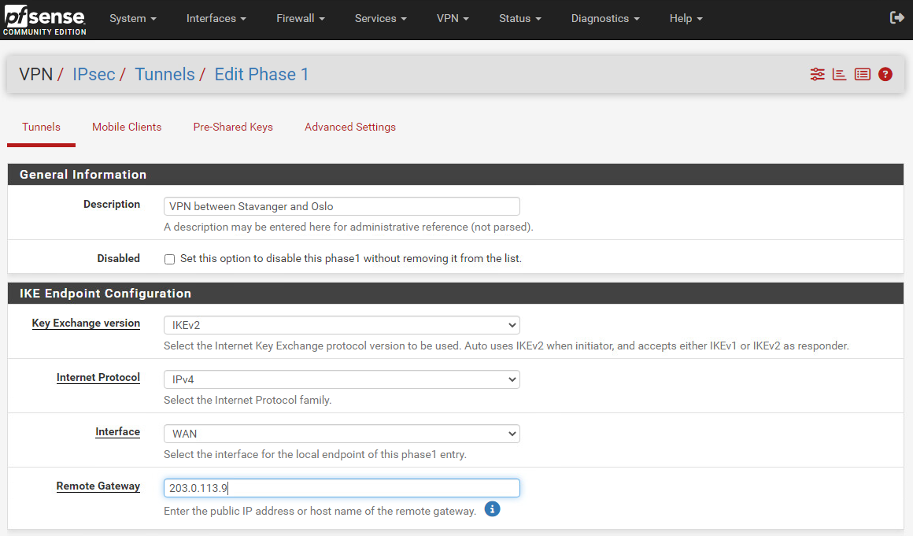

  hier eine description eingeben und das remote gateway eintragen:

  - Adresse von oslo-fw: 203.0.113.9
  
  der Rest sollte defaultmässig gleich wie im screenshot sein.

- weiter:

  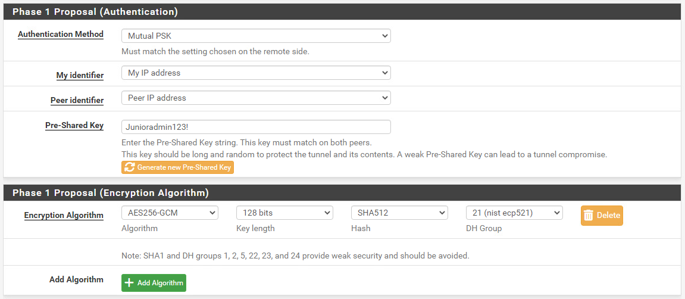

  hier einen Preshared key eingeben:
  - Key: ``Junioradmin123!``
  
  und die enryption details wählen wie im screenshot beschrieben.

- speichern und changes anwenden!

- "show Phase 2 entries" anclicken:
  
  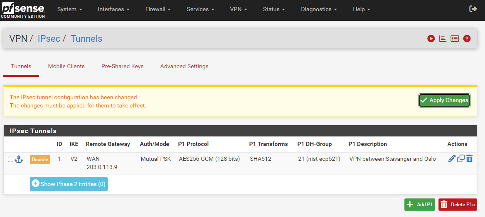
  
  dann auf "Add P2" clicken

- hier dann:
  
  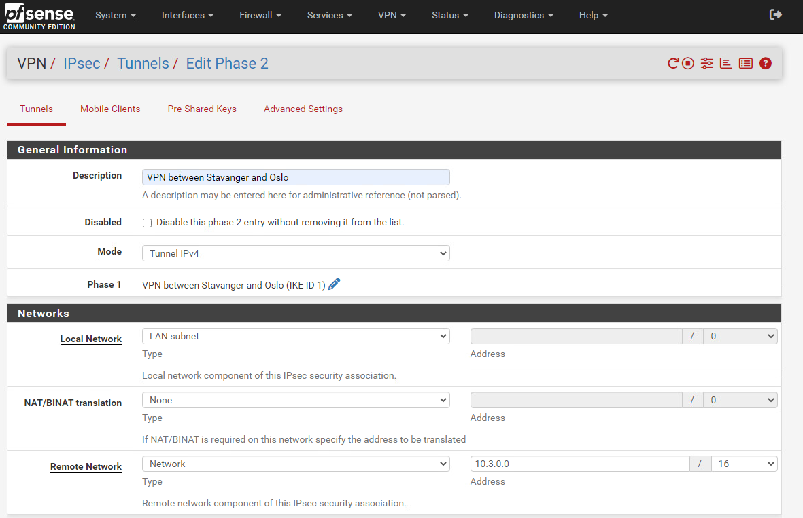

  - eine Beschreibung setzen.
  
  unter Networks:
  - local network: ``Lan subnet`` damit das Netz am LAN Interface verwendet wird.
  - Remote network: ``Network`` und die netzwerkadresse angeben.
  
- folgend:
  
  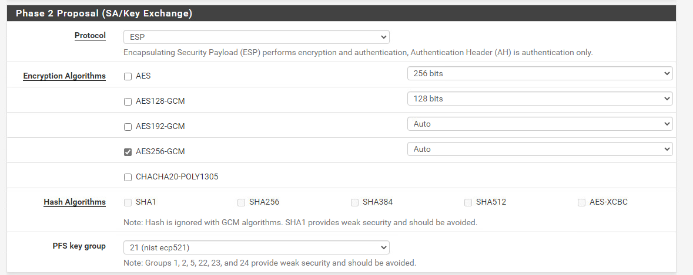

  hier wie im screenshot attribute auswählen. Damit ein höheres Level an Sicherheit gewehrleistet wird.

- speichern und anwenden!
  
  Endergebniss:
  
  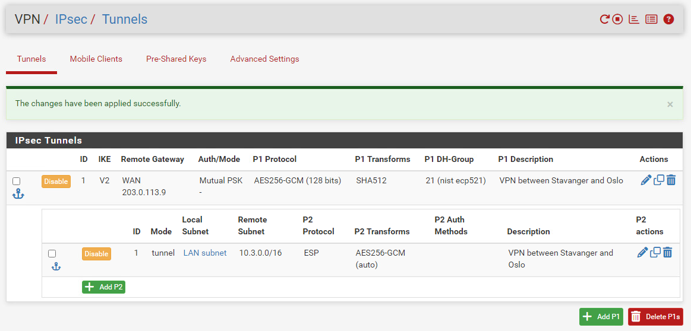

#### sv-vpn Policy Konfiguration

Damit Traffic über den VPN kann, müssen Policies erstellt werden die dies zulassen.

dafür muss eine inbound und eine outbound regel erstellt werden.

**Outbound**:

- unter "Firewall" dann -> "Rules" und dort eine der beiden add buttons drücken. (nicht das gelbe "+ Seperator")
  
  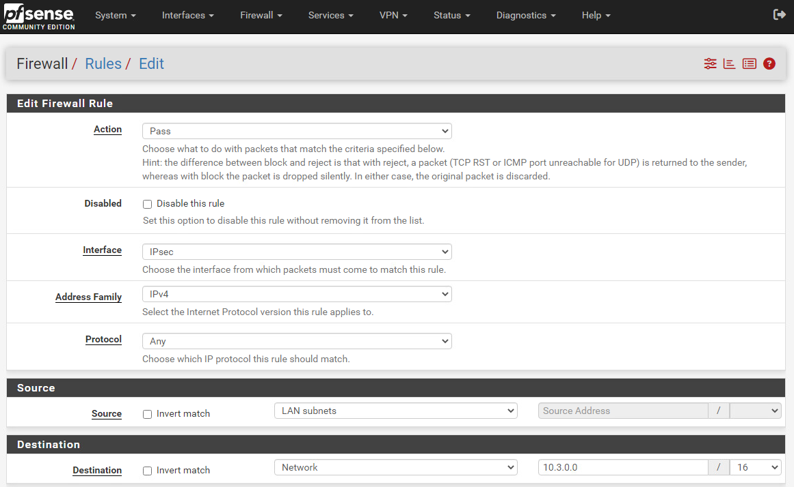

  - Protocol: ``any``
  - Source: ``LAN subnets``
  - Destination: ``Network`` -> ``10.3.0.0/16``
  
  der rest sollte standardmässig gleich wie im screenshot sein

  speichern und anwenden!

**Inbound**:

- wieder under "Firewall" dann -> "Rules" eine neue Policy erstellen:

  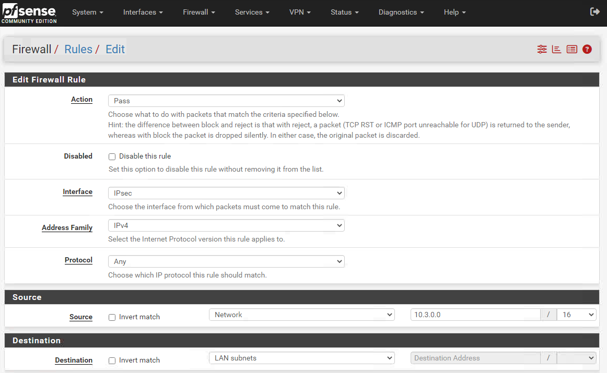
  
  - Protocol: ``any``
  - Source: ``Network`` -> ``10.3.0.0/16``
  - Destination: ``LAN subnets``

  der rest sollte standardmässig gleich wie im screenshot sein

  speichern und anwenden!
