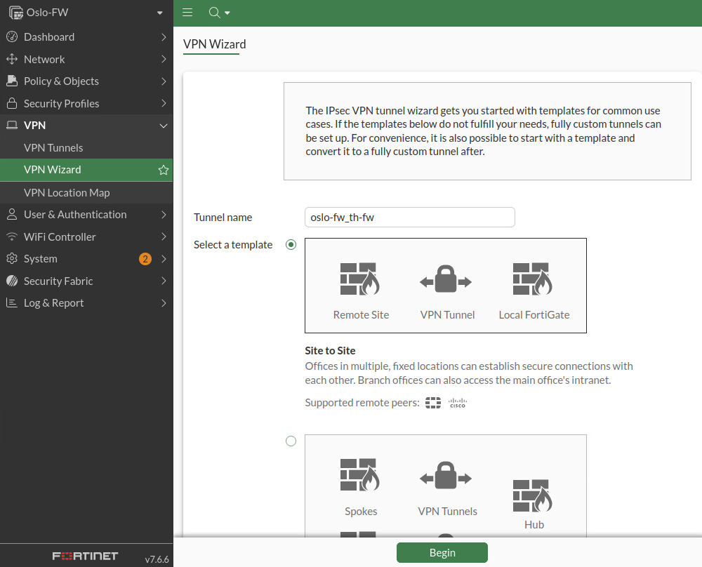
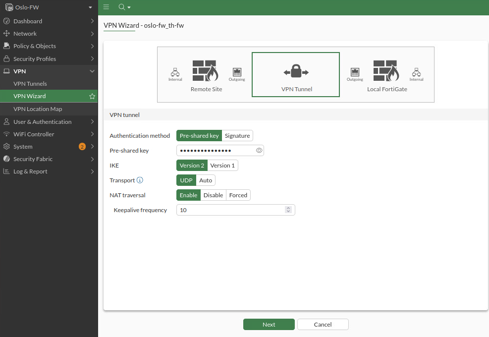
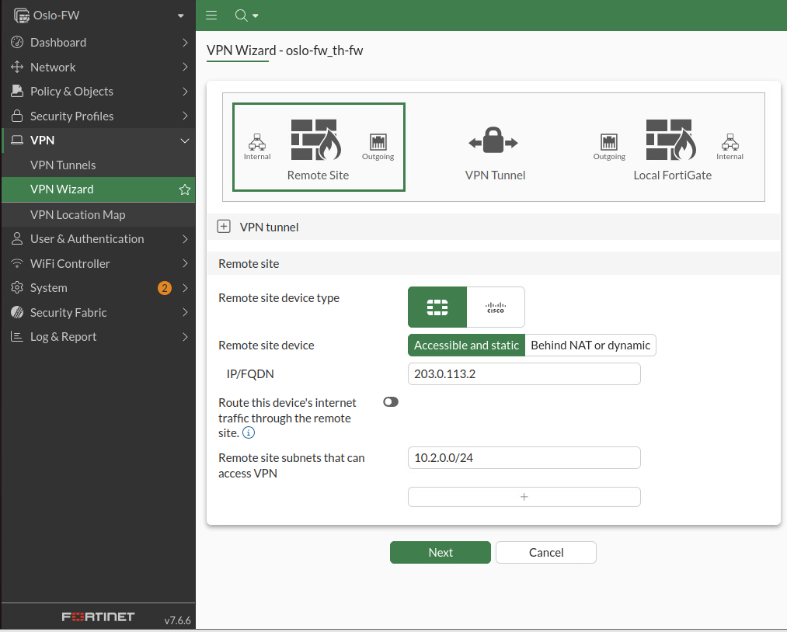
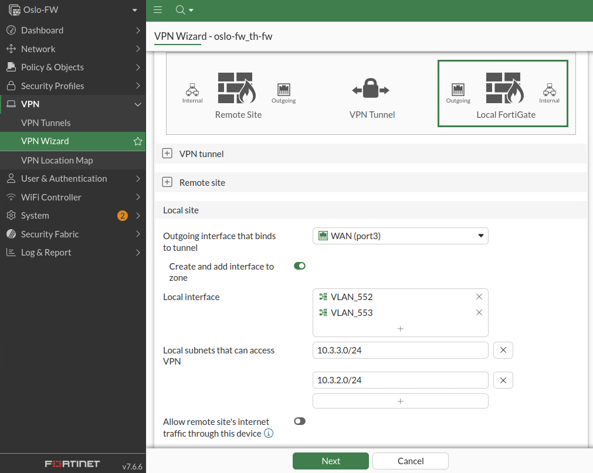
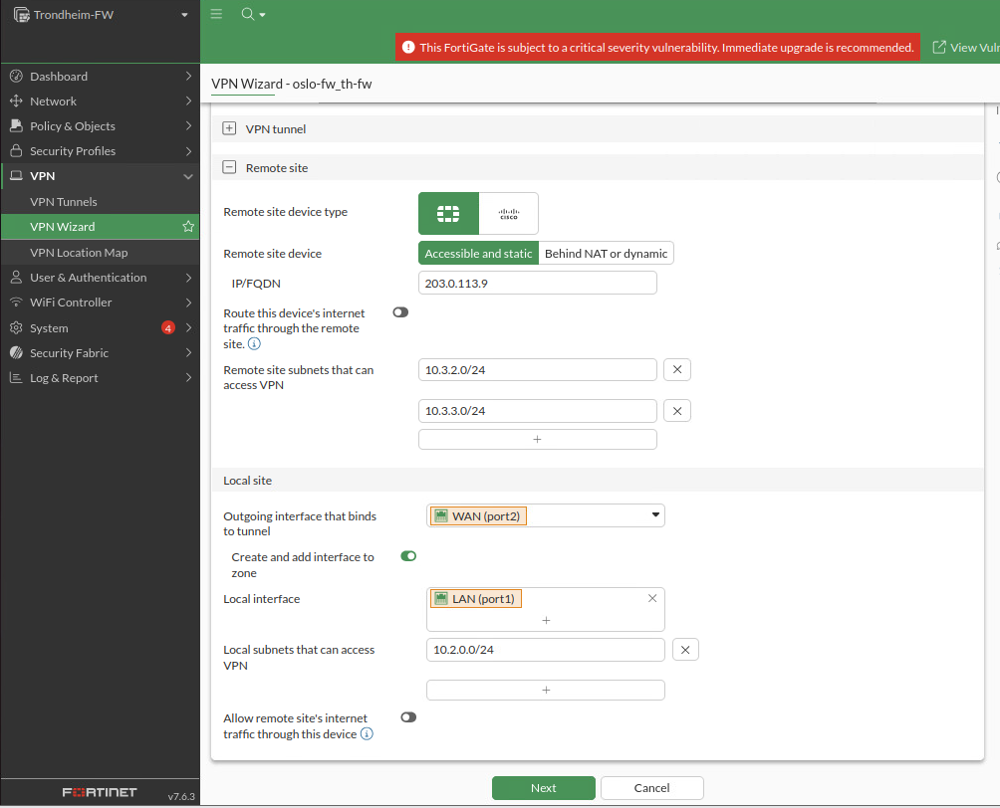

# VPN: oslo-fw <---> th-fw

- [VPN: oslo-fw \<---\> th-fw](#vpn-oslo-fw-----th-fw)
  - [Übersicht](#übersicht)
  - [Konfiguration](#konfiguration)
    - [oslo-fw](#oslo-fw)
    - [th-fw](#th-fw)
  - [Probleme](#probleme)
    - [Phase-2 Proposal](#phase-2-proposal)

## Übersicht

Ein VPN zwischen [oslo-fw](../../Oslo/oslo-fw/oslo-fw.md) und [th-fw](../../Trondheim/th-fw/th-fw.md)

Um Site-to-Site Conectivity zwischen den Standorten "Oslo" und "Trondheim" zu ermöglichen.

## Konfiguration

### oslo-fw

konfiguration des VPNs auf der Fortigate Firewall: oslo-fw:

- In der GUI unter dem Reiter: "VPN" dann -> "VPN-Wizzard":

  

  hier site-to-site auswählen und auf "begin" drücken
- im nächten fenster:

  
  
  hier einen Pre-Shared Key eingeben und dann weiter drücken.
  
  *PS: Die restlichen attribute sollten standardmäsig die aus dem screenshot ensprechen.*
- im nächsten Fenster:

  

  - den Typen des anderen Gerätes eingeben
  - die Remote Addresse ist statisch und direkt erreichbar durch BB2 **\<hier LINK zu BB2 Doku\>**
  
    Adresse: ``203.0.113.2``

  - Das LAN in Trondheim, welches über den VPN darf, angeben.

    Netz-Adresse: ``10.2.0.0/24``
  - next drücken.
- im nächsten Fenster:
  
  
  
  - das outgoing Interface auswählen.
  - unter "Local Interface" die Lokalen Interfaces des VPN entry / exit auswählen.
  
    *PS: im screenshot sind es die Vlan-Interfaces da die Fortigate eigene Virtuelle Interfaces pro Vlan erstellt.*
  - die Lokalen Subnetze welche über den VPN dürfen angeben.
    - Managment Vlan: ``10.3.2.0/24``
    - domain Vlan: ``10.3.3.0/24``
  - die restlichen optionen sollten standardmäßig gleich wie im Screenshot sein.

[Probleme](#probleme) durchlesen!

### th-fw

konfiguration des VPN auf der Fortigate Firewall: th-fw:

Die Konfiguration ist gleich wie auf der [oslo-fw](#oslo-fw) bis auf einzelne eingaben:

- Die Remote Adresse ist: ``203.0.113.9``
- die Remote Site subnets sind die beiden Vlans in Oslo:
  - Managment Vlan: ``10.3.2.0/24``
  - domain Vlan: ``10.3.3.0/24``
- das in-/out-going interface des VPNs angeben.
- das Lokale Subnetz angeben welchens über den VPN darf.
  - Adresse: ``10.2.0.0/24``

[Probleme](#probleme) durchlesen!

## Probleme

### Phase-2 Proposal

Der Automatisch erstelle VPN verwendet veraltete Hash- und verschlüsselungs algorythmen. Diese sollten im Reiter: "VPN" dann "VPN Tunnels" im jewilig erstellten Tunnel herausgenommen werden.

den Tunnel bearbeiten, dann ganz unten unter "Phase 2 selectors"  den VPN tunnel auswählen und bearbeiten. Unter Advanced die unsicheren Verfahren abwählen/löschen.
