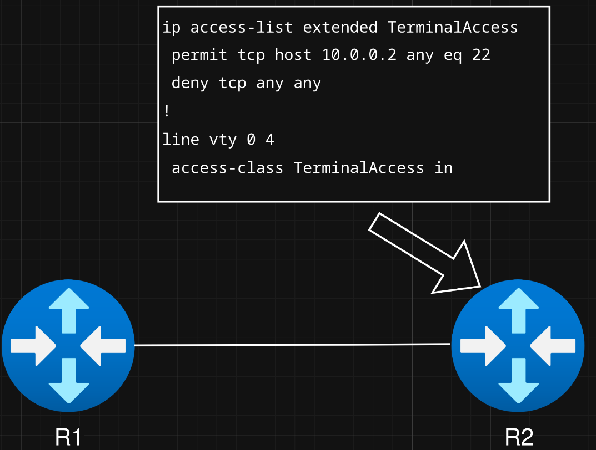

# Evolution of firewalls Pt.1

#### Jan Wilimek, Benjamin Zwettler

## Überblick

| Merkmal | Packet Filter | Stateful / CBAC | ZBF |
| - | - | - | - |
| Stateful | nein | ja | ja  |
|Konf. Aufwand| hoch | mittel | mittel |
| Anwendung | einfache access control (Bsp. ssh whitelist) | dynamischer Verkehr (Bsp. Rückverbindungen ermöglichen) | Netzwerk Segmentierung (Bsp. unterschiedliche Vertrauensberreiche) |

---
# Packetfilter (ACL's)
ende der 1980er: der erste Ansatz einer Firewall

Öffnete den Weg für standhaftere Firewalls.

---

#### Packetfilter Eigenschaften:
    
Filtern einzelne Pakete anhand einfacher Regeln:

- Source und Destination IP-Adresse
- Port Nummer
- Protokoll

---
Packetfilter Firewalls sind **Stateless**!


- Jedes Packet wird **individuel** inspected
- keine History von altem Traffic
    - Stateless Firewalls erkennen nicht ob ein eingehendes Packet eine Antwort auf eine davor gesendete Request ist.
- filtert nur anhand von einfachen Regeln
    - es werden nur IP, Port und Protokoll überprüft
- sehr viel Konfigurationsaufwand bei komplexen Topologien

---
#### Funktionsweise

ACLs *(Paketfilter)* sind einfach und relativ schnell zu konfigurieren. Haben aber nur sehr spezielle Anwendungen

**Bsp:**

Um lokalen SSH-Zugang als Whitelist zu ermöglichen, verwenden wir eine ACL, die ausgewählte Adressen, die mit TCP Port 22 (SSH) Anfragen, zulässt.



*der rechte Router (R2) kann nur noch von der Adresse 10.0.0.2 via ssh administriert werden.*

# Stateful & Cbac
### Stateful Firewalls:
Anfang 2000er zweite Generation von Firewalls:

#### Stateful Firewalls Eigenschaften
- Pakete werden nicht mehr isoliert betrachtet, sondern im Zusammenhang mit zuvor gesehenem Traffic
- Pakete werden als Teile einer Session/Connection zwischen Hosts angesehen
- Die Stateful Firewall aktualisiert den Status der einzelnen Connections
- Nur Pakete die zu gültigen/bestehenden Connections gehören werden zugelassen

#### Funktionsweise:

Stateful Firewalls befinden sich grundsätzlich auf Layer 3 und 4 im OSI Modell. Später wurden sie aufgrund von steigendem Bedarf an Application Layer Security auf Layer 7 Inspection erweitert (führte in weiterer Folge zu UTM Systemen).

##### States    
- Werden vewendet um den Status der Session anzugeben
- Sind platformspezifisch und nicht standardisiert
- Unterscheiden sich bei Stateful Connection-Oriented Protocols (z.B. TCP) und Stateless Connectionless Protocols (z.B. UDP)

##### State table
- Beinhaltet die States von den der Firewall bekannten Sessions.
- Wird verwendet um zu überprüfen ob Pakete zu einer vorhandenen Session gehören.
- Beinhaltet Session Informationen wie u.a.:
  - Source IP
  - Destination IP
  - Protocol
  - Sequence- and ACK Number
  - Source und Destination Port
  - State

**Bsp. Stateful Connection-Oriented Protocol:**
Aufbau einer TCP Connection:
- Die TCP-Flags SYN, SYN-ACK und ACK werden von der Stateful Firewall ausgewertet, um den Verbindungsaufbau zu erkennen und den entsprechenden Firewall-State zu setzen. 
- Die Firewall findet während des Handshakes die Informationen über Quelle, Ziel, Reihenfolge der Pakete und Daten innerhalb des Pakets heraus
- Diese Informationen werden in dem State Table gespeichert und sorgen dafür, dass nur Pakete zugelassen werden, die zu einer gültigen, bestehenden Session gehören.
- Nach dem Empfang eines TCP Reset (RST) oder Finish (FIN) wird die Session als beended markiert, der Eintrag aus dem State Table entfernt und spätere Pakete der Connection verworfen

**Bsp. Stateless Connectionless Protocol:**
Aufbau einer UDP Session:
- UDP hat keine Flags und Sequencenumbers wie TCP.
- Zusätzlich können sich die Portnummern in einem UDP-Datenfluss innerhalb einer Session zufällig ändern (dynamische Ports).
- Deshalb werden IP-Adressen inspected
- UDP braucht ICMP zur Fehlerrückmeldung (z.B. Port unreachable)
- Die Stateless Firewall verwendet die ICMP-Meldungen um den State der UDP-Session zu erkennen/setzen und ihre Gültigkeit zu bestätigen
- Die Firewall erkennt bei UDP nicht wann die Session zu Ende ist, deshalb wird ein Timeout gesetzt, nach dessen Ablauf der UDP-Session Eintrag aus dem State Table gelöscht wird

#### Cbac (Context-Based Access Control)
Cbac stellt eine Cisco Implementation der Stateful Packet Inspection dar

- Cbac verfügt neben Layer 3 und 4 auch eingeschränkte Protokoll-spezifische Layer 7 Inspection
- Cbac öffnet Ports dynamisch und schließt sie nach Ende der Session wieder 
- Es arbeitet mit ACLs welche Inbound am Interface und Inspection Classes, welche Outbound konfiguriert werden.


# Zone based Firewalls

anfang der 2000er: als Erweiterung der Stateful-Firewalls

#### ZBF Eigenschaften:
- **Zonen**
    - Interfaces werden **genau einer** Zone zugewiesen.
    - Traffic innerhalb derselben Zone ist standardmäßig erlaubt, zwischen verschiedenen Zonen jedoch standardmäßig verboten, solange kein Zone-Pair existiert.
    --- 


- **Class-Maps**
    
    in der classmap wird festgelegt:
    - welche Traffic-Typen / Protokolle inspiziert oder gefiltert werden sollen (z. B. tcp, udp, http, icmp, usw.)

    - optional: eine Match-ACL, die Traffic anhand von IP-Adressen/Ports definiert
    (z. B. „nur 10.0.0.0/24 darf über TCP 22“)

    Wichtig: Class-Maps definieren nur welcher Traffic gematcht wird – **nicht** was damit passiert.
    
    --- 
    
- **Policy-Maps**

    In einer Policy-Map wird festgelegt:

    - welche Class-Maps angewendet werden, und

    - wie der gematchte Traffic behandelt werden soll:
      - ```inspect```(zustandsbehaftete Firewall – erlaubt Rückverkehr)
      - ```pass```(einfach erlauben, ohne Inspection)
      - ```drop```(verwerfen)
    - Was mit nicht gematchtem Traffic passiert
    (Standard ist drop, wenn nicht anders konfiguriert)

    ---

- **Zonen-Paare**

    In einem Zonen-Paar wird definiert:
    
    - von welcher Source-Zone
    - zu welcher Destination-Zone
    - welche Policy-Map auf diesen Traffic angewendet wird

## Config
- ### Packetfilter *(ACL)*
    Access-List:
    ```
    Router(config)#ip access-list extended TerminalAccess
    Router(config-ext-nacl)#permit tcp host 10.0.0.2 any eq 22
    Router(config-ext-nacl)#deny tcp any any
    Router(config-ext-nacl)#exit
    ```
    List auf line geben:
    ```
    Router(config)#line vty 0 4 
    Router(config-line)#access-class TerminalAccess in
    Router(config-line)#exit
    ```
    auf interface:
    ```
    Router(config)#interface GigabitEthernet 0/0
    Router(config-if)#ip access-group TerminalAccess in
    Router(config-if)#exit
    ```


- ### Stateful FW (CBAC)
    ```
    ip inspect name MY-CBAC http
    ip inspect name MY-CBAC ftp
    interface GigabitEthernet0/0
     ip inspect MY-CBAC out
     
    ```

- ### Zone-Based-Firewall
    Zonen erstellen:
    ```
    zone security INSIDE
    zone security OUTSIDE
    ```

    Interfaces Zonen zuweisen:
    ```
    interface GigabitEthernet0/0
     zone-member security INSIDE
    
    interface GigabitEthernet0/1
     zone-member security OUTSIDE
    ```

    Class-Maps erstellen:
    ```
    class-map type inspect match-any EXAMPLEMAP
    match access-group 101
    ```


## Fun facts

- Der Begriff "Firewall" stammt von Brandmauern welche im Bauwesen verwendet werden um die Ausbreitung von Feuer in kleinere Bereiche einzudämmen.

## Quellen
- [paloaltonetworks.com](https://www.paloaltonetworks.com/cyberpedia/history-of-firewalls)
- [illumio.com](https://www.illumio.com/blog/firewall-stateful-inspection)
- [fortinet.com](https://www.fortinet.com/de/resources/cyberglossary/stateful-firewall)
- [paubox.com](https://www.paubox.com/blog/what-is-a-stateful-firewall)
- [geeksforgeeks.org (ZBF)](https://www.geeksforgeeks.org/computer-networks/zone-based-firewall/)
- [geeksforgeeks.org (cbac)](https://www.geeksforgeeks.org/computer-networks/context-based-access-control-cbac/)
- [cisco.com](https://www.cisco.com/c/de_de/support/docs/unified-communications/unified-border-element/220378-configure-zone-based-firewall-zbfw-co.html)
- [cisco.com (cbac)](https://www.cisco.com/c/en/us/td/docs/ios/sec_data_plane/configuration/guide/12_4/sec_data_plane_12_4_book/sec_cfg_content_ac.pdf)
- [cisco.com (stateful firewall)](https://www.cisco.com/c/en/us/td/docs/wireless/asr_5000/21-26/psf-admin/21-26-psf-admin/21-16-PSF-Admin_chapter_01.html)