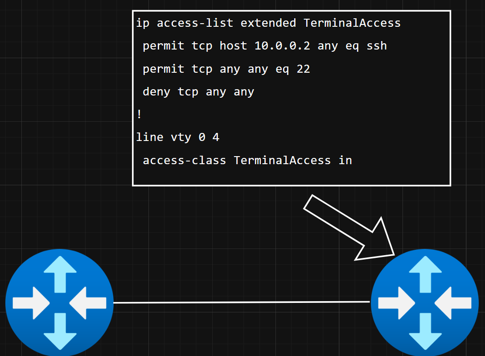

# Evolution of firewalls Pt.1

#### Jan Willimek, Benjamin Zwettler

## Überblick

| Merkmal | Packet Filter | Stateful / CBAC | ZBF |
| - | - | - | - |
| Stateful | nein | ja | ja  |
|Konf. Aufwand| hoch | mittel | mittel |
| Anwendung | einfache acces control (Bsp. ssh whitelist) | dynamischer verkehr (Bsp. rückverbindung ermöglichen) | Netzwerk segmentierung (Bsp. unterschiedliche vertrauensberreiche) |

---
# Packetfilter (ACL's)
ende der 1980er: der erste Ansatz einer Firewall

Öffnete den weg für standhaftere Firewalls.

---

#### Packetfilter Eigenschaften:
    
Filtern einzelne Packete anhand einfacher regeln:

- Source und Destination IP-Adresse
- Port Nummer
- Protokol

---
Packetfilter firewalls sind **Stateless**!

- Jedes Packet wird **individuel** inspected
- keine History von altem Traffic
    - Stateless firewalls erkennen nicht ob ein eingehendes Packet eine antwort auf eine davor gesendete request ist.
- filtert nur anhand von einfachen regeln
    - es werden nur IP, Port und Protokol überprüft
- sehr viel Konfigurationsaufwand bei komplexen Topologien

---
#### Funktionsweise

ACLs *(Paketfilter)* sind einfach und relativ schnell zu konfigurieren. Haben aber nur sehr spezielle anwendungen

**Bsp:**

Um lokalen ssh zugang als whitelist zu ermöglichen verwenden wir eine ACL die ausgewählte Addressen auf unseren ssh tcp port zuläst und den rest blockiert.

## Stateful & Cbac
### Stateful Firewalls:
Anfang 2000er zweite generation von Firewalls:
#### Stateful Firewalls Eigenschaften
- Packete nicht mehr generell als alleinstehnd angesehen
- Packete als Teile eines größeren Austausches zwischen Hosts betrachtet
- überwachen des Zustands der Verbindungen
- ermitteln und behalten des Kontexts vom Traffic
- herausfinden der Zusammenhänge zwischen Packeten

#### Funktionsweise
##### States    
Werden vewendet um den Status der Session anzugeben.

Bsp.: Client application startet TCP Verbindung
- bei TCP werden die 4 bits SYN,ACK,RST,FIN zur Bestimmung vom State verwendet
- TCP SYN flag wird gesetzt um den Start der Verbindung anzugeben -> Firewall erkennt Flag und setzt State auf NEW.
- Nach Antwort vom Server mit SYN + ACK Flags hat Firewall Packete von beiden Seiten erkannt -> Firewall setzt connection State auf ESTABLISHED  
- Nach Sendung von RST oder FIN + ACK Flags -> Firewall bereitet State für Löschung vor

##### State table
Wird verwendet um zu überprüfen ob Packets zu einer vorhandenen Session gehören.
Beinhaltet session Information:
  - Source IP
  - Destination IP
  - Protocol
  - State
## Zone based Firewalls

## Fun facts

## Quellen
- [www.paloaltonetworks.com](https://www.paloaltonetworks.com/cyberpedia/history-of-firewalls)
- [illumio.com] (https://www.illumio.com/blog/firewall-stateful-inspection)
- [fortinet.com] (https://www.fortinet.com/de/resources/cyberglossary/stateful-firewall)
- [paubox.com] (https://www.paubox.com/blog/what-is-a-stateful-firewall)
